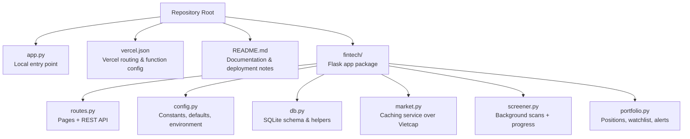
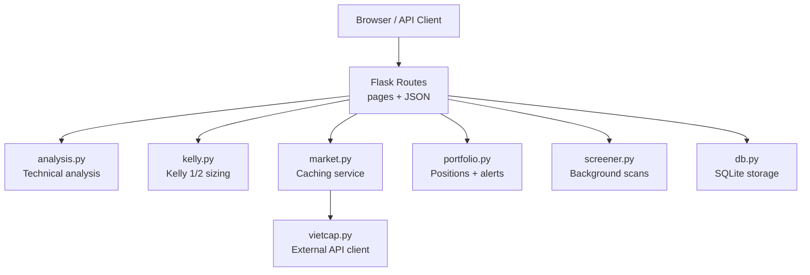
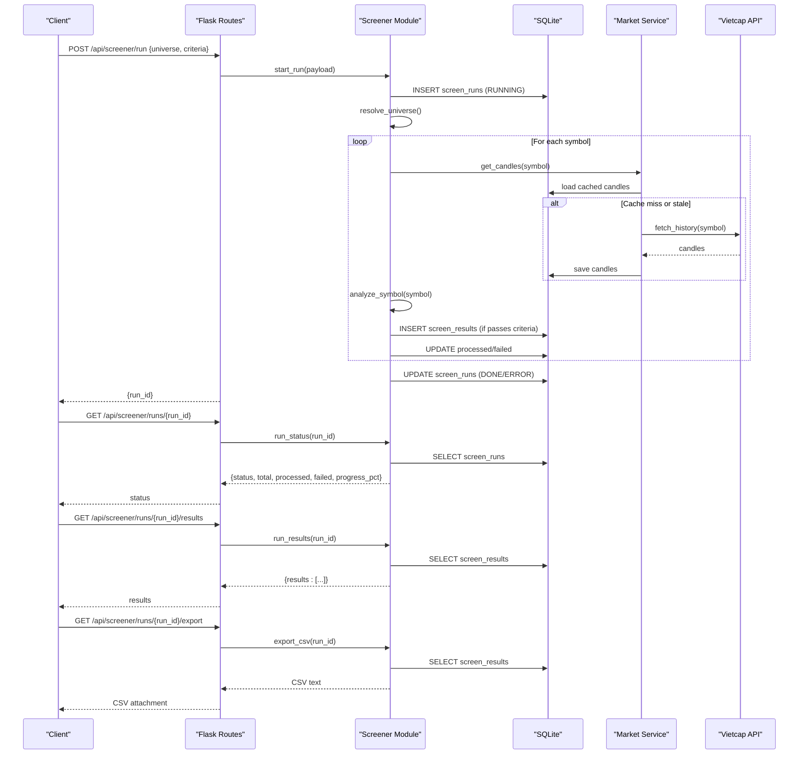
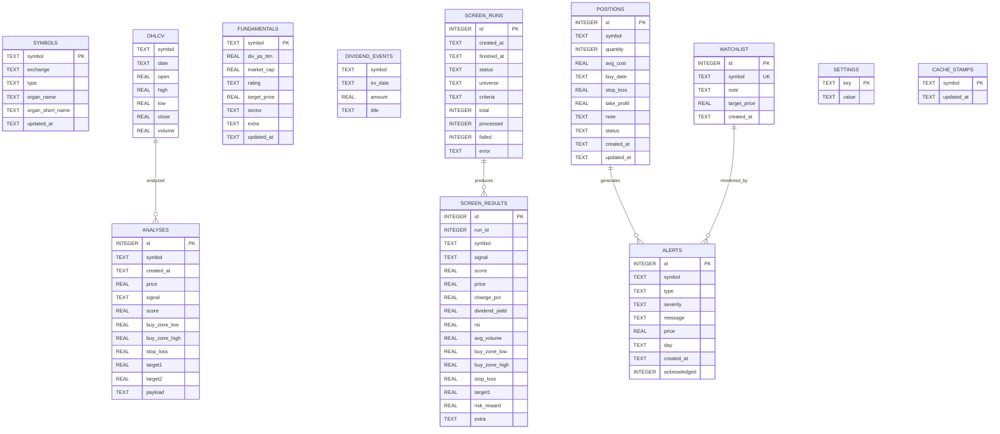

# API Reference

<cite>
**Referenced Files in This Document**   
- [README.md](file://README.md)
- [app.py](file://app.py)
- [vercel.json](file://vercel.json)
- [fintech/routes.py](file://fintech/routes.py)
- [fintech/config.py](file://fintech/config.py)
- [fintech/db.py](file://fintech/db.py)
- [fintech/market.py](file://fintech/market.py)
- [fintech/screener.py](file://fintech/screener.py)
- [fintech/portfolio.py](file://fintech/portfolio.py)
</cite>

## Table of Contents
1. [Introduction](#introduction)
2. [Project Structure](#project-structure)
3. [Core Components](#core-components)
4. [Architecture Overview](#architecture-overview)
5. [Web Routes and Pages](#web-routes-and-pages)
6. [REST API Reference](#rest-api-reference)
7. [Asynchronous Stock Screening Workflow](#asynchronous-stock-screening-workflow)
8. [Data Models and Storage](#data-models-and-storage)
9. [Serverless Deployment on Vercel](#serverless-deployment-on-vercel)
10. [Security, Rate Limiting, and CORS](#security-rate-limiting-and-cors)
11. [Client Implementation Guidelines](#client-implementation-guidelines)
12. [Troubleshooting Guide](#troubleshooting-guide)
13. [Conclusion](#conclusion)

## Introduction
FinViet Pro is a Python Flask application that provides Vietnamese stock technical analysis, portfolio management, alerts, stock screening, and settings through both web pages and JSON REST endpoints. It uses SQLite for persistence and integrates with the Vietcap Trading API for market data. The application supports local development and serverless deployment on Vercel.

Key capabilities include:
- Technical analysis using Fibonacci levels, Pivot Points, support/resistance clusters, RSI, MACD, moving averages, Bollinger Bands, and ATR.
- Kelly 1/2 position sizing based on win probability and payoff.
- Portfolio tracking with unrealized profit/loss, allocation, and stop-loss/take-profit management.
- Automated alert generation for stop-loss hits, sell signals, target hits, trailing stops, support breaks, buy signals, and watchlist targets.
- Multi-threaded stock screening over index groups, exchanges, or custom symbol lists with progress tracking and CSV export.
- Settings persistence for capital, risk parameters, cache behavior, scan frequency, lot size, and screener limits.

**Section sources**
- [README.md:1-24](file://README.md#L1-L24)
- [README.md:44-57](file://README.md#L44-L57)
- [README.md:69-77](file://README.md#L69-L77)

## Project Structure
The repository follows a feature-oriented layout under `fintech/`, with Flask routes, business modules, templates, and static assets organized by domain. The root entry point starts the Flask server locally, while Vercel deployment uses a separate WSGI entrypoint referenced by configuration.

**Diagram sources**
- [app.py:1-10](file://app.py#L1-L10)
- [vercel.json:1-14](file://vercel.json#L1-L14)
- [fintech/routes.py:1-10](file://fintech/routes.py#L1-L10)
- [fintech/config.py:1-30](file://fintech/config.py#L1-L30)
- [fintech/db.py:1-20](file://fintech/db.py#L1-L20)
- [fintech/market.py:1-10](file://fintech/market.py#L1-L10)
- [fintech/screener.py:1-20](file://fintech/screener.py#L1-L20)
- [fintech/portfolio.py:1-10](file://fintech/portfolio.py#L1-L10)

**Section sources**
- [README.md:79-105](file://README.md#L79-L105)
- [app.py:1-10](file://app.py#L1-L10)
- [vercel.json:1-14](file://vercel.json#L1-L14)

## Core Components
- **Routes**: Flask Blueprint exposing page renderers and JSON endpoints.
- **Configuration**: Environment-driven host/port/debug flags, data directory selection, default settings, universe groups, exchange list, signal thresholds, and signal labels.
- **Database**: SQLite schema for symbols, OHLCV candles, fundamentals, dividend events, analyses, screen runs/results, positions, watchlist, alerts, settings, and cache stamps.
- **Market Service**: Caches candle history, fundamentals, dividend events, and listings; falls back to cache when external calls fail.
- **Screener**: Background multi-threaded scanning with progress tracking, filtering by signal, score, volume, price range, and dividend yield; CSV export.
- **Portfolio**: Position CRUD, watchlist management, summary calculations, and alert engine scanning positions and watchlist.

**Section sources**
- [fintech/routes.py:1-15](file://fintech/routes.py#L1-L15)
- [fintech/config.py:27-80](file://fintech/config.py#L27-L80)
- [fintech/db.py:12-137](file://fintech/db.py#L12-L137)
- [fintech/market.py:20-154](file://fintech/market.py#L20-L154)
- [fintech/screener.py:15-21](file://fintech/screener.py#L15-L21)
- [fintech/portfolio.py:1-10](file://fintech/portfolio.py#L1-L10)

## Architecture Overview
The system exposes HTTP endpoints served by Flask. Web clients request HTML pages and consume JSON APIs. Business logic is split into modules: analysis (technical indicators), kelly (position sizing), market (data caching), portfolio (positions/alerts), screener (background scans), and vietcap (external data client). Persistence is handled by SQLite via the database module.

**Diagram sources**
- [fintech/routes.py:6-8](file://fintech/routes.py#L6-L8)
- [fintech/market.py:1-10](file://fintech/market.py#L1-L10)
- [fintech/portfolio.py:1-10](file://fintech/portfolio.py#L1-L10)
- [fintech/screener.py:1-13](file://fintech/screener.py#L1-L13)
- [fintech/db.py:1-11](file://fintech/db.py#L1-L11)

## Web Routes and Pages
The application serves six primary pages through Flask templates. Each route returns an HTML page with an active navigation marker.

| Route | Method | Page | Description |
|---|---:|---|---|
| `/` | GET | Dashboard | Overview of indices, portfolio value, new alerts, recent screening opportunities. |
| `/phan-tich` | GET | Technical Analysis | Candlestick chart with Fibonacci grid, Pivot levels, support/resistance, signal arrows, action tabs, Kelly calculator, dividend info. |
| `/sang-loc` | GET | Stock Screener | Universe selection, criteria filters, start scan button, progress bar, results table, CSV export. |
| `/danh-muc` | GET | Portfolio Management | Positions, PnL, allocation, watchlist, “Scan alerts now” button. |
| `/canh-bao` | GET | Alerts | Filterable alert list, mark as read, bulk acknowledge, rescan. |
| `/cai-dat` | GET | Settings | Capital, Kelly mode, risk %, max position %, lot size, history days, cache hours, scan interval, min average volume, screener limit, refresh symbols. |

These pages are rendered by Jinja templates under `fintech/templates/`. The JavaScript files under `fintech/static/js/` drive interactivity and call the REST API endpoints documented below.

**Section sources**
- [fintech/routes.py:24-53](file://fintech/routes.py#L24-L53)
- [README.md:44-57](file://README.md#L44-L57)

## REST API Reference
All JSON endpoints use standard HTTP methods and return JSON payloads. Errors are returned as `{ "error": "<message>" }` with appropriate status codes.

### Health
- **GET** `/api/health`
- Response:
  - `status`: string `"ok"`
  - `app`: string `"FinViet Pro"`
  - `time`: string timestamp
  - `serverless`: boolean
  - `storage`: string `"ephemeral"` or `"local-sqlite"`

**Section sources**
- [fintech/routes.py:58-68](file://fintech/routes.py#L58-L68)

### Symbols
- **GET** `/api/symbols?query=<term>&limit=<n>`
  - Returns `{ "symbols": [...] }`
  - `limit` capped at 100.
- **POST** `/api/symbols/refresh`
  - Forces symbol list refresh from Vietcap.
  - Response: `{ "ok": true, "updated": <count_or_message> }`

**Section sources**
- [fintech/routes.py:71-87](file://fintech/routes.py#L71-L87)
- [fintech/market.py:94-108](file://fintech/market.py#L94-L108)

### Index Summary
- **GET** `/api/index/summary`
- Response:
  - `indices`: array of objects with `symbol`, `price`, `change_pct`, `spark` (last 60 closes).

**Section sources**
- [fintech/routes.py:90-95](file://fintech/routes.py#L90-L95)
- [fintech/market.py:126-146](file://fintech/market.py#L126-L146)

### Technical Analysis
- **GET** `/api/analyze?symbol=<SYMBOL>&refresh=<1|true|yes>&days=<n>`
  - Fetches candles (cached or live), fundamentals (best-effort), computes analysis payload, persists best-effort.
  - Response includes analysis result plus `data_source` (`"cache"` or `"vietcap"`).
  - Error responses:
    - `400` if missing symbol.
    - `502` for Vietcap errors.
    - `500` for unexpected errors.

Example usage pattern:
- Request: `GET /api/analyze?symbol=FPT&days=400`
- Success response contains signal, score, levels (buy zone, stop loss, targets), indicators, reasons, and metadata such as exchange and organization names.

**Section sources**
- [fintech/routes.py:98-133](file://fintech/routes.py#L98-L133)
- [fintech/market.py:20-43](file://fintech/market.py#L20-L43)

### Recent Analyses
- **GET** `/api/analysis/recent?limit=<n>`
- Response:
  - `items`: array of recent analysis records.

**Section sources**
- [fintech/routes.py:136-138](file://fintech/routes.py#L136-L138)
- [fintech/db.py:437-442](file://fintech/db.py#L437-L442)

### Dividends
- **GET** `/api/dividends/<symbol>`
- Response:
  - `symbol`: string
  - `events`: array of dividend events
  - `dividend_ttm`: number or null

**Section sources**
- [fintech/routes.py:141-155](file://fintech/routes.py#L141-L155)
- [fintech/market.py:81-91](file://fintech/market.py#L81-L91)

### Kelly Sizing
- **POST** `/api/kelly/calc`
- Request body fields:
  - `win_prob`: number (percentage)
  - `payoff`: number
  - `entry`: number (required)
  - `stop`: number (defaults to `entry * 0.95`)
  - `equity`: number (from settings if omitted)
  - `mode`: string `"half"` or `"full"`
- Validation:
  - Missing or non-positive `entry` → `400`.
  - Stop must be less than entry → `400`.
- Response: Kelly recommendation including recommended quantity and sizing constraints.

**Section sources**
- [fintech/routes.py:158-196](file://fintech/routes.py#L158-L196)

### Screener Endpoints
- **GET** `/api/screener/universes`
  - Response: `{ "groups": [...], "exchanges": [...] }`
- **POST** `/api/screener/run`
  - Request body:
    - `universe`: object with `type` (`"group"`, `"exchange"`, `"custom"`) and `value`.
    - `criteria`: object with filters like `signals`, `min_score`, `min_avg_volume`, `price_min`, `price_max`, `min_dividend_yield`, `exclude_unknown_dividend`, `max_symbols`.
  - Response: `{ "run_id": <int> }`
  - Errors:
    - `409` for invalid input or conflicting run state.
    - `502` for Vietcap data errors.
    - `500` for unexpected errors.
- **GET** `/api/screener/runs?limit=<n>`
  - Response: `{ "runs": [...] }`
- **GET** `/api/screener/runs/<run_id>`
  - Response: run status including `status`, `total`, `processed`, `failed`, `progress_pct`.
  - Error: `404` if not found.
- **GET** `/api/screener/runs/<run_id>/results`
  - Response: `{ "results": [...] }`
  - Error: `404` if not found.
- **GET** `/api/screener/runs/<run_id>/export`
  - Response: CSV file attachment.
  - Error: `404` if not found.

**Section sources**
- [fintech/routes.py:201-253](file://fintech/routes.py#L201-L253)
- [fintech/screener.py:32-59](file://fintech/screener.py#L32-L59)
- [fintech/screener.py:126-211](file://fintech/screener.py#L126-L211)
- [fintech/screener.py:238-310](file://fintech/screener.py#L238-L310)

### Portfolio Endpoints
- **GET** `/api/portfolio/overview`
  - Response:
    - `positions`: array of positions with computed metrics.
    - `summary`: portfolio summary (equity, cash, market value, cost, PnL, allocation %).
    - `watchlist`: array of watched symbols with latest analysis.
    - `alerts_count`: integer unread alerts.
- **POST** `/api/portfolio/positions`
  - Request body:
    - `symbol`: string (required)
    - `quantity`: number > 0 (required)
    - `avg_cost`: number > 0 (required)
    - Optional: `buy_date`, `stop_loss`, `take_profit`, `note`
  - Response: `{ "ok": true, "id": <position_id> }`
  - Errors:
    - `400` for validation failures.
    - `500` for unexpected errors.
- **PUT** `/api/portfolio/positions/<position_id>`
  - Request body: partial update fields.
  - Response: `{ "ok": true }`
  - Errors:
    - `400` for validation failures.
    - `500` for unexpected errors.
- **DELETE** `/api/portfolio/positions/<position_id>`
  - Response: `{ "ok": true }`
  - Error: `500` for unexpected errors.
- **POST** `/api/portfolio/watch`
  - Request body:
    - `symbol`: string (required)
    - Optional: `note`, `target_price`
  - Response: `{ "ok": true }`
  - Errors:
    - `400` for validation failures.
    - `500` for unexpected errors.
- **DELETE** `/api/portfolio/watch/<watch_id>`
  - Response: `{ "ok": true }`
  - Error: `500` for unexpected errors.
- **POST** `/api/portfolio/scan`
  - Request body:
    - `force`: boolean (optional)
  - Response:
    - `skipped`: boolean
    - `created`: integer alerts created
    - `scanned`: integer scanned items
    - `alerts_count`: integer unread alerts
  - Error: `500` for unexpected errors.

**Section sources**
- [fintech/routes.py:258-337](file://fintech/routes.py#L258-L337)
- [fintech/portfolio.py:30-129](file://fintech/portfolio.py#L30-L129)
- [fintech/portfolio.py:179-278](file://fintech/portfolio.py#L179-L278)

### Alerts Endpoints
- **GET** `/api/alerts?include_ack=<1|true|yes>&limit=<n>`
  - Response:
    - `alerts`: array of alert records
    - `unread`: integer count
- **POST** `/api/alerts/<alert_id>/ack`
  - Response: `{ "ok": true, "unread": <new_count> }`
- **POST** `/api/alerts/ack-all`
  - Response: `{ "ok": true, "unread": 0 }`

**Section sources**
- [fintech/routes.py:342-363](file://fintech/routes.py#L342-L363)
- [fintech/portfolio.py:291-310](file://fintech/portfolio.py#L291-L310)

### Settings Endpoints
- **GET** `/api/settings`
  - Response: merged settings dictionary.
- **POST** `/api/settings`
  - Request body: key/value pairs for allowed keys:
    - `equity`, `risk_pct`, `max_position_pct`, `kelly_mode`, `history_days`, `cache_hours`, `scan_minutes`, `min_avg_volume`, `lot`, `screener_max_symbols`
  - Behavior:
    - `kelly_mode` normalized to `"half"` or `"full"`.
    - Numeric values validated and non-negative.
  - Response:
    - `ok`: boolean
    - `updated`: object with updated keys
    - `settings`: full merged settings

**Section sources**
- [fintech/routes.py:368-397](file://fintech/routes.py#L368-L397)
- [fintech/config.py:43-55](file://fintech/config.py#L43-L55)

## Asynchronous Stock Screening Workflow
Stock screening is asynchronous due to potentially long-running computations across many symbols. Clients should start a run, poll status, retrieve results when done, and optionally export CSV.

**Diagram sources**
- [fintech/routes.py:206-253](file://fintech/routes.py#L206-L253)
- [fintech/screener.py:126-211](file://fintech/screener.py#L126-L211)
- [fintech/screener.py:238-310](file://fintech/screener.py#L238-L310)
- [fintech/market.py:20-43](file://fintech/market.py#L20-L43)

**Section sources**
- [fintech/screener.py:15-21](file://fintech/screener.py#L15-L21)
- [fintech/screener.py:126-211](file://fintech/screener.py#L126-L211)
- [fintech/screener.py:238-310](file://fintech/screener.py#L238-L310)

## Data Models and Storage
The application stores all core entities in SQLite. Key tables include:

- `symbols`: ticker metadata and listing info.
- `ohlcv`: daily OHLCV candles per symbol.
- `fundamentals`: company fundamentals (dividend TTM, market cap, rating, target price, sector, extra).
- `dividend_events`: historical dividends per symbol.
- `analyses`: persisted technical analysis snapshots.
- `screen_runs`: background screener job metadata and status.
- `screen_results`: screener output rows.
- `positions`: open positions with cost, stop-loss, take-profit, note, timestamps.
- `watchlist`: symbols being monitored with optional target price.
- `alerts`: generated alerts with type, severity, message, price, day, acknowledgment flag.
- `settings`: user-configurable application settings.
- `cache_stamps`: last update time for symbol caches.

**Diagram sources**
- [fintech/db.py:12-137](file://fintech/db.py#L12-L137)

**Section sources**
- [fintech/db.py:12-137](file://fintech/db.py#L12-L137)
- [fintech/db.py:169-229](file://fintech/db.py#L169-L229)

## Serverless Deployment on Vercel
FinViet Pro is packaged for Vercel serverless runtime:

- Entry point: `api/index.py` (WSGI recognized by `@vercel/python`).
- Routing: All requests rewritten to `/api/index`.
- Function configuration:
  - Runtime: `python3.12`
  - Max duration: `60 seconds`
  - Included files: `fintech/**`
- Data directory: On Vercel, SQLite path switches to `/tmp/finviet-pro`; this is ephemeral and instance-scoped.
- Ignore rules: `data/`, `tools/`, and caches are excluded from bundle.
- Environment detection: `VERCEL=1` triggers serverless behavior in configuration.

Important considerations:
- Filesystem writes only allowed under `/tmp`; data may be lost on cold start or instance changes.
- Long-running tasks (screening large universes) can be truncated by the 60-second limit; use small universes (≤ 50 symbols) or deploy to persistent hosting for production.
- Instance sleep after response means background scans do not continue automatically; trigger scans via UI requests.
- Cold starts cause initial latency.
- External internet access required for Vietcap; verify with health endpoint.

**Section sources**
- [README.md:114-147](file://README.md#L114-L147)
- [vercel.json:1-14](file://vercel.json#L1-L14)
- [fintech/config.py:7-25](file://fintech/config.py#L7-L25)

## Security, Rate Limiting, and CORS
- Authentication: No built-in authentication middleware is present in the provided codebase. Access control is not implemented at the API layer.
- Rate limiting: No explicit rate limiting is configured in routes or middleware.
- CORS: No explicit CORS handling is visible in the routes; cross-origin behavior depends on Flask defaults and reverse proxy configuration.
- Security headers: No custom security headers are set in the routes shown.
- Input validation:
  - Many endpoints perform basic validation (e.g., missing symbol, numeric ranges, Kelly inputs).
  - Screener validates universe types and criteria; portfolio validates position fields.
- Best practices for production:
  - Add authentication (JWT/session) before exposing internal APIs externally.
  - Configure CORS explicitly to restrict origins.
  - Implement rate limiting to protect against abuse.
  - Add security headers (HSTS, CSP, X-Frame-Options, etc.) via middleware or reverse proxy.
  - Use HTTPS and secure cookies if sessions are used.

**Section sources**
- [fintech/routes.py:13-22](file://fintech/routes.py#L13-L22)
- [fintech/routes.py:158-196](file://fintech/routes.py#L158-L196)
- [fintech/routes.py:274-337](file://fintech/routes.py#L274-L337)

## Client Implementation Guidelines
General guidelines:
- Base URL: Use your deployed hostname (local: `http://127.0.0.1:5000`, Vercel: `https://<your-app>.vercel.app`).
- Content-Type: Set `application/json` for POST/PUT requests.
- Error handling: Check HTTP status codes and parse `{ "error": "<message>" }` for failures.
- Pagination: Use `limit` query parameters where available; respect caps enforced by the server.
- Idempotency: Avoid duplicate operations (e.g., multiple concurrent screener runs); handle `409` conflicts.

Common operations:

1. Fetch technical analysis for a symbol:
   - `GET /api/analyze?symbol=FPT&days=400`
   - Handle `400` (missing symbol), `502` (Vietcap error), `500` (unexpected error).
   - Use `data_source` to decide whether to show cache vs live data.

2. Manage portfolio positions:
   - Create: `POST /api/portfolio/positions` with `symbol`, `quantity`, `avg_cost`.
   - Update: `PUT /api/portfolio/positions/<id>` with partial fields.
   - Delete: `DELETE /api/portfolio/positions/<id>`.
   - Overview: `GET /api/portfolio/overview` to display PnL, allocation, and watchlist.

3. Trigger stock screening:
   - Start: `POST /api/screener/run` with `universe` and `criteria`.
   - Poll: `GET /api/screener/runs/<run_id>` until `status` is `DONE` or `ERROR`.
   - Retrieve: `GET /api/screener/runs/<run_id>/results`.
   - Export: `GET /api/screener/runs/<run_id>/export` to download CSV.

4. Retrieve alert notifications:
   - List: `GET /api/alerts?include_ack=false&limit=100`.
   - Acknowledge single: `POST /api/alerts/<id>/ack`.
   - Acknowledge all: `POST /api/alerts/ack-all`.

5. Settings:
   - Get: `GET /api/settings`.
   - Update: `POST /api/settings` with allowed keys; response includes updated settings.

Asynchronous task handling:
- For long-running tasks like screening, implement polling with exponential backoff.
- Show progress percentage from `progress_pct`.
- Handle `404` for unknown run IDs and `409` for conflicting runs.
- Consider disabling UI controls during active runs to prevent duplicate submissions.

**Section sources**
- [fintech/routes.py:98-133](file://fintech/routes.py#L98-L133)
- [fintech/routes.py:206-253](file://fintech/routes.py#L206-L253)
- [fintech/routes.py:274-337](file://fintech/routes.py#L274-L337)
- [fintech/routes.py:342-363](file://fintech/routes.py#L342-L363)
- [fintech/routes.py:374-397](file://fintech/routes.py#L374-L397)

## Troubleshooting Guide
Common issues and resolutions:

- Missing symbol parameter on analysis:
  - Symptom: `400` with error message indicating missing symbol.
  - Fix: Ensure `symbol` query parameter is provided and non-empty.

- Vietcap data errors:
  - Symptom: `502` responses from analysis, screener, or dividends endpoints.
  - Fix: Verify network connectivity and Vietcap availability; retry later; check health endpoint.

- Screener conflicts:
  - Symptom: `409` when starting a new screener run.
  - Fix: Wait for existing run to finish; poll status endpoint.

- Stale screener runs on serverless:
  - Symptom: Runs stuck in `RUNNING` after instance restart.
  - Behavior: System marks abandoned runs as `ERROR` after threshold; clients should treat as failed and start a new run.

- Portfolio validation errors:
  - Symptom: `400` when creating/updating positions with invalid fields.
  - Fix: Validate `quantity > 0`, `avg_cost > 0`, and other required fields.

- Alert scanning throttling:
  - Symptom: Scan skipped due to recent scan interval.
  - Fix: Use `force=true` to bypass throttle or wait for interval to expire.

- Vercel ephemeral storage:
  - Symptom: Data loss after cold start or instance change.
  - Fix: Use persistent hosting for production or set `FINTECH_DATA_DIR` to a durable volume.

**Section sources**
- [fintech/routes.py:98-133](file://fintech/routes.py#L98-L133)
- [fintech/routes.py:206-217](file://fintech/routes.py#L206-L217)
- [fintech/routes.py:274-295](file://fintech/routes.py#L274-L295)
- [fintech/screener.py:214-235](file://fintech/screener.py#L214-L235)
- [fintech/portfolio.py:179-189](file://fintech/portfolio.py#L179-L189)
- [README.md:139-147](file://README.md#L139-L147)

## Conclusion
FinViet Pro provides a comprehensive set of web pages and REST endpoints for Vietnamese stock analysis, portfolio management, alerts, and screening. The API is straightforward, returning JSON payloads with clear error structures. For production deployments, consider adding authentication, CORS policies, rate limiting, and security headers. On Vercel, be mindful of ephemeral storage and execution timeouts, especially for long-running tasks like stock screening. Clients should implement robust error handling, polling for asynchronous operations, and respect server-enforced limits.