# Architecture Overview

<cite>
**Referenced Files in This Document**
- [app.py](file://app.py)
- [__init__.py](file://fintech/__init__.py)
- [routes.py](file://fintech/routes.py)
- [config.py](file://fintech/config.py)
- [db.py](file://fintech/db.py)
- [vietcap.py](file://fintech/vietcap.py)
- [market.py](file://fintech/market.py)
- [analysis.py](file://fintech/analysis.py)
- [kelly.py](file://fintech/kelly.py)
- [portfolio.py](file://fintech/portfolio.py)
- [screener.py](file://fintech/screener.py)
</cite>

## Table of Contents
1. [Introduction](#introduction)
2. [Project Structure](#project-structure)
3. [Core Components](#core-components)
4. [Architecture Overview](#architecture-overview)
5. [Detailed Component Analysis](#detailed-component-analysis)
6. [Dependency Analysis](#dependency-analysis)
7. [Performance Considerations](#performance-considerations)
8. [Troubleshooting Guide](#troubleshooting-guide)
9. [Conclusion](#conclusion)

## Introduction
FinViet Pro is a modular Flask application for Vietnamese stock technical analysis, portfolio management, alerts, and stock screening. It separates HTTP routing from business logic, uses a service layer for market data and domain operations, and persists state in SQLite. External market data comes from the Vietcap Trading API, with caching to reduce network calls. The system supports both local deployment and Vercel serverless deployment.

The architecture follows:
- Blueprint-based route organization under `routes.py`.
- Service modules for market data (`market.py`), technical analysis (`analysis.py`), capital sizing (`kelly.py`), portfolio and alerts (`portfolio.py`), and background screening (`screener.py`).
- A dedicated data access layer (`db.py`) over SQLite.
- Configuration and environment handling (`config.py`).
- An external client wrapper (`vietcap.py`) for rate-limited, retry-safe API calls.

## Project Structure
At runtime, `app.py` starts the Flask process, while `fintech/__init__.py` creates the application, initializes the database, registers the main blueprint, and sets JSON response behavior. Routes are grouped under a single Flask blueprint named `main`, which delegates to service modules rather than implementing business logic directly.

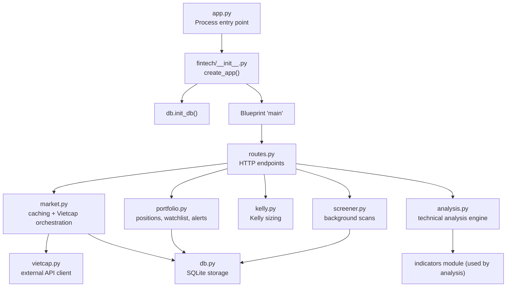

**Diagram sources**
- [app.py:1-10](file://app.py#L1-L10)
- [__init__.py:7-21](file://fintech/__init__.py#L7-L21)
- [routes.py:1-10](file://fintech/routes.py#L1-L10)
- [market.py:1-8](file://fintech/market.py#L1-L8)
- [analysis.py:1-23](file://fintech/analysis.py#L1-L23)
- [kelly.py:1-11](file://fintech/kelly.py#L1-L11)
- [portfolio.py:1-8](file://fintech/portfolio.py#L1-L8)
- [screener.py:1-14](file://fintech/screener.py#L1-L14)
- [vietcap.py:1-40](file://fintech/vietcap.py#L1-L40)
- [db.py:1-11](file://fintech/db.py#L1-L11)

**Section sources**
- [app.py:1-10](file://app.py#L1-L10)
- [__init__.py:7-21](file://fintech/__init__.py#L7-L21)
- [routes.py:1-10](file://fintech/routes.py#L1-L10)

## Core Components
- Application factory and lifecycle: `fintech/__init__.py` builds the Flask app, initializes SQLite, registers the blueprint, and adds JSON cache-control headers.
- HTTP routes: `routes.py` defines pages and REST endpoints, validates inputs, and delegates to services.
- Market service: `market.py` provides cached candles, fundamentals, dividend events, symbol search, index summary, and listing refresh.
- Technical analysis engine: `analysis.py` computes indicators, Fibonacci levels, pivot points, support/resistance clusters, composite signals, backtesting stats, and actionable buy/sell levels.
- Capital sizing: `kelly.py` implements full and half-Kelly sizing with risk budgeting and lot rounding.
- Portfolio and alerts: `portfolio.py` manages positions, watchlist, PnL, and alert scanning.
- Screener: `screener.py` runs background scans across universes with progress tracking and CSV export.
- Data access: `db.py` defines schema, connection helpers, settings store, and domain tables.
- External integration: `vietcap.py` wraps Vietcap endpoints with retries, concurrency control, and normalization.
- Configuration: `config.py` centralizes paths, defaults, thresholds, universe groups, and environment detection.

**Section sources**
- [__init__.py:7-21](file://fintech/__init__.py#L7-L21)
- [routes.py:1-398](file://fintech/routes.py#L1-L398)
- [market.py:1-154](file://fintech/market.py#L1-L154)
- [analysis.py:1-680](file://fintech/analysis.py#L1-L680)
- [kelly.py:1-98](file://fintech/kelly.py#L1-L98)
- [portfolio.py:1-310](file://fintech/portfolio.py#L1-L310)
- [screener.py:1-310](file://fintech/screener.py#L1-L310)
- [db.py:1-450](file://fintech/db.py#L1-L450)
- [vietcap.py:1-260](file://fintech/vietcap.py#L1-L260)
- [config.py:1-80](file://fintech/config.py#L1-L80)

## Architecture Overview
FinViet Pro uses a layered design:
- Presentation layer: Flask templates and static assets render dashboards, analysis charts, screener UI, portfolio views, alerts, and settings.
- Route layer: Blueprint routes parse requests, validate parameters, and call services.
- Service layer: Business logic modules encapsulate technical analysis, portfolio operations, screener orchestration, and capital sizing.
- Data layer: SQLite stores symbols, OHLCV, fundamentals, dividends, analyses, screen runs/results, positions, watchlist, alerts, settings, and cache stamps.
- External layer: Vietcap client fetches listings, OHLC history, company details, and dividend events.

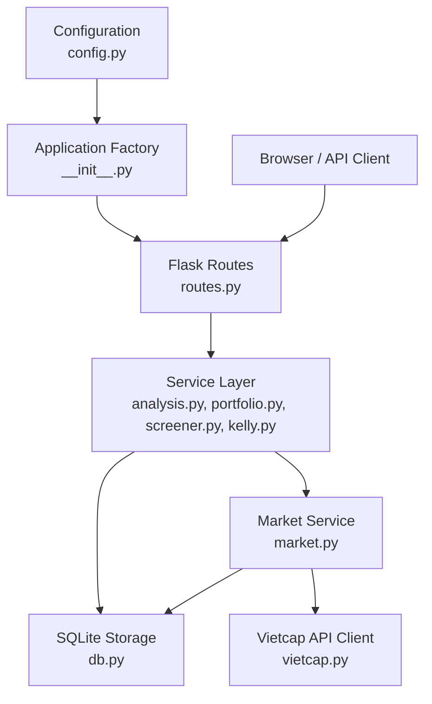

**Diagram sources**
- [routes.py:1-398](file://fintech/routes.py#L1-L398)
- [analysis.py:598-680](file://fintech/analysis.py#L598-L680)
- [portfolio.py:1-310](file://fintech/portfolio.py#L1-L310)
- [screener.py:1-310](file://fintech/screener.py#L1-L310)
- [kelly.py:66-98](file://fintech/kelly.py#L66-L98)
- [market.py:20-124](file://fintech/market.py#L20-L124)
- [db.py:12-137](file://fintech/db.py#L12-L137)
- [vietcap.py:46-58](file://fintech/vietcap.py#L46-L58)
- [config.py:1-80](file://fintech/config.py#L1-L80)
- [__init__.py:7-21](file://fintech/__init__.py#L7-L21)

## Detailed Component Analysis

### HTTP Route Layer and Blueprint Pattern
The blueprint pattern organizes all HTTP endpoints under a single `main` blueprint. Pages return templates; APIs return JSON. Input validation helpers normalize query and body parameters. Errors are returned as structured JSON responses with appropriate status codes.

Key responsibilities:
- Page rendering for dashboard, analysis, screener, portfolio, alerts, and settings.
- REST endpoints for health, symbols, index summary, analysis, dividends, Kelly calculation, screener runs, portfolio CRUD, watchlist, scan, alerts, and settings.
- Delegation to services for business logic and persistence.

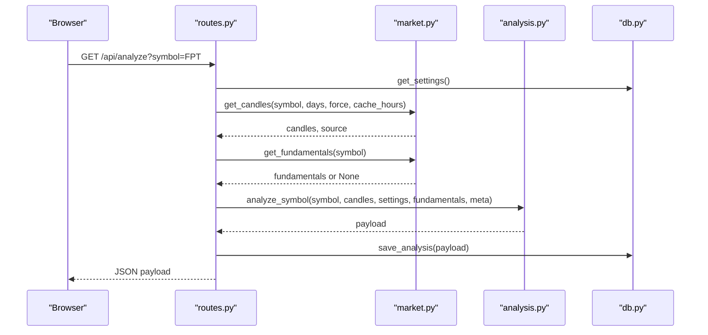

**Diagram sources**
- [routes.py:98-133](file://fintech/routes.py#L98-L133)
- [market.py:20-43](file://fintech/market.py#L20-L43)
- [analysis.py:598-680](file://fintech/analysis.py#L598-L680)
- [db.py:413-434](file://fintech/db.py#L413-L434)

**Section sources**
- [routes.py:1-398](file://fintech/routes.py#L1-L398)

### Market Service and Caching Strategy
The market service abstracts external API calls and caches results in SQLite. It returns a tuple `(data, source)` indicating whether data came from cache or Vietcap. Caching rules:
- Candles: use stored OHLCV if recent enough; otherwise fetch from Vietcap and persist.
- Fundamentals: cache company details and dividend events with configurable TTL.
- Symbol list: refresh periodically or on demand.
- Index summary: compute latest close and change for VNINDEX/VN30 using cached candles.

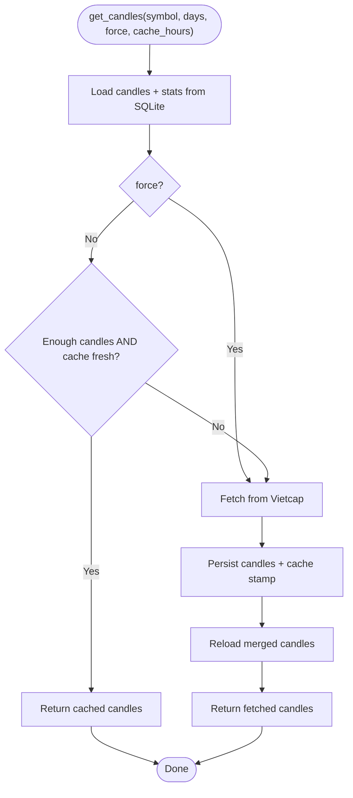

**Diagram sources**
- [market.py:20-43](file://fintech/market.py#L20-L43)
- [db.py:289-351](file://fintech/db.py#L289-L351)
- [vietcap.py:135-189](file://fintech/vietcap.py#L135-L189)

**Section sources**
- [market.py:1-154](file://fintech/market.py#L1-L154)

### Technical Analysis Engine
The analysis engine computes a comprehensive signal and actionable levels:
- Indicator bundle: SMA, EMA, RSI, MACD, Bollinger Bands, ATR, volume averages.
- Fibonacci retracement and extension levels based on swing anchors.
- Pivot points for daily/weekly/monthly periods.
- Support/resistance clustering with tolerance and recency weighting.
- Composite scoring combining trend, momentum, levels, volume, and pivots.
- Backtesting simulation to estimate win-rate, payoff, expectancy, drawdown.
- Actionable levels: buy points, sell targets, stop loss, risk/reward, warnings.

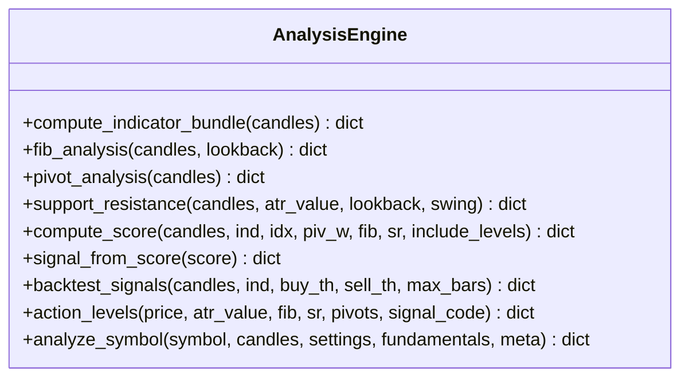

**Diagram sources**
- [analysis.py:43-61](file://fintech/analysis.py#L43-L61)
- [analysis.py:66-124](file://fintech/analysis.py#L66-L124)
- [analysis.py:174-186](file://fintech/analysis.py#L174-L186)
- [analysis.py:191-240](file://fintech/analysis.py#L191-L240)
- [analysis.py:251-372](file://fintech/analysis.py#L251-L372)
- [analysis.py:375-387](file://fintech/analysis.py#L375-L387)
- [analysis.py:392-490](file://fintech/analysis.py#L392-L490)
- [analysis.py:506-593](file://fintech/analysis.py#L506-L593)
- [analysis.py:598-680](file://fintech/analysis.py#L598-L680)

**Section sources**
- [analysis.py:1-680](file://fintech/analysis.py#L1-L680)

### Portfolio Management and Alert Scanning
Portfolio service manages positions, watchlist, and alerts:
- Positions overview calculates current price, PnL, suggested stop, buy zone, and signal context.
- Watchlist rows enrich each symbol with analysis results.
- Alert scanner evaluates positions and watchlist against stop-loss, take-profit, signal thresholds, trailing stop, support break, and target hit rules.
- Alerts are upserted per day to avoid duplicates.

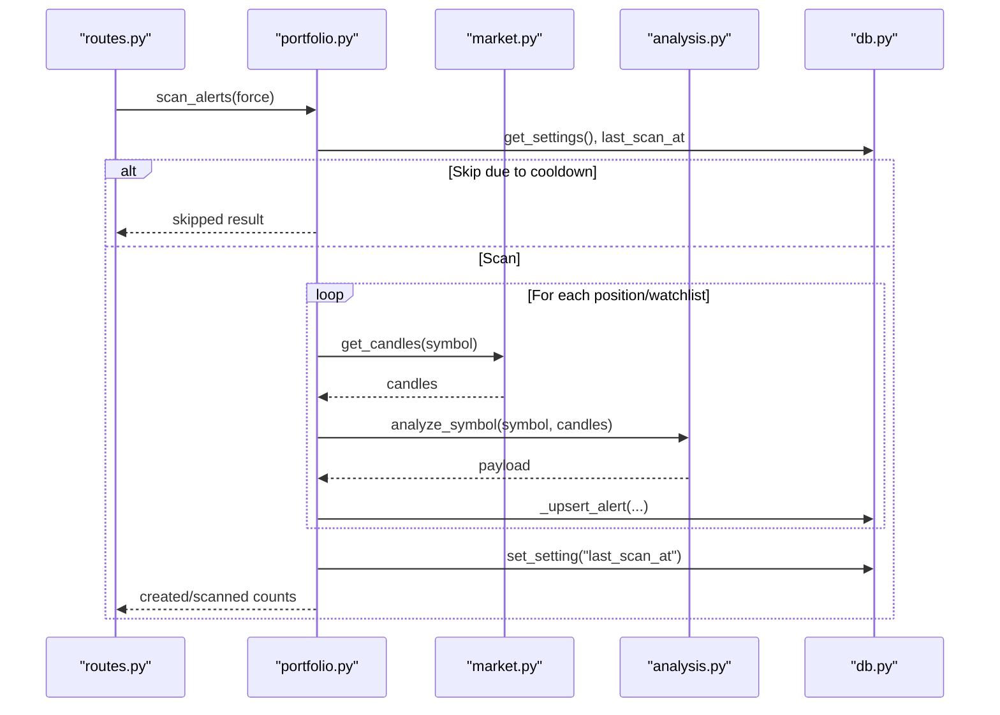

**Diagram sources**
- [routes.py:328-337](file://fintech/routes.py#L328-L337)
- [portfolio.py:179-278](file://fintech/portfolio.py#L179-L278)
- [market.py:20-43](file://fintech/market.py#L20-L43)
- [analysis.py:598-680](file://fintech/analysis.py#L598-L680)
- [db.py:201-229](file://fintech/db.py#L201-L229)

**Section sources**
- [portfolio.py:1-310](file://fintech/portfolio.py#L1-L310)

### Screener Background Processing
Screener supports background scans over Vietcap groups, exchanges, or custom lists:
- Resolves universe to a deduplicated symbol list.
- Analyzes symbols concurrently with thread pool workers.
- Persists intermediate results and progress.
- Exposes run status, results, and CSV export.
- Handles stale runs in serverless environments.

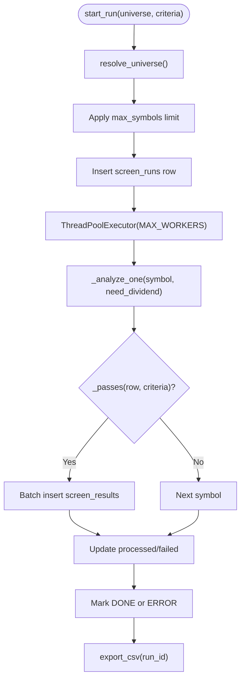

**Diagram sources**
- [screener.py:32-59](file://fintech/screener.py#L32-L59)
- [screener.py:62-97](file://fintech/screener.py#L62-L97)
- [screener.py:100-123](file://fintech/screener.py#L100-L123)
- [screener.py:126-211](file://fintech/screener.py#L126-L211)
- [screener.py:238-251](file://fintech/screener.py#L238-L251)
- [screener.py:293-309](file://fintech/screener.py#L293-L309)

**Section sources**
- [screener.py:1-310](file://fintech/screener.py#L1-L310)

### Kelly Capital Sizing
Kelly module implements fractional Kelly sizing:
- Full Kelly fraction based on win probability and payoff ratio.
- Half-Kelly mode recommended by Edward Thorp for smoother equity curves.
- Position size constrained by risk budget, maximum position percentage, and lot size.
- Recommendation payload includes amounts, quantities, notes, and constraints.

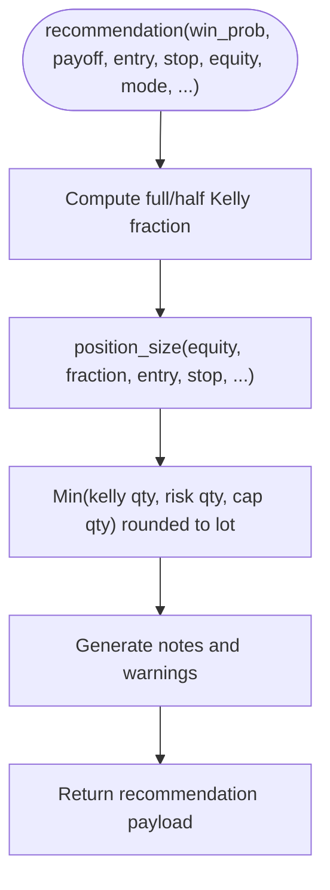

**Diagram sources**
- [kelly.py:15-27](file://fintech/kelly.py#L15-L27)
- [kelly.py:30-63](file://fintech/kelly.py#L30-L63)
- [kelly.py:66-98](file://fintech/kelly.py#L66-L98)

**Section sources**
- [kelly.py:1-98](file://fintech/kelly.py#L1-L98)

### Data Access Layer and Schema
The data layer defines SQLite schema and provides generic helpers plus domain-specific functions:
- Tables: symbols, ohlcv, fundamentals, dividend_events, analyses, screen_runs, screen_results, positions, watchlist, alerts, settings, cache_stamps.
- Settings store merges default values with persisted overrides.
- Batch inserts and upserts optimize write performance.
- Connection manager enables WAL mode and transaction safety.

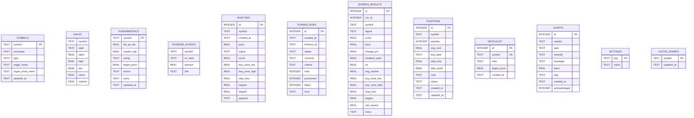

**Diagram sources**
- [db.py:12-137](file://fintech/db.py#L12-L137)

**Section sources**
- [db.py:1-450](file://fintech/db.py#L1-L450)

### External Integration with Vietcap API
The Vietcap client handles:
- Listing retrieval and group queries.
- OHLC candle history with timestamp normalization and fallback dates.
- Company fundamentals and dividend events.
- Retry logic with exponential backoff and concurrency semaphore.
- Exchange normalization and robust parsing.

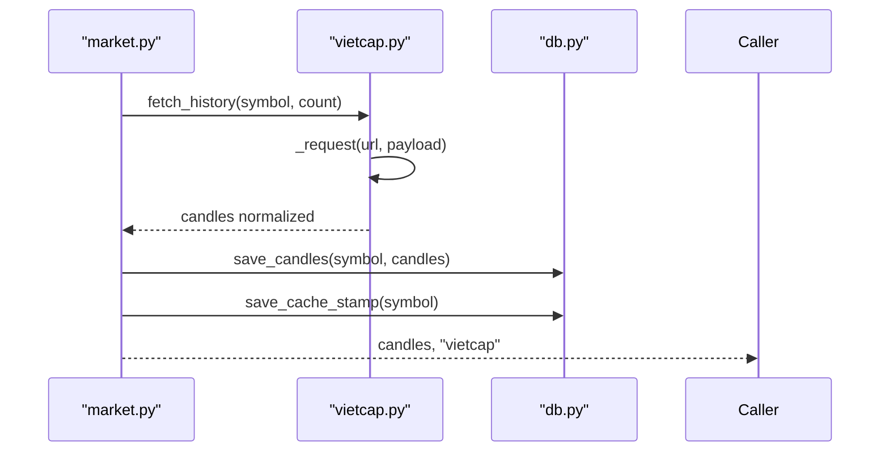

**Diagram sources**
- [market.py:20-43](file://fintech/market.py#L20-L43)
- [vietcap.py:135-189](file://fintech/vietcap.py#L135-L189)
- [db.py:289-351](file://fintech/db.py#L289-L351)

**Section sources**
- [vietcap.py:1-260](file://fintech/vietcap.py#L1-L260)

## Dependency Analysis
Component dependencies reflect clear separation of concerns:
- Routes depend on services but not directly on external APIs or database internals.
- Market service depends on Vietcap client and DB layer.
- Analysis engine depends on indicators and configuration constants.
- Portfolio service depends on analysis, market, and DB.
- Screener depends on analysis, market, vietcap, and DB.
- Kelly module is pure math with no side effects.
- DB layer depends only on config for path and defaults.

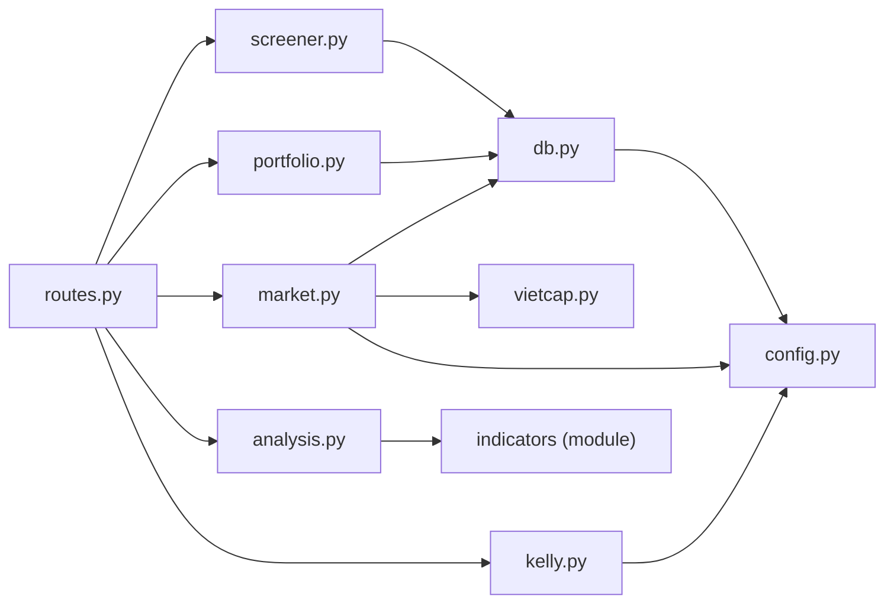

**Diagram sources**
- [routes.py:1-10](file://fintech/routes.py#L1-L10)
- [market.py:1-8](file://fintech/market.py#L1-L8)
- [analysis.py:15-22](file://fintech/analysis.py#L15-L22)
- [portfolio.py:1-8](file://fintech/portfolio.py#L1-L8)
- [screener.py:1-14](file://fintech/screener.py#L1-L14)
- [kelly.py:1-11](file://fintech/kelly.py#L1-L11)
- [db.py:1-11](file://fintech/db.py#L1-L11)
- [config.py:1-80](file://fintech/config.py#L1-L80)

**Section sources**
- [routes.py:1-398](file://fintech/routes.py#L1-L398)
- [market.py:1-154](file://fintech/market.py#L1-L154)
- [analysis.py:1-680](file://fintech/analysis.py#L1-L680)
- [portfolio.py:1-310](file://fintech/portfolio.py#L1-L310)
- [screener.py:1-310](file://fintech/screener.py#L1-L310)
- [kelly.py:1-98](file://fintech/kelly.py#L1-L98)
- [db.py:1-450](file://fintech/db.py#L1-L450)
- [vietcap.py:1-260](file://fintech/vietcap.py#L1-L260)
- [config.py:1-80](file://fintech/config.py#L1-L80)

## Performance Considerations
- Database performance:
  - WAL journal mode and synchronous NORMAL improve throughput and durability balance.
  - Batch inserts via `executemany` reduce commit overhead.
  - Indexes on frequently queried columns like `ohlcv(symbol, date)`, `screen_results(run_id)`, `alerts(day, acknowledged)`.
- Network efficiency:
  - Candle caching reduces repeated API calls.
  - Fundamentals and dividend events have separate refresh intervals.
  - Vietcap client uses retries and a concurrency semaphore to avoid overwhelming the external API.
- Concurrency:
  - Screener uses a thread pool for parallel symbol analysis.
  - Portfolio scanning respects a cooldown interval to avoid excessive re-analysis.
- Serverless considerations:
  - Ephemeral filesystem on Vercel requires persistent storage configuration via environment variables.
  - Long-running scans may be interrupted; stale run reconciliation prevents blocking new runs.

[No sources needed since this section provides general guidance]

## Troubleshooting Guide
Common issues and resolutions:
- Missing or invalid symbol data:
  - Ensure symbol list refresh is triggered or wait for scheduled refresh.
  - Validate symbol normalization and exchange mapping.
- API failures:
  - VietcapError indicates transport or data issues; check connectivity and endpoint availability.
  - Routes map Vietcap errors to 502 responses for data-related failures.
- Insufficient historical data:
  - Analysis requires minimum bars; increase history_days or ensure sufficient candles exist.
- Stale screener runs:
  - On serverless restarts, stale RUNNING runs are marked ERROR; start a new run.
- Settings validation:
  - Only allowed keys are accepted; numeric fields must be non-negative.
- Cache staleness:
  - Adjust cache_hours in settings to balance freshness and API usage.

**Section sources**
- [routes.py:71-87](file://fintech/routes.py#L71-L87)
- [routes.py:98-133](file://fintech/routes.py#L98-L133)
- [vietcap.py:42-58](file://fintech/vietcap.py#L42-L58)
- [analysis.py:598-605](file://fintech/analysis.py#L598-L605)
- [screener.py:214-235](file://fintech/screener.py#L214-L235)
- [routes.py:368-397](file://fintech/routes.py#L368-L397)

## Conclusion
FinViet Pro’s modular Flask architecture cleanly separates HTTP routing, business logic, data access, and external integrations. The market service layer abstracts Vietcap API interactions with robust caching, while the analysis engine delivers comprehensive technical signals and actionable levels. Portfolio and screener modules provide operational workflows backed by SQLite persistence. Configuration management and error handling ensure resilience across local and serverless deployments. This design supports scalability, maintainability, and clear extension points for additional indicators, strategies, or data sources.

[No sources needed since this section summarizes without analyzing specific files]