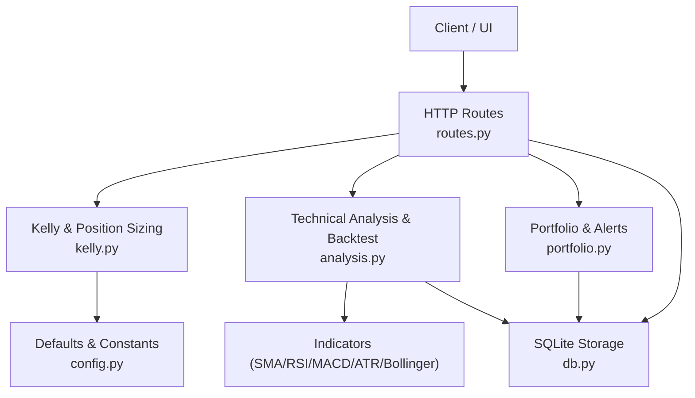
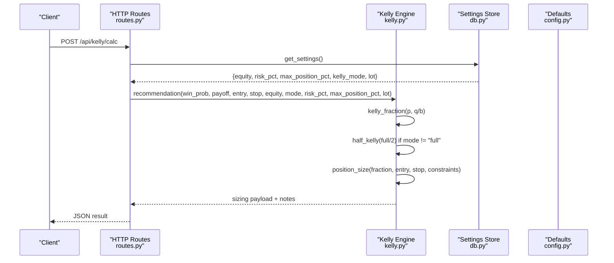
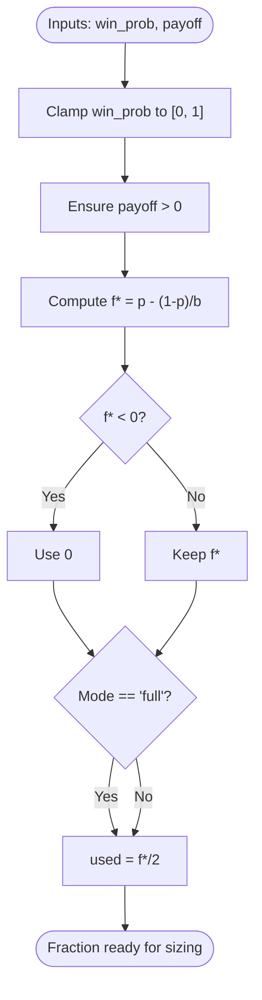
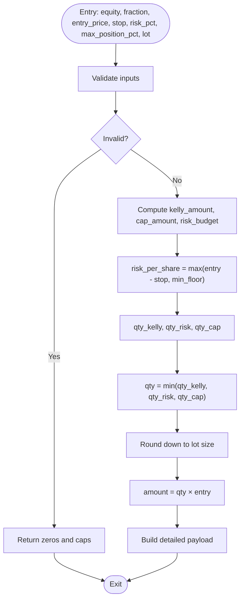
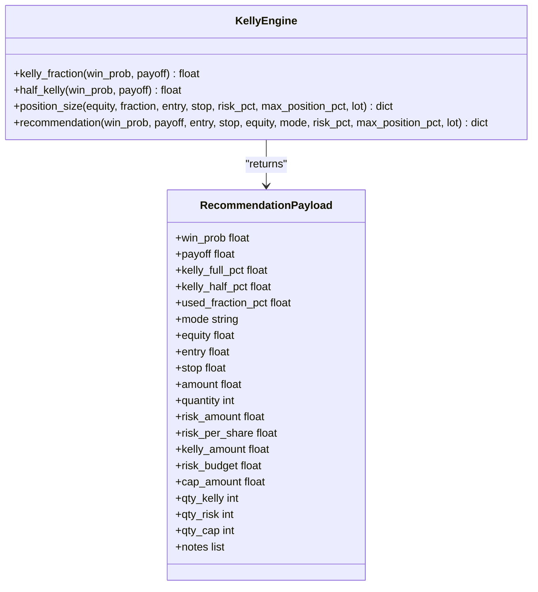
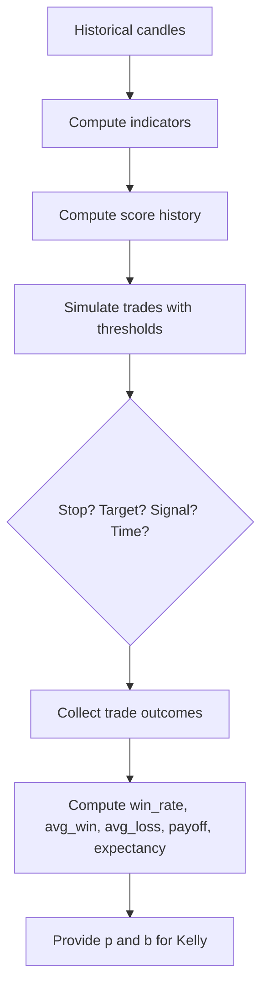
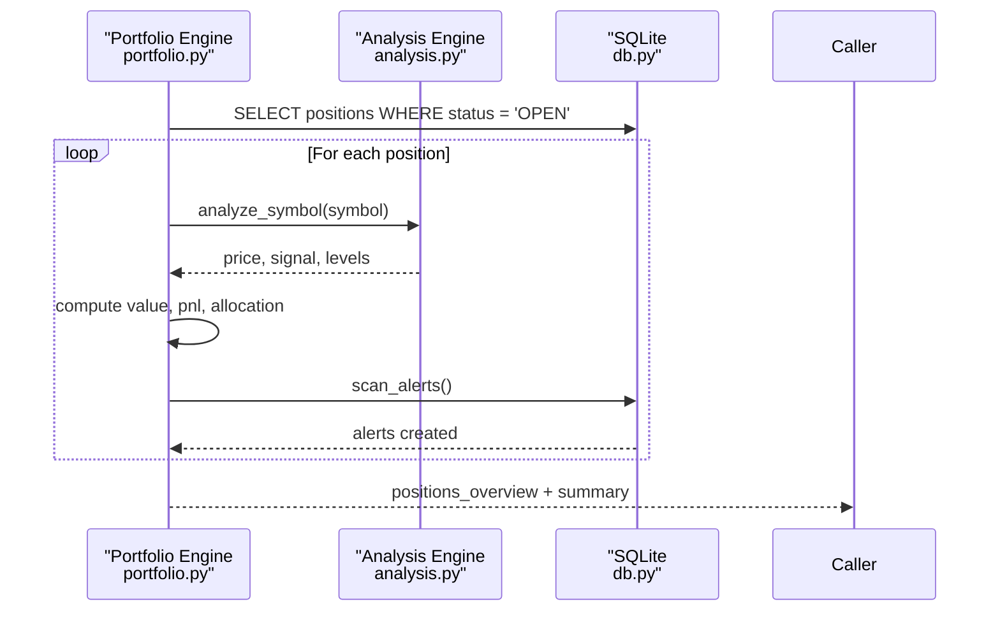
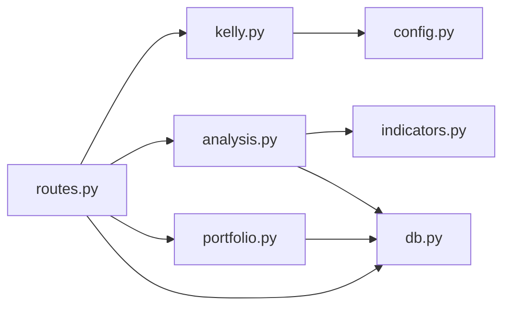

# Capital Management System

<cite>
**Referenced Files in This Document**   
- [README.md](file://README.md)
- [kelly.py](file://fintech/kelly.py)
- [analysis.py](file://fintech/analysis.py)
- [portfolio.py](file://fintech/portfolio.py)
- [routes.py](file://fintech/routes.py)
- [db.py](file://fintech/db.py)
- [config.py](file://fintech/config.py)
</cite>

## Table of Contents
1. [Introduction](#introduction)
2. [Project Structure](#project-structure)
3. [Core Components](#core-components)
4. [Architecture Overview](#architecture-overview)
5. [Detailed Component Analysis](#detailed-component-analysis)
6. [Dependency Analysis](#dependency-analysis)
7. [Performance Considerations](#performance-considerations)
8. [Troubleshooting Guide](#troubleshooting-guide)
9. [Conclusion](#conclusion)

## Introduction
This document explains the capital management system built around advanced position sizing using the Kelly Criterion. The system implements:
- Full Kelly formula for optimal long-term growth.
- Edward Thorp’s 1/2 Kelly modification to reduce drawdowns and smooth equity curves.
- A position sizing engine that enforces multiple constraints: risk percentage per trade, maximum single-position allocation, and lot-size rounding for Vietnamese market requirements.
- Integration with a technical analysis and backtesting framework that supplies historical win rates and payoff ratios as inputs to Kelly calculations.
- Portfolio tracking, alerting, and lifecycle management for open positions.

The goal is to make the mathematical theory accessible while providing enough implementation detail for developers who need to extend or audit the system.

## Project Structure
At a high level, the capital management logic lives in `kelly.py`, but it depends on configuration defaults, HTTP routes, technical analysis, portfolio state, and SQLite persistence.

**Diagram sources**
- [routes.py:158-196](file://fintech/routes.py#L158-L196)
- [kelly.py:15-97](file://fintech/kelly.py#L15-L97)
- [analysis.py:390-490](file://fintech/analysis.py#L390-L490)
- [portfolio.py:30-80](file://fintech/portfolio.py#L30-L80)
- [db.py:128-229](file://fintech/db.py#L128-L229)
- [config.py:43-55](file://fintech/config.py#L43-L55)

**Section sources**
- [README.md:1-24](file://README.md#L1-L24)
- [README.md:59-68](file://README.md#L59-L68)
- [README.md:79-105](file://README.md#L79-L105)

## Core Components
- **Kelly math**: full Kelly fraction and half-Kelly safety fraction.
- **Position sizing engine**: converts a capital fraction into an executable order size under multiple constraints.
- **Recommendation API**: composes Kelly inputs, sizing results, and user-facing notes.
- **Backtesting integration**: computes win rate and payoff ratio from simulated trades.
- **Portfolio engine**: manages positions, watchlist, and alerts; integrates with analysis for live levels.
- **Configuration and settings**: default capital, risk budget, max allocation, lot size, and Kelly mode.

**Section sources**
- [kelly.py:1-11](file://fintech/kelly.py#L1-L11)
- [kelly.py:15-27](file://fintech/kelly.py#L15-L27)
- [kelly.py:30-63](file://fintech/kelly.py#L30-L63)
- [kelly.py:66-97](file://fintech/kelly.py#L66-L97)
- [analysis.py:390-490](file://fintech/analysis.py#L390-L490)
- [portfolio.py:30-80](file://fintech/portfolio.py#L30-L80)
- [config.py:43-55](file://fintech/config.py#L43-L55)

## Architecture Overview
The capital management flow starts when a client requests a Kelly calculation. The route layer reads current settings, validates inputs, and calls the Kelly recommendation function. That function chooses between full Kelly and half Kelly based on configuration, then runs the position sizing engine with risk-per-trade, maximum position cap, and lot rounding. The result includes suggested quantity, amount, risk exposure, and explanatory notes.

**Diagram sources**
- [routes.py:158-196](file://fintech/routes.py#L158-L196)
- [kelly.py:66-97](file://fintech/kelly.py#L66-L97)
- [kelly.py:15-27](file://fintech/kelly.py#L15-L27)
- [kelly.py:30-63](file://fintech/kelly.py#L30-L63)
- [db.py:222-229](file://fintech/db.py#L222-L229)
- [config.py:43-55](file://fintech/config.py#L43-L55)

## Detailed Component Analysis

### Mathematical Theory: Full Kelly and Half Kelly
- **Full Kelly**: f* = p - q / b, where p is the probability of winning, q = 1 - p, and b is the net payoff ratio (average win divided by average loss).
- **Half Kelly**: f_half = f* / 2, recommended by Edward Thorp to reduce drawdowns at the cost of roughly 25% less growth potential.

In this codebase:
- `kelly_fraction` computes full Kelly with safe bounds and floor at zero.
- `half_kelly` returns half of the full Kelly fraction.
- The recommendation function selects the used fraction based on the configured mode ("half" vs "full").

**Diagram sources**
- [kelly.py:15-27](file://fintech/kelly.py#L15-L27)
- [kelly.py:66-74](file://fintech/kelly.py#L66-L74)

**Section sources**
- [kelly.py:1-11](file://fintech/kelly.py#L1-L11)
- [kelly.py:15-27](file://fintech/kelly.py#L15-L27)
- [kelly.py:66-74](file://fintech/kelly.py#L66-L74)

### Position Sizing Engine: Constraints and Lot Rounding
The sizing engine translates a capital fraction into an executable order size under three main constraints:
1. **Kelly-based allocation**: equity × used fraction.
2. **Risk-based allocation**: equity × risk_pct divided by risk_per_share.
3. **Maximum position cap**: equity × max_position_pct.

It also rounds down to the nearest lot size (default 100 shares), which aligns with Vietnamese market trading rules.

Key behaviors:
- If equity, entry, or fraction are invalid, the engine returns zero-sized results.
- Risk per share is derived from the distance between entry and stop, with a minimum floor to avoid degenerate cases.
- Final quantity is the minimum of Kelly quantity, risk quantity, and cap quantity, rounded down to the lot size.
- The returned payload includes detailed breakdowns: total amount, quantity, risk amount, risk per share, Kelly amount, risk budget, cap amount, and individual quantities before rounding.

**Diagram sources**
- [kelly.py:30-63](file://fintech/kelly.py#L30-L63)

**Section sources**
- [kelly.py:30-63](file://fintech/kelly.py#L30-L63)

### Recommendation API: Inputs, Outputs, and Notes
The recommendation function composes:
- Full Kelly and half Kelly fractions.
- Selected fraction based on mode ("half" or "full").
- Position sizing with all constraints.
- User-facing notes explaining Kelly behavior, fractional usage, and risk guidance.

Outputs include:
- Win probability and payoff.
- Full and half Kelly percentages.
- Used fraction percentage and mode.
- Equity, entry, stop.
- Sizing details: amount, quantity, risk metrics, budgets, and pre-round quantities.
- Notes describing whether Kelly is non-positive, why half Kelly is used, and general risk advice.

**Diagram sources**
- [kelly.py:15-27](file://fintech/kelly.py#L15-L27)
- [kelly.py:30-63](file://fintech/kelly.py#L30-L63)
- [kelly.py:66-97](file://fintech/kelly.py#L66-L97)

**Section sources**
- [kelly.py:66-97](file://fintech/kelly.py#L66-L97)

### Backtesting Framework Integration: Kelly Inputs from Historical Performance
The technical analysis module simulates bar-by-bar signals and calculates:
- Win rate.
- Average win and average loss.
- Payoff ratio (average win / absolute average loss).
- Expectancy and drawdown statistics.

These outputs feed directly into Kelly calculations:
- Win rate becomes p (probability of winning).
- Payoff ratio becomes b (net payoff).

The backtester uses:
- Buy threshold and sell threshold from configuration.
- Stop loss set at 1.5× ATR below entry.
- Target profit set at 2R (twice the risk).
- Time exit after a fixed number of bars if neither stop nor target is hit.

**Diagram sources**
- [analysis.py:390-490](file://fintech/analysis.py#L390-L490)

**Section sources**
- [analysis.py:390-490](file://fintech/analysis.py#L390-L490)

### Portfolio Tracking and Position Lifecycle
The portfolio module manages:
- Open positions with entry price, quantity, stop loss, take profit, and notes.
- Real-time PnL and allocation based on latest prices.
- Watchlist monitoring and alert generation.
- Alert scanning for stop-loss hits, take-profit hits, sell signals, buy signals, trailing stops, support breaks, and target price reaches.

Integration points:
- Uses analysis to compute current price, signal, and actionable levels.
- Persists positions, alerts, and settings via SQLite.
- Provides overview and summary endpoints for the UI.

**Diagram sources**
- [portfolio.py:30-80](file://fintech/portfolio.py#L30-L80)
- [portfolio.py:179-278](file://fintech/portfolio.py#L179-L278)
- [db.py:93-126](file://fintech/db.py#L93-L126)

**Section sources**
- [portfolio.py:30-80](file://fintech/portfolio.py#L30-L80)
- [portfolio.py:179-278](file://fintech/portfolio.py#L179-L278)
- [db.py:93-126](file://fintech/db.py#L93-L126)

### Configuration and Settings: Defaults for Kelly and Risk Controls
Default settings define:
- Initial equity.
- Risk per trade percentage.
- Maximum single-position allocation.
- Kelly mode ("half" or "full").
- History days, cache hours, scan frequency, minimum volume, lot size, and screener limits.

These values are merged with persisted settings and consumed by routes and engines.

**Section sources**
- [config.py:43-55](file://fintech/config.py#L43-L55)
- [routes.py:368-397](file://fintech/routes.py#L368-L397)
- [db.py:222-229](file://fintech/db.py#L222-L229)

## Dependency Analysis
The capital management system has clear separation of concerns:
- Routes expose HTTP endpoints and validate inputs.
- Kelly module provides pure math and sizing logic.
- Analysis module provides technical indicators, scoring, and backtesting stats.
- Portfolio module manages state and alerts.
- DB module persists data and settings.
- Config module defines defaults and environment detection.

**Diagram sources**
- [routes.py:1-10](file://fintech/routes.py#L1-L10)
- [kelly.py:1-11](file://fintech/kelly.py#L1-L11)
- [analysis.py:1-10](file://fintech/analysis.py#L1-L10)
- [portfolio.py:1-8](file://fintech/portfolio.py#L1-L8)
- [db.py:1-10](file://fintech/db.py#L1-L10)
- [config.py:1-10](file://fintech/config.py#L1-L10)

**Section sources**
- [routes.py:1-10](file://fintech/routes.py#L1-L10)
- [kelly.py:1-11](file://fintech/kelly.py#L1-L11)
- [analysis.py:1-10](file://fintech/analysis.py#L1-L10)
- [portfolio.py:1-8](file://fintech/portfolio.py#L1-L8)
- [db.py:1-10](file://fintech/db.py#L1-L10)
- [config.py:1-10](file://fintech/config.py#L1-L10)

## Performance Considerations
- **Kelly computation is O(1)**: minimal arithmetic operations with input clamping and safeguards.
- **Position sizing is O(1)**: constant-time calculations and integer rounding.
- **Backtesting is O(n)**: iterates over recent bars to simulate trades and compute statistics.
- **Portfolio scanning is O(m)**: scans open positions and watchlist entries, calling analysis once per symbol.
- **Database access uses WAL mode** for better concurrency and reduced locking.

Practical recommendations:
- Limit backtest window to recent bars to keep computations fast.
- Cache analysis results and use refresh flags to avoid redundant network calls.
- Tune scan frequency based on server capacity and deployment model (local vs serverless).

[No sources needed since this section provides general guidance]

## Troubleshooting Guide
Common issues and resolutions:
- **Kelly ≤ 0**: Indicates insufficient win probability relative to payoff; consider revisiting strategy or adjusting thresholds.
- **Quantity rounds to zero**: Suggested size is below one lot; either increase capital or adjust risk parameters.
- **Stop loss must be below entry**: Route validation rejects invalid stop configurations.
- **Missing symbol or invalid quantity/cost**: Portfolio creation requires valid inputs; check request payloads.
- **Alerts not firing**: Verify scan interval and last scan timestamp; force scan if necessary.

Operational checks:
- Health endpoint confirms app status and storage type.
- Settings endpoint shows current configuration; update via allowed keys only.
- Recent analyses endpoint helps verify analysis pipeline and backtest stats.

**Section sources**
- [kelly.py:76-83](file://fintech/kelly.py#L76-L83)
- [routes.py:176-196](file://fintech/routes.py#L176-L196)
- [portfolio.py:83-106](file://fintech/portfolio.py#L83-L106)
- [portfolio.py:179-278](file://fintech/portfolio.py#L179-L278)
- [routes.py:58-68](file://fintech/routes.py#L58-L68)
- [routes.py:374-397](file://fintech/routes.py#L374-L397)

## Conclusion
The capital management system combines rigorous mathematical theory with practical risk controls:
- Full Kelly maximizes long-term compounding but can produce deep drawdowns.
- Half Kelly, following Edward Thorp, reduces drawdowns significantly while accepting lower growth.
- The position sizing engine enforces robust constraints: risk per trade, maximum allocation, and lot rounding for Vietnamese markets.
- Backtesting provides empirical win rates and payoff ratios to inform Kelly inputs.
- Portfolio tracking and alerting ensure disciplined execution and ongoing risk monitoring.

For beginners, start with half Kelly and conservative risk percentages. For experienced developers, audit the sizing constraints, tune backtest windows, and integrate custom risk models as needed.

[No sources needed since this section summarizes without analyzing specific files]