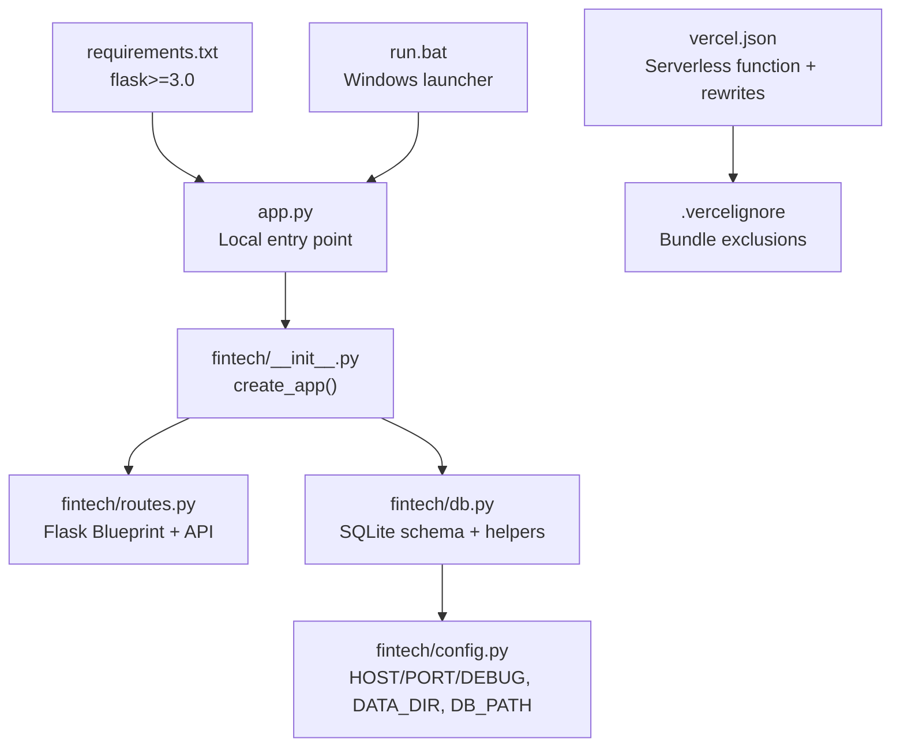
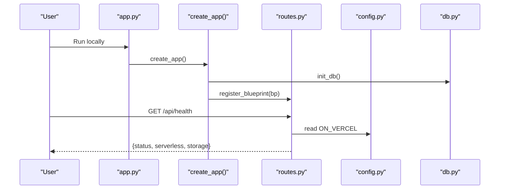
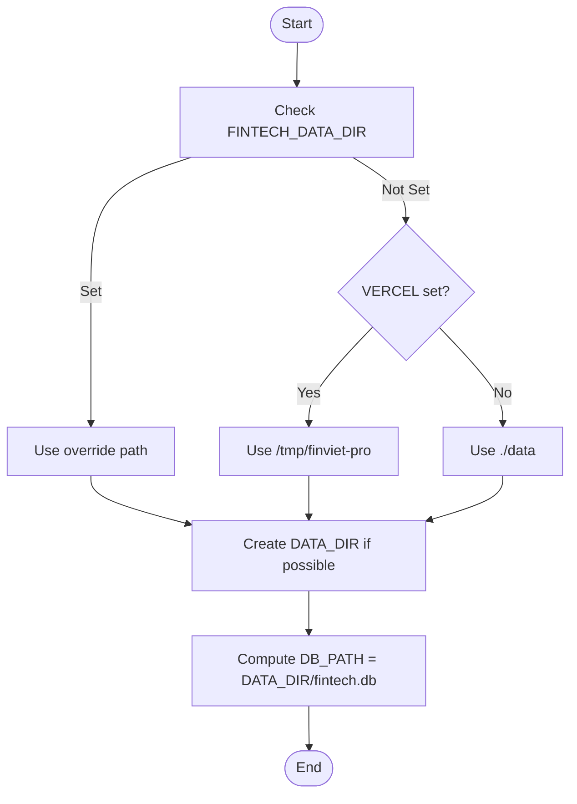
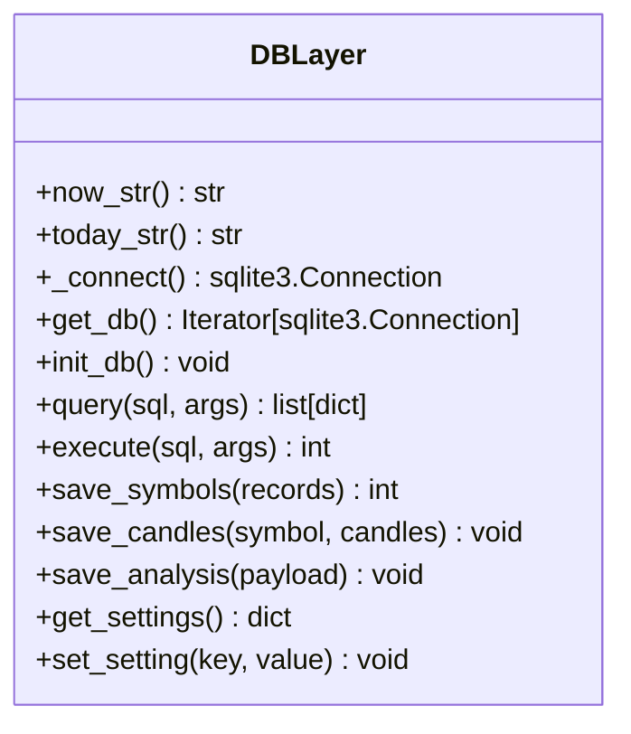
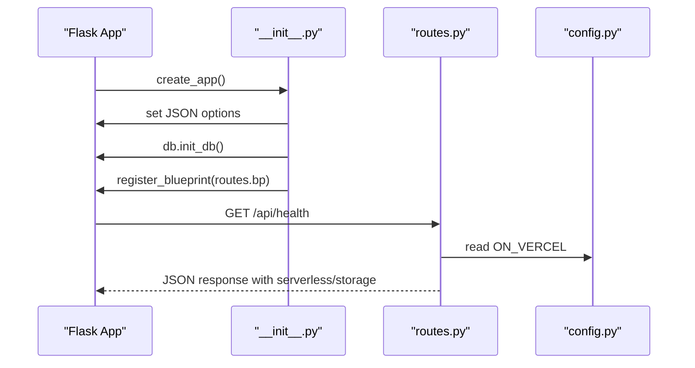
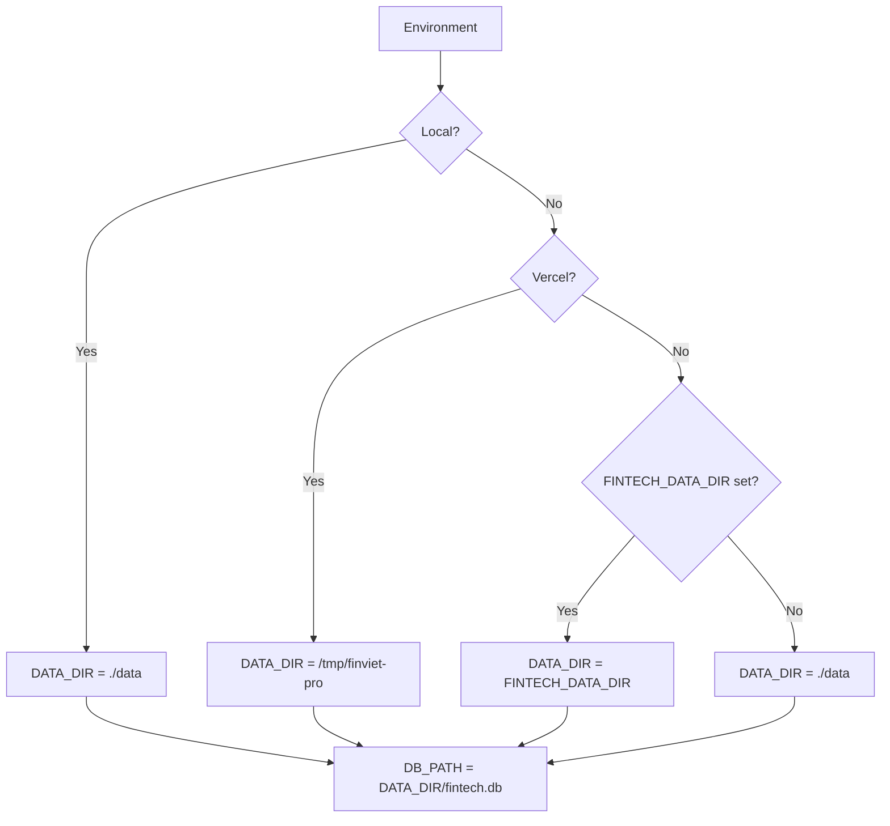

# Configuration & Deployment

<cite>
**Referenced Files in This Document**
- [app.py](file://app.py)
- [config.py](file://fintech/config.py)
- [db.py](file://fintech/db.py)
- [__init__.py](file://fintech/__init__.py)
- [routes.py](file://fintech/routes.py)
- [vercel.json](file://vercel.json)
- [.vercelignore](file://.vercelignore)
- [requirements.txt](file://requirements.txt)
- [run.bat](file://run.bat)
- [README.md](file://README.md)
</cite>

## Table of Contents
1. [Introduction](#introduction)
2. [Project Structure](#project-structure)
3. [Core Components](#core-components)
4. [Architecture Overview](#architecture-overview)
5. [Detailed Component Analysis](#detailed-component-analysis)
6. [Environment Variables and Validation](#environment-variables-and-validation)
7. [Configuration Management](#configuration-management)
8. [Database Initialization and Data Storage](#database-initialization-and-data-storage)
9. [Local Development Setup](#local-development-setup)
10. [Vercel Serverless Deployment](#vercel-serverless-deployment)
11. [Production Deployment Strategies](#production-deployment-strategies)
12. [Performance Tuning](#performance-tuning)
13. [Logging and Monitoring](#logging-and-monitoring)
14. [Troubleshooting Guide](#troubleshooting-guide)
15. [Conclusion](#conclusion)

## Introduction
This document explains how to configure, deploy, and operate FinViet Pro across local development and production environments. It covers environment variables, configuration management, database initialization, Vercel serverless deployment, production strategies, performance tuning, logging, monitoring, and troubleshooting.

## Project Structure
FinViet Pro is a Flask application with SQLite storage. The entry point runs the Flask app locally, while Vercel uses a separate serverless entrypoint defined by `vercel.json`. Configuration is centralized in `fintech/config.py`, and database schema and helpers are in `fintech/db.py`.

**Diagram sources**
- [app.py:1-10](file://app.py#L1-L10)
- [fintech/__init__.py:7-21](file://fintech/__init__.py#L7-L21)
- [fintech/routes.py:1-10](file://fintech/routes.py#L1-L10)
- [fintech/db.py:1-11](file://fintech/db.py#L1-L11)
- [fintech/config.py:1-30](file://fintech/config.py#L1-L30)
- [vercel.json:1-14](file://vercel.json#L1-L14)
- [.vercelignore:1-8](file://.vercelignore#L1-L8)
- [requirements.txt:1-2](file://requirements.txt#L1-L2)
- [run.bat:1-29](file://run.bat#L1-L29)

**Section sources**
- [README.md:79-105](file://README.md#L79-L105)

## Core Components
- Application factory initializes Flask, registers routes, and ensures the database is initialized.
- Configuration module centralizes environment-driven settings and defaults.
- Database layer defines schema, connection helpers, and default settings persistence.
- Routes expose pages and JSON APIs, including health checks that report serverless mode.

Key responsibilities:
- `app.py`: Starts Flask with host/port/debug from config for local execution.
- `fintech/__init__.py`: Creates Flask app, registers blueprint, sets JSON behavior, adds cache headers for JSON responses.
- `fintech/config.py`: Reads environment variables, detects Vercel, computes data directory and DB path, defines defaults and constants.
- `fintech/db.py`: Defines schema, initializes tables, manages connections, persists settings, and provides query helpers.
- `fintech/routes.py`: Exposes endpoints like `/api/health` which reports serverless status and storage type.

**Section sources**
- [app.py:1-10](file://app.py#L1-L10)
- [fintech/__init__.py:7-21](file://fintech/__init__.py#L7-L21)
- [fintech/config.py:1-30](file://fintech/config.py#L1-L30)
- [fintech/db.py:148-175](file://fintech/db.py#L148-L175)
- [fintech/routes.py:58-68](file://fintech/routes.py#L58-L68)

## Architecture Overview
The system follows a layered architecture:
- Entry points: local (`app.py`) and serverless (`vercel.json` pointing to Python runtime).
- Application layer: Flask app created via `create_app`, registering routes and initializing DB.
- Configuration layer: Environment variables and defaults determine runtime behavior.
- Data layer: SQLite database with WAL enabled; data directory varies by environment (local vs ephemeral `/tmp`).

**Diagram sources**
- [app.py:1-10](file://app.py#L1-L10)
- [fintech/__init__.py:7-21](file://fintech/__init__.py#L7-L21)
- [fintech/routes.py:58-68](file://fintech/routes.py#L58-L68)
- [fintech/config.py:7-17](file://fintech/config.py#L7-L17)
- [fintech/db.py:169-175](file://fintech/db.py#L169-L175)

## Detailed Component Analysis

### Configuration Module
- Detects Vercel via `VERCEL` environment variable.
- Determines data directory:
  - If `FINTECH_DATA_DIR` is set, use it.
  - Else if on Vercel, use `/tmp/finviet-pro`.
  - Else use project-local `data/`.
- Computes `DB_PATH` based on `DATA_DIR`.
- Reads `FINTECH_HOST`, `FINTECH_PORT`, `FINTECH_DEBUG` with defaults.

**Diagram sources**
- [fintech/config.py:7-25](file://fintech/config.py#L7-L25)

**Section sources**
- [fintech/config.py:7-30](file://fintech/config.py#L7-L30)

### Database Layer
- Schema includes tables for symbols, OHLCV, fundamentals, dividend events, analyses, screen runs/results, positions, watchlist, alerts, settings, and cache stamps.
- Connection helper enables WAL journaling and synchronous NORMAL for better concurrency and performance.
- `init_db()` creates tables and seeds default settings if missing.

**Diagram sources**
- [fintech/db.py:140-175](file://fintech/db.py#L140-L175)
- [fintech/db.py:234-257](file://fintech/db.py#L234-L257)
- [fintech/db.py:289-311](file://fintech/db.py#L289-L311)
- [fintech/db.py:413-434](file://fintech/db.py#L413-L434)
- [fintech/db.py:201-229](file://fintech/db.py#L201-L229)

**Section sources**
- [fintech/db.py:12-137](file://fintech/db.py#L12-L137)
- [fintech/db.py:148-175](file://fintech/db.py#L148-L175)

### Application Factory and Routes
- `create_app()` initializes JSON behavior, calls `db.init_db()`, registers routes blueprint, and adds cache-control headers for JSON responses.
- Health endpoint returns serverless flag and storage type based on `ON_VERCEL`.

**Diagram sources**
- [fintech/__init__.py:7-21](file://fintech/__init__.py#L7-L21)
- [fintech/routes.py:58-68](file://fintech/routes.py#L58-L68)
- [fintech/config.py:7-17](file://fintech/config.py#L7-L17)

**Section sources**
- [fintech/__init__.py:7-21](file://fintech/__init__.py#L7-L21)
- [fintech/routes.py:58-68](file://fintech/routes.py#L58-L68)

## Environment Variables and Validation
- `FINTECH_HOST`: Host address for local server; default `"127.0.0.1"`.
- `FINTECH_PORT`: Port number; default `5000`; converted to integer.
- `FINTECH_DEBUG`: Enables debug mode when equal to `"1"`; default disabled.
- `VERCEL`: Boolean-like detection for serverless environment; presence implies ephemeral filesystem.
- `FINTECH_DATA_DIR`: Overrides persistent data directory; recommended for non-Vercel deployments requiring durable storage.

Validation rules:
- `FINTECH_PORT` is cast to `int`; invalid values will raise an error at startup.
- `FINTECH_DEBUG` is truthy only when exactly `"1"`.
- `VERCEL` presence toggles serverless behavior and storage strategy.
- `FINTECH_DATA_DIR` must be writable; otherwise, DB operations may fail or fall back to best-effort behavior.

**Section sources**
- [fintech/config.py:27-30](file://fintech/config.py#L27-L30)
- [fintech/config.py:7-17](file://fintech/config.py#L7-L17)

## Configuration Management
The configuration system adapts to different environments:
- Local development: Uses project-local `data/` directory for SQLite.
- Vercel serverless: Uses `/tmp/finviet-pro` due to read-only filesystem except `/tmp`.
- Custom persistent storage: Set `FINTECH_DATA_DIR` to a mounted volume (e.g., VPS, Render, Railway).

Behavioral differences:
- On Vercel, health endpoint reports `serverless: true` and `storage: "ephemeral"`.
- Default settings are seeded into SQLite during initialization.

**Diagram sources**
- [fintech/config.py:7-25](file://fintech/config.py#L7-L25)
- [fintech/routes.py:58-68](file://fintech/routes.py#L58-L68)

**Section sources**
- [fintech/config.py:7-25](file://fintech/config.py#L7-L25)
- [fintech/routes.py:58-68](file://fintech/routes.py#L58-L68)

## Database Initialization and Data Storage
- Schema creation occurs on app startup via `init_db()`.
- Default user settings are inserted if not present.
- SQLite is configured with WAL mode and NORMAL synchronous for improved concurrency and durability.
- Data directory creation is attempted; failures on read-only filesystems are tolerated but may affect persistence.

Operational notes:
- On Vercel, data stored under `/tmp` is ephemeral and may be lost on cold starts or instance changes.
- For persistent storage outside Vercel, set `FINTECH_DATA_DIR` to a durable mount.

**Section sources**
- [fintech/db.py:169-175](file://fintech/db.py#L169-L175)
- [fintech/db.py:148-153](file://fintech/db.py#L148-L153)
- [fintech/config.py:19-25](file://fintech/config.py#L19-L25)

## Local Development Setup
Steps:
1. Ensure Python 3.10+ (preferably 3.12+) is installed and available in PATH.
2. Install dependencies: `pip install -r requirements.txt`.
3. Run the application: `python app.py`.
4. Open browser to `http://127.0.0.1:5000`.

Optional:
- Use Windows launcher `run.bat`, which checks Python, installs Flask if missing, opens the browser, and runs the app.

Environment variables (optional):
- `FINTECH_HOST`: Bind address (default `127.0.0.1`).
- `FINTECH_PORT`: Port (default `5000`).
- `FINTECH_DEBUG=1`: Enable debug mode.

**Section sources**
- [README.md:26-43](file://README.md#L26-L43)
- [run.bat:1-29](file://run.bat#L1-L29)
- [app.py:1-10](file://app.py#L1-L10)

## Vercel Serverless Deployment
Prerequisites:
- Node.js and Vercel CLI installed globally.
- GitHub repository containing the project.

Deployment methods:
- Vercel CLI: `vercel login`, `vercel` for preview, `vercel --prod` for production.
- GitHub integration: Import repository on vercel.com/new; keep defaults; deploy.

Serverless specifics:
- Runtime: Python 3.12.
- Function timeout: 60 seconds.
- Rewrites: All requests routed to `/api/index`.
- Include files: `fintech/**` templates and static assets.
- Ignore patterns: `data/`, `tools/`, temp directories, caches, bytecode, logs.

Important constraints:
- Filesystem write access limited to `/tmp`; data is ephemeral.
- Large screener scans may be truncated by timeout; limit universe size.
- Instance sleep after response means background scanning requires user-triggered actions.
- Cold start latency is expected.
- External internet access required for Vietcap data; verify via `/api/health`.

Verification:
- Call `GET /api/health` to confirm serverless mode and storage type.

**Section sources**
- [README.md:114-154](file://README.md#L114-L154)
- [vercel.json:1-14](file://vercel.json#L1-L14)
- [.vercelignore:1-8](file://.vercelignore#L1-L8)
- [fintech/routes.py:58-68](file://fintech/routes.py#L58-L68)

## Production Deployment Strategies
Options:
- Vercel serverless: Suitable for demos and low-volume usage; data is ephemeral.
- VPS/Render/Railway: Persistent SQLite via `FINTECH_DATA_DIR` pointing to a mounted volume.
- Containerized deployment: Package Flask app with a process manager (e.g., gunicorn) behind a reverse proxy.

Recommendations:
- Use a persistent volume for SQLite to avoid data loss.
- Configure a reverse proxy (nginx/Caddy) for TLS termination and caching.
- Set `FINTECH_HOST` to bind appropriately (e.g., `0.0.0.0` for containerized services).
- Disable debug mode in production (`FINTECH_DEBUG` not set or not `"1"`).
- Monitor disk space and file permissions for the data directory.

**Section sources**
- [README.md:139-147](file://README.md#L139-L147)
- [fintech/config.py:7-25](file://fintech/config.py#L7-L25)

## Performance Tuning
- SQLite WAL mode and NORMAL synchronous improve concurrency and reduce lock contention.
- Cache durations:
  - Candle history: configurable via settings (`history_days`, `cache_hours`).
  - Symbol list refresh interval: controlled by `SYMBOLS_REFRESH_HOURS`.
  - Fundamentals refresh interval: controlled by `FUNDAMENTALS_REFRESH_HOURS`.
- Limit screener universe size to avoid timeouts on serverless platforms.
- Reduce request payload sizes where possible; leverage client-side caching for static assets.

Operational tips:
- Tune `scan_minutes` and other settings via UI or persisted settings table.
- Avoid frequent full symbol refreshes; rely on cached lists unless forced.

**Section sources**
- [fintech/db.py:148-153](file://fintech/db.py#L148-L153)
- [fintech/config.py:31-35](file://fintech/config.py#L31-L35)
- [README.md:77-78](file://README.md#L77-L78)

## Logging and Monitoring
- No dedicated logging framework is configured; consider adding structured logging in production.
- Health endpoint provides basic operational signals:
  - `status`: overall health.
  - `serverless`: indicates serverless runtime.
  - `storage`: indicates ephemeral vs local-sqlite.
- For external monitoring:
  - Poll `/api/health` periodically.
  - Track HTTP status codes and response times via your platform’s metrics.
  - Add application-level metrics (requests per minute, error rates) using a library like Prometheus client.

**Section sources**
- [fintech/routes.py:58-68](file://fintech/routes.py#L58-L68)

## Troubleshooting Guide
Common issues and resolutions:
- Cannot connect to database:
  - Verify `FINTECH_DATA_DIR` is writable.
  - On Vercel, understand `/tmp` is ephemeral; consider persistent storage elsewhere.
- Screener scan times out:
  - Reduce universe size; serverless functions have a 60-second limit.
- Cold start latency:
  - Expected on serverless; first request may be slower.
- Missing external data:
  - Ensure outbound internet access to Vietcap; check `/api/health`.
- Permission errors writing to data directory:
  - Adjust filesystem permissions or switch to a persistent volume.
- Debugging locally:
  - Set `FINTECH_DEBUG=1` to enable Flask debug mode.

Diagnostic steps:
- Confirm environment variables are set correctly.
- Validate `/api/health` response for serverless and storage indicators.
- Inspect application logs (platform-specific) for errors.

**Section sources**
- [README.md:139-154](file://README.md#L139-L154)
- [fintech/config.py:19-25](file://fintech/config.py#L19-L25)
- [fintech/routes.py:58-68](file://fintech/routes.py#L58-L68)

## Conclusion
FinViet Pro supports flexible configuration across local and serverless environments. Environment variables control host, port, debug mode, and data storage location. Vercel deployment is straightforward with built-in serverless configuration, but data persistence requires careful planning. For production, prefer persistent storage, proper process management, and robust monitoring. Use the provided health endpoint and environment variables to validate deployment correctness and troubleshoot issues effectively.