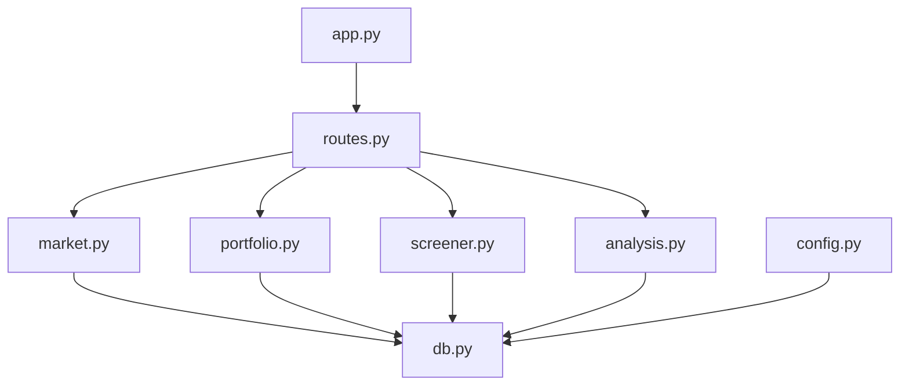
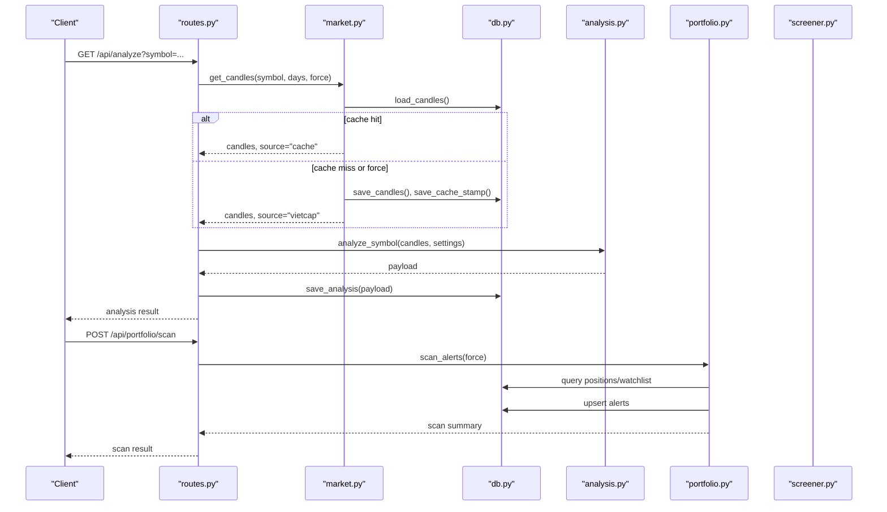
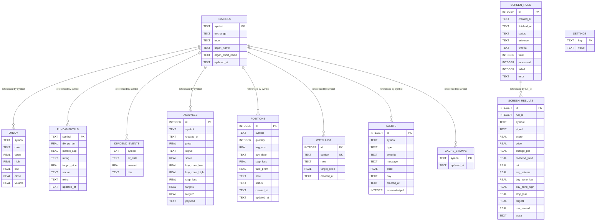
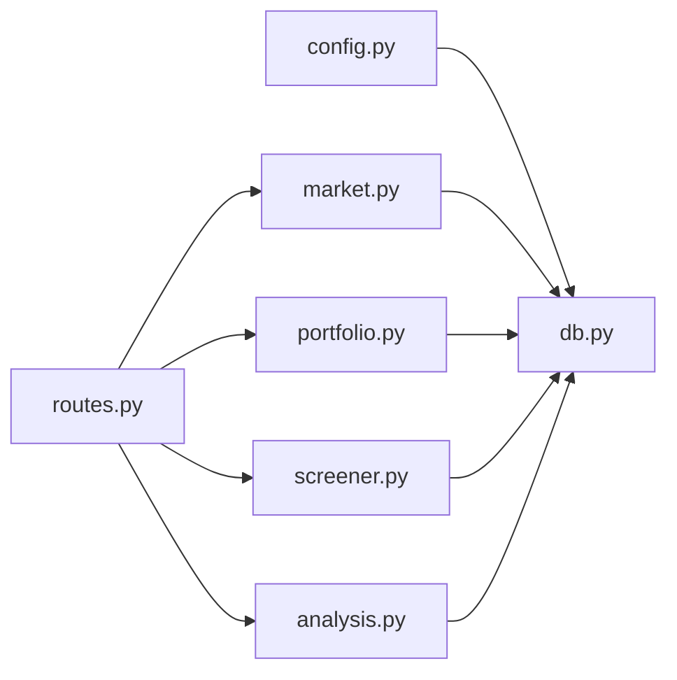
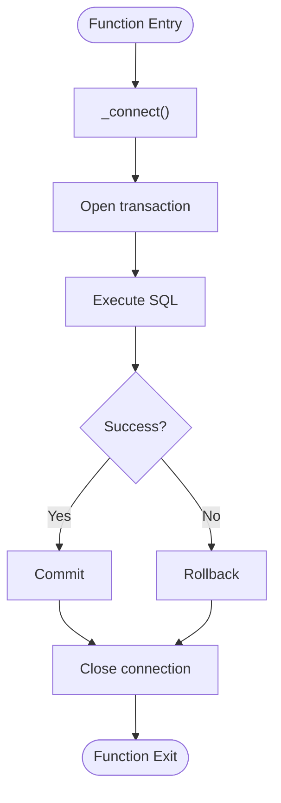

# Database Design

<cite>
**Referenced Files in This Document**
- [db.py](file://fintech/db.py)
- [config.py](file://fintech/config.py)
- [portfolio.py](file://fintech/portfolio.py)
- [screener.py](file://fintech/screener.py)
- [analysis.py](file://fintech/analysis.py)
- [market.py](file://fintech/market.py)
- [routes.py](file://fintech/routes.py)
- [app.py](file://app.py)
</cite>

## Table of Contents
1. [Introduction](#introduction)
2. [Project Structure](#project-structure)
3. [Core Components](#core-components)
4. [Architecture Overview](#architecture-overview)
5. [Detailed Component Analysis](#detailed-component-analysis)
6. [Dependency Analysis](#dependency-analysis)
7. [Performance Considerations](#performance-considerations)
8. [Troubleshooting Guide](#troubleshooting-guide)
9. [Conclusion](#conclusion)
10. [Appendices](#appendices)

## Introduction
This document describes the SQLite database design for FinViet Pro. It covers entity relationships, indexing strategy, validation rules, data access patterns, connection and transaction handling, lifecycle policies, security considerations, backup strategies, and migration guidance. The goal is to make the schema and its usage clear to both technical and non-technical readers.

FinViet Pro uses a single SQLite file as its persistent store. The schema defines reference data (symbols), market data (OHLCV), fundamentals, dividend events, analysis results, screener runs and results, portfolio positions, watchlist, alerts, application settings, and cache stamps. Business logic is implemented in Python modules that read and write through a shared storage layer.

## Project Structure
The database-related code is primarily located under the fintech package:
- Schema and storage helpers are defined in db.py.
- Configuration including DB path and default settings is in config.py.
- Portfolio operations (positions, watchlist, alerts) are in portfolio.py.
- Screener background jobs and progress tracking are in screener.py.
- Technical analysis engine writes analysis payloads to analyses in analysis.py via db.save_analysis.
- Market data caching reads/writes OHLCV, fundamentals, dividend events, and symbol metadata in market.py.
- HTTP routes in routes.py orchestrate API endpoints that call these modules.
- app.py starts the Flask application.

**Diagram sources**
- [app.py:1-10](file://app.py#L1-L10)
- [routes.py:1-398](file://fintech/routes.py#L1-L398)
- [market.py:1-154](file://fintech/market.py#L1-L154)
- [portfolio.py:1-310](file://fintech/portfolio.py#L1-L310)
- [screener.py:1-310](file://fintech/screener.py#L1-L310)
- [analysis.py:1-680](file://fintech/analysis.py#L1-L680)
- [db.py:1-450](file://fintech/db.py#L1-L450)
- [config.py:1-80](file://fintech/config.py#L1-L80)

**Section sources**
- [app.py:1-10](file://app.py#L1-L10)
- [routes.py:1-398](file://fintech/routes.py#L1-L398)
- [db.py:1-450](file://fintech/db.py#L1-L450)
- [config.py:1-80](file://fintech/config.py#L1-L80)

## Core Components
FinViet Pro’s SQLite database includes the following core entities:
- symbols: reference table for stock identifiers and exchange metadata.
- ohlcv: time-series price data per symbol.
- fundamentals: company-level metrics and ratings.
- dividend_events: historical dividend announcements per symbol.
- analyses: persisted analysis payloads with signals and levels.
- screen_runs: background screener job metadata and status.
- screen_results: matched screener outcomes per run.
- positions: user portfolio holdings.
- watchlist: user-curated list of symbols to monitor.
- alerts: generated notifications for positions and watchlist.
- settings: key/value application configuration.
- cache_stamps: last refresh timestamps for cached data.

Key constraints and keys:
- Primary keys are used for identity and uniqueness where appropriate (for example, symbol in symbols, composite primary keys in ohlcv and dividend_events).
- Unique constraints enforce business rules such as one alert per symbol/type/day and unique watchlist entries by symbol.
- Indexes are created on frequently filtered columns like symbol/date in ohlcv, symbol/created_at in analyses, day/acknowledged in alerts, and run_id in screen_results.

Data types:
- Text fields store codes, labels, notes, and JSON strings.
- REAL stores numeric values such as prices, volumes, scores, and percentages.
- INTEGER stores IDs, quantities, and flags.

Validation rules enforced at the database level:
- NOT NULL constraints on required fields (for example, symbol and date in ohlcv; type and severity in alerts).
- UNIQUE(symbol, type, day) prevents duplicate alerts per symbol/type/day.
- DEFAULT values (for example, status 'OPEN' in positions; acknowledged 0 in alerts).

Business rule implementations:
- Upserts use ON CONFLICT clauses to update existing records when duplicates occur (for example, symbols, ohlcv, dividend_events, settings, watchlist, alerts).
- Application logic enforces additional validations (for example, positive quantity and cost for positions; signal thresholds from config).

**Section sources**
- [db.py:12-137](file://fintech/db.py#L12-L137)
- [portfolio.py:83-125](file://fintech/portfolio.py#L83-L125)
- [screener.py:126-211](file://fintech/screener.py#L126-L211)
- [market.py:20-43](file://fintech/market.py#L20-L43)
- [config.py:37-55](file://fintech/config.py#L37-L55)

## Architecture Overview
The database architecture supports four main flows:
- Market data ingestion and caching: market.py fetches OHLCV and fundamentals from Vietcap, then persists them using db.py helpers. Cache stamps control refresh intervals.
- Analysis persistence: analysis.py computes signals and levels; routes.py calls db.save_analysis to persist analysis payloads.
- Screener execution: screener.py launches background threads to analyze symbols, filter by criteria, and persist results into screen_results while updating screen_runs progress.
- Portfolio and alerts: portfolio.py manages positions and watchlist, and generates alerts based on current prices and signals.

**Diagram sources**
- [routes.py:98-133](file://fintech/routes.py#L98-L133)
- [market.py:20-43](file://fintech/market.py#L20-L43)
- [db.py:289-351](file://fintech/db.py#L289-L351)
- [analysis.py:598-680](file://fintech/analysis.py#L598-L680)
- [portfolio.py:179-278](file://fintech/portfolio.py#L179-L278)

## Detailed Component Analysis

### Entity Relationship Model
The following diagram shows the main tables and their relationships. Foreign key relationships are not declared at the SQLite level but are implied by application logic and indexes.

**Diagram sources**
- [db.py:12-137](file://fintech/db.py#L12-L137)

**Section sources**
- [db.py:12-137](file://fintech/db.py#L12-L137)

### Data Validation Rules
Database-level validation:
- Required fields: NOT NULL constraints ensure critical columns are populated (for example, symbol and date in ohlcv; type and severity in alerts).
- Uniqueness: UNIQUE(symbol, type, day) ensures only one alert per symbol/type/day; UNIQUE(symbol) in watchlist prevents duplicate watchlist entries.
- Defaults: status defaults to 'OPEN' in positions; acknowledged defaults to 0 in alerts.

Application-level validation:
- Position creation validates symbol presence, positive quantity, and positive average cost.
- Settings updates validate allowed keys and numeric ranges.
- Screener criteria enforce minimum score, volume, price range, and dividend yield filters.

Upsert behavior:
- INSERT ... ON CONFLICT DO UPDATE is used across multiple tables to support idempotent writes (for example, symbols, ohlcv, dividend_events, settings, watchlist, alerts).

**Section sources**
- [db.py:12-137](file://fintech/db.py#L12-L137)
- [portfolio.py:83-125](file://fintech/portfolio.py#L83-L125)
- [routes.py:368-397](file://fintech/routes.py#L368-L397)
- [screener.py:100-123](file://fintech/screener.py#L100-L123)

### Indexing Strategy
Indexes are defined to optimize frequent queries:
- idx_ohlcv_symbol(symbol, date): accelerates candle retrieval per symbol and chronological ordering.
- idx_analyses_symbol(symbol, created_at): speeds up recent analyses and per-symbol lookups.
- idx_screen_results_run(run_id): improves join-like queries for screener results by run.
- idx_alerts_day(day, acknowledged): optimizes daily alert listing and unread counts.

Additional recommended indexes (not present in schema):
- positions(symbol, status) for portfolio overview filtering.
- fundamentals(updated_at) for freshness checks.
- cache_stamps(updated_at) for cache staleness evaluation.

These recommendations align with common query patterns observed in market.py, portfolio.py, and screener.py.

**Section sources**
- [db.py:22-28](file://fintech/db.py#L22-L28)
- [db.py:49-60](file://fintech/db.py#L49-L60)
- [db.py:75-91](file://fintech/db.py#L75-L91)
- [db.py:114-126](file://fintech/db.py#L114-L126)
- [market.py:20-43](file://fintech/market.py#L20-L43)
- [portfolio.py:30-62](file://fintech/portfolio.py#L30-L62)
- [screener.py:264-277](file://fintech/screener.py#L264-L277)

### Data Access Patterns
Connection management:
- Connections are created per operation via _connect(), which sets row_factory to sqlite3.Row and enables WAL journal mode and synchronous=NORMAL for performance.
- get_db() is a context manager that commits on success and rolls back on exception, ensuring transaction boundaries around each helper call.

Query helpers:
- query(): returns all rows as dicts.
- query_one(): returns the first row or None.
- execute(): performs write operations and returns lastrowid.
- executemany(): bulk inserts for efficiency.

Transaction handling:
- Each helper wraps a connection in a transaction; explicit multi-step transactions are not used beyond helper scope.
- Background screener batches inserts and periodically updates run progress within helper transactions.

Best practices observed:
- Parameterized queries prevent SQL injection.
- Bulk operations reduce round-trips.
- Upserts handle idempotency for repeated data loads.

**Section sources**
- [db.py:148-196](file://fintech/db.py#L148-L196)
- [screener.py:140-203](file://fintech/screener.py#L140-L203)

### Data Lifecycle Policies
Retention and archival:
- Historical analysis data (analyses) grows over time; no automatic cleanup is implemented. Consider periodic deletion of older rows based on created_at.
- Screener results (screen_results) are tied to runs; consider archiving or purging old runs and results after a retention window.
- OHLCV data can grow indefinitely; consider pruning older candles beyond configured history_days.

Cleanup procedures:
- Temporary screening results should be archived or deleted after export or after a configurable period.
- Alerts may accumulate; consider purging acknowledged alerts older than a threshold.
- Cache stamps can be cleaned if symbols are removed or refreshed infrequently.

Archival strategies:
- Export screen_results to CSV (already supported) and archive externally.
- Move old analyses to an archive table or external storage.
- Compress or partition OHLCV by symbol and date ranges.

**Section sources**
- [screener.py:293-310](file://fintech/screener.py#L293-L310)
- [db.py:437-449](file://fintech/db.py#L437-L449)
- [market.py:20-43](file://fintech/market.py#L20-L43)

### Security Considerations
- Input validation: All SQL uses parameterized queries to prevent injection.
- Settings allowlist: Only predefined keys are accepted when updating settings.
- Error handling: Exceptions are caught and converted to user-friendly messages without exposing internal stack traces.
- Filesystem permissions: Ensure the SQLite file has restricted access; avoid exposing it directly.

Backup strategies:
- Use SQLite’s built-in backup API or copy the .db file while the application is stopped or during low-traffic periods.
- For serverless environments (for example, Vercel), persist data to a mounted volume; otherwise, the ephemeral filesystem may lose data on restart.

Migration paths:
- The schema is applied via executescript on init; there is no versioned migration system.
- Introduce a schema_version table and apply incremental ALTER TABLE statements safely.
- Provide rollback scripts and test migrations against a staging database before deployment.

**Section sources**
- [routes.py:368-397](file://fintech/routes.py#L368-L397)
- [db.py:169-175](file://fintech/db.py#L169-L175)
- [config.py:7-25](file://fintech/config.py#L7-L25)

## Dependency Analysis
The database layer depends on configuration for DB path and default settings. Higher-level modules depend on db.py for persistence and on each other for orchestration.

**Diagram sources**
- [config.py:1-80](file://fintech/config.py#L1-L80)
- [db.py:1-450](file://fintech/db.py#L1-L450)
- [market.py:1-154](file://fintech/market.py#L1-L154)
- [portfolio.py:1-310](file://fintech/portfolio.py#L1-L310)
- [screener.py:1-310](file://fintech/screener.py#L1-L310)
- [analysis.py:1-680](file://fintech/analysis.py#L1-L680)
- [routes.py:1-398](file://fintech/routes.py#L1-L398)

**Section sources**
- [config.py:1-80](file://fintech/config.py#L1-L80)
- [db.py:1-450](file://fintech/db.py#L1-L450)
- [routes.py:1-398](file://fintech/routes.py#L1-L398)

## Performance Considerations
- WAL mode and synchronous=NORMAL improve concurrency and throughput.
- Batch inserts via executemany reduce overhead.
- Indexes on symbol/date and run_id accelerate common queries.
- Caching reduces network calls and DB writes; cache hours and history days are configurable.
- Screener uses thread pool to parallelize analysis while batching DB writes.

Recommendations:
- Add indexes on positions(symbol, status) and fundamentals(updated_at).
- Periodically vacuum and analyze to maintain index statistics.
- Monitor DB size and implement retention/archival policies.

[No sources needed since this section provides general guidance]

## Troubleshooting Guide
Common issues and resolutions:
- Duplicate alerts: Check UNIQUE(symbol, type, day); verify alert generation logic does not create duplicates.
- Missing OHLCV data: Verify cache stamp and refresh intervals; check Vietcap API errors and fallback to cache.
- Screener stuck in RUNNING: Reconcile stale runs based on age; mark as ERROR if abandoned.
- Settings not persisting: Ensure ALLOWED_SETTINGS includes the key and value is valid.

Operational checks:
- Health endpoint reports storage type and serverless mode.
- Recent analyses and screener runs provide visibility into data freshness and job status.

**Section sources**
- [db.py:114-126](file://fintech/db.py#L114-L126)
- [market.py:20-43](file://fintech/market.py#L20-L43)
- [screener.py:214-236](file://fintech/screener.py#L214-L236)
- [routes.py:58-68](file://fintech/routes.py#L58-L68)

## Conclusion
FinViet Pro’s SQLite schema is straightforward and effective for a desktop/serverless trading assistant. It balances simplicity with practical indexing and upsert semantics. To scale further, introduce versioned migrations, stronger foreign key enforcement, and automated lifecycle policies for retention and archival. The current design supports robust data access patterns and clear separation of concerns across market data, analysis, portfolio, and screener components.

[No sources needed since this section summarizes without analyzing specific files]

## Appendices

### Connection and Transaction Flow

**Diagram sources**
- [db.py:148-166](file://fintech/db.py#L148-L166)

**Section sources**
- [db.py:148-166](file://fintech/db.py#L148-L166)