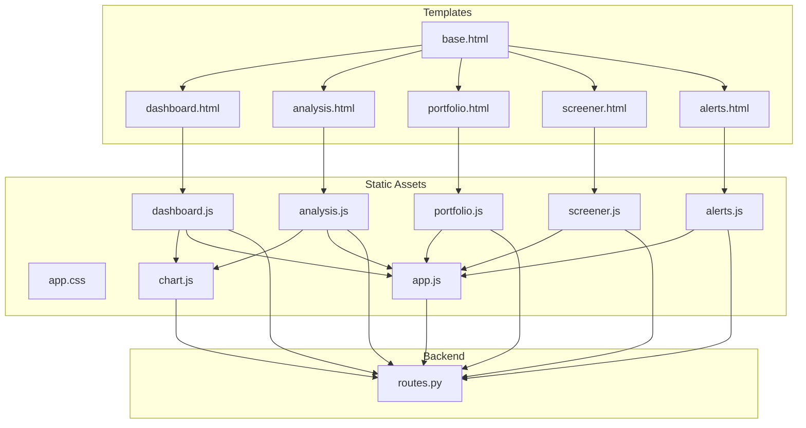
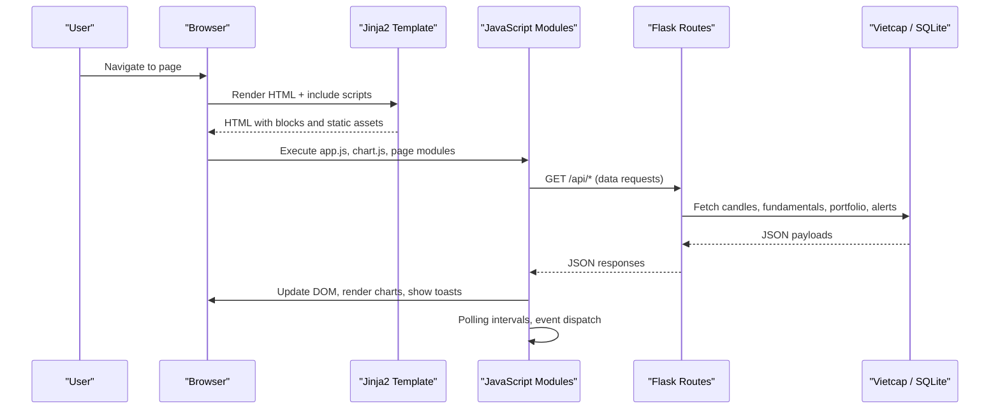
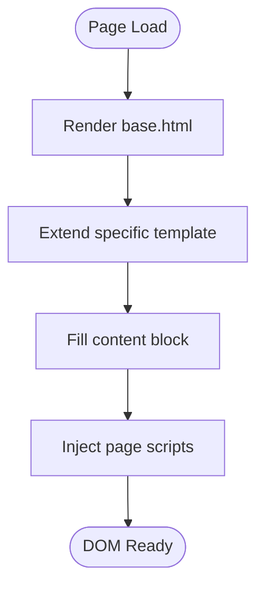
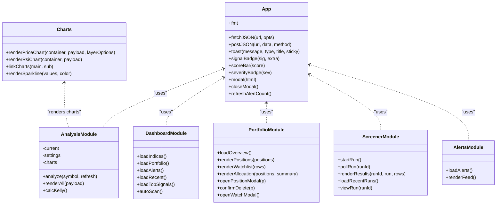
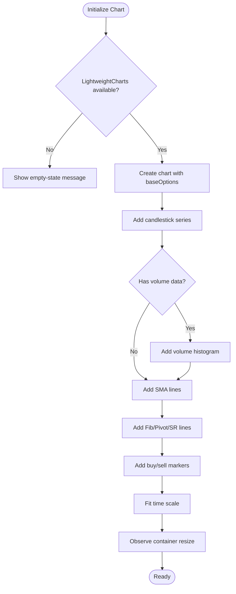
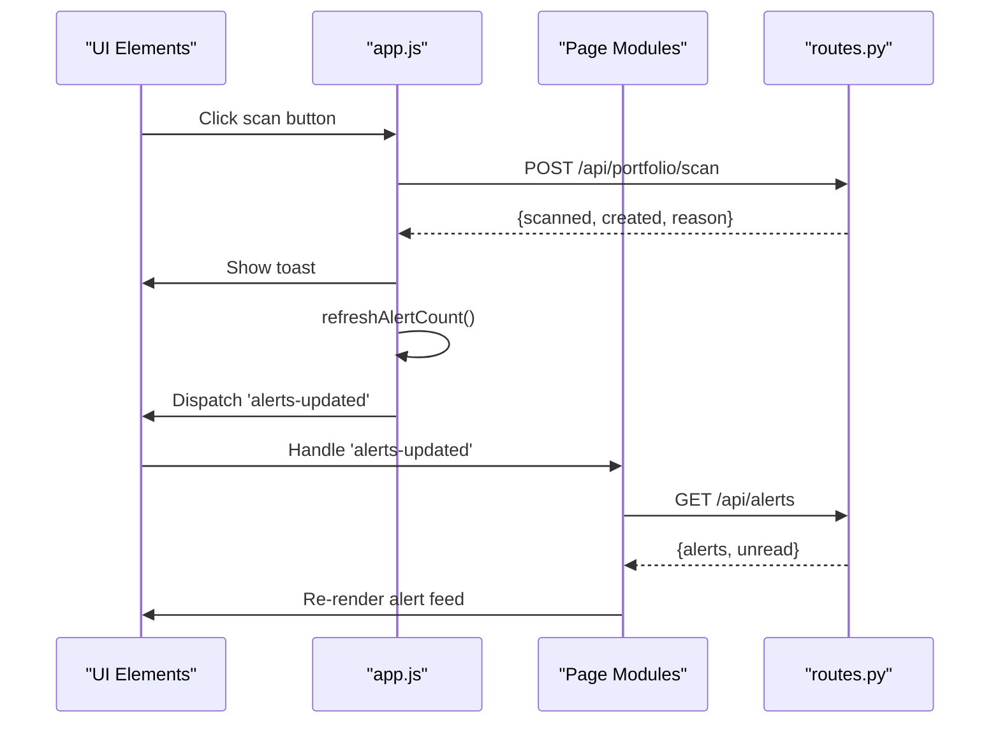
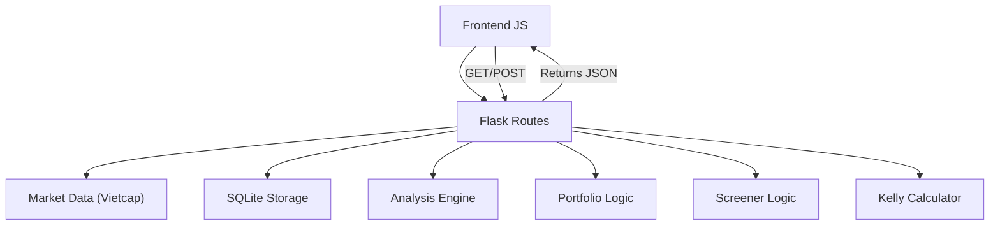
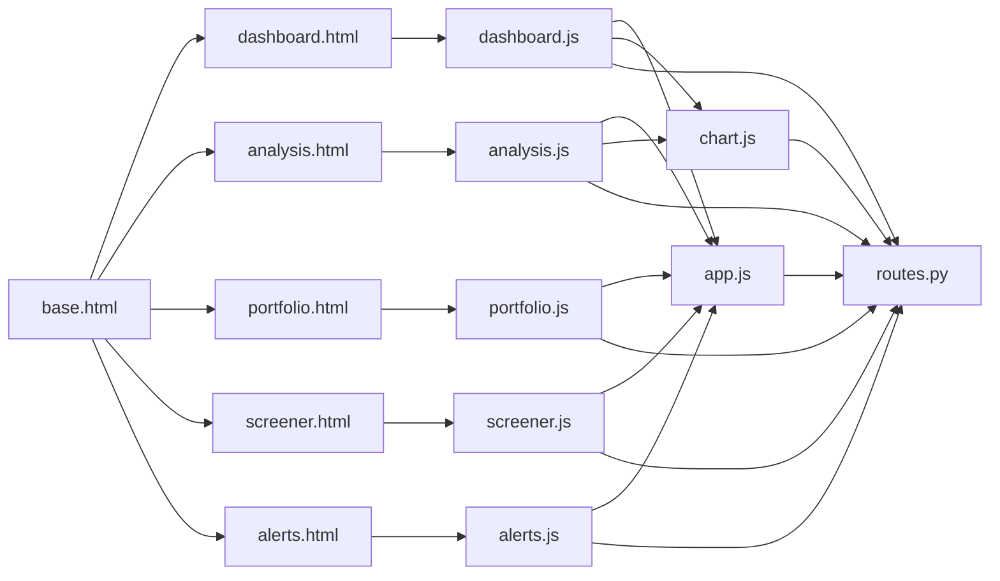

# Frontend Architecture

<cite>
**Referenced Files in This Document**
- [base.html](file://fintech/templates/base.html)
- [dashboard.html](file://fintech/templates/dashboard.html)
- [analysis.html](file://fintech/templates/analysis.html)
- [portfolio.html](file://fintech/templates/portfolio.html)
- [screener.html](file://fintech/templates/screener.html)
- [alerts.html](file://fintech/templates/alerts.html)
- [app.css](file://fintech/static/css/app.css)
- [app.js](file://fintech/static/js/app.js)
- [chart.js](file://fintech/static/js/chart.js)
- [analysis.js](file://fintech/static/js/analysis.js)
- [dashboard.js](file://fintech/static/js/dashboard.js)
- [portfolio.js](file://fintech/static/js/portfolio.js)
- [screener.js](file://fintech/static/js/screener.js)
- [alerts.js](file://fintech/static/js/alerts.js)
- [routes.py](file://fintech/routes.py)
</cite>

## Table of Contents
1. [Introduction](#introduction)
2. [Project Structure](#project-structure)
3. [Core Components](#core-components)
4. [Architecture Overview](#architecture-overview)
5. [Detailed Component Analysis](#detailed-component-analysis)
6. [Dependency Analysis](#dependency-analysis)
7. [Performance Considerations](#performance-considerations)
8. [Troubleshooting Guide](#troubleshooting-guide)
9. [Conclusion](#conclusion)

## Introduction
This document describes the frontend architecture of the application with a focus on:
- Jinja2 template structure and inheritance
- JavaScript module organization for charts, dashboards, portfolio management, screener, and alerts
- CSS styling architecture using a fintech dark theme and responsive breakpoints
- Integration between backend data and frontend visualization components via REST APIs
- Real-time update mechanisms through polling and event-driven UI updates
- Cross-browser compatibility, performance optimization for large datasets, and accessibility considerations for financial data visualization

## Project Structure
The frontend is organized into three main layers:
- Templates (Jinja2): base layout and page-specific views
- Static assets: shared CSS and modular JavaScript files
- Backend routes: Flask endpoints serving pages and JSON APIs consumed by the frontend

**Diagram sources**
- [base.html:1-100](file://fintech/templates/base.html#L1-L100)
- [dashboard.html:1-116](file://fintech/templates/dashboard.html#L1-L116)
- [analysis.html:1-159](file://fintech/templates/analysis.html#L1-L159)
- [portfolio.html:1-114](file://fintech/templates/portfolio.html#L1-L114)
- [screener.html:1-133](file://fintech/templates/screener.html#L1-L133)
- [alerts.html:1-46](file://fintech/templates/alerts.html#L1-L46)
- [app.js:1-192](file://fintech/static/js/app.js#L1-L192)
- [chart.js:1-296](file://fintech/static/js/chart.js#L1-L296)
- [dashboard.js:1-178](file://fintech/static/js/dashboard.js#L1-L178)
- [analysis.js:1-315](file://fintech/static/js/analysis.js#L1-L315)
- [portfolio.js:1-420](file://fintech/static/js/portfolio.js#L1-L420)
- [screener.js:1-268](file://fintech/static/js/screener.js#L1-L268)
- [alerts.js:1-128](file://fintech/static/js/alerts.js#L1-L128)
- [routes.py:1-398](file://fintech/routes.py#L1-L398)

**Section sources**
- [base.html:1-100](file://fintech/templates/base.html#L1-L100)
- [routes.py:24-53](file://fintech/routes.py#L24-L53)

## Core Components
- Base template provides layout, navigation, global search, toasts, modal root, and script loading hooks.
- Page templates extend the base template and define content blocks.
- Shared JavaScript utilities provide formatting, fetch helpers, toast notifications, symbol suggestions, alert count refresh, and modal helpers.
- Chart module renders price and RSI charts using lightweight-charts, overlays technical levels, and links chart time scales.
- Page-specific modules handle data fetching, rendering, user interactions, and real-time updates.

Key responsibilities:
- app.js: shared utilities, global search, alert count polling, modals
- chart.js: lightweight-charts integration, series creation, overlays, resize handling
- analysis.js: analysis page logic, Kelly calculator integration, indicator rendering
- dashboard.js: index summary, portfolio overview, alerts feed, recent analyses
- portfolio.js: positions CRUD, watchlist, allocation bar, alerts
- screener.js: universe selection, criteria collection, run polling, results export
- alerts.js: alert filtering, acknowledgment, scanning

**Section sources**
- [base.html:1-100](file://fintech/templates/base.html#L1-L100)
- [app.js:1-192](file://fintech/static/js/app.js#L1-L192)
- [chart.js:1-296](file://fintech/static/js/chart.js#L1-L296)
- [analysis.js:1-315](file://fintech/static/js/analysis.js#L1-L315)
- [dashboard.js:1-178](file://fintech/static/js/dashboard.js#L1-L178)
- [portfolio.js:1-420](file://fintech/static/js/portfolio.js#L1-L420)
- [screener.js:1-268](file://fintech/static/js/screener.js#L1-L268)
- [alerts.js:1-128](file://fintech/static/js/alerts.js#L1-L128)

## Architecture Overview
The frontend follows a server-rendered template approach with client-side enhancements:
- Jinja2 templates render HTML with placeholders for dynamic content.
- JavaScript modules load after DOM ready to attach event listeners and fetch data from REST endpoints.
- Charts are rendered using lightweight-charts loaded from CDN; fallback behavior is implemented when the library is unavailable.
- Real-time updates are achieved via periodic polling and custom events.

**Diagram sources**
- [base.html:96-97](file://fintech/templates/base.html#L96-L97)
- [app.js:102-130](file://fintech/static/js/app.js#L102-L130)
- [chart.js:73-81](file://fintech/static/js/chart.js#L73-L81)
- [routes.py:98-133](file://fintech/routes.py#L98-L133)

## Detailed Component Analysis

### Template Inheritance and Layout
- base.html defines the global layout, sidebar navigation, topbar with global search, content block, footer, toast container, modal root, and script injection points.
- Page templates extend base.html and fill title, header_title, content, and scripts blocks.
- Active navigation state is passed via active variable.

**Diagram sources**
- [base.html:1-100](file://fintech/templates/base.html#L1-L100)
- [dashboard.html:1-116](file://fintech/templates/dashboard.html#L1-L116)
- [analysis.html:1-159](file://fintech/templates/analysis.html#L1-L159)
- [portfolio.html:1-114](file://fintech/templates/portfolio.html#L1-L114)
- [screener.html:1-133](file://fintech/templates/screener.html#L1-L133)
- [alerts.html:1-46](file://fintech/templates/alerts.html#L1-L46)

**Section sources**
- [base.html:1-100](file://fintech/templates/base.html#L1-L100)
- [dashboard.html:1-116](file://fintech/templates/dashboard.html#L1-L116)
- [analysis.html:1-159](file://fintech/templates/analysis.html#L1-L159)
- [portfolio.html:1-114](file://fintech/templates/portfolio.html#L1-L114)
- [screener.html:1-133](file://fintech/templates/screener.html#L1-L133)
- [alerts.html:1-46](file://fintech/templates/alerts.html#L1-L46)

### JavaScript Module Organization
- app.js exposes shared utilities: number/price/pct/volume/money formatting, fetchJSON/postJSON wrappers, toast notifications, signal badges, score bars, severity badges, global symbol suggestions, alert count refresh, and modal helpers.
- chart.js encapsulates lightweight-charts usage: theme, options, candlestick series, volume histogram, SMA lines, Fibonacci levels, pivot points, support/resistance lines, markers, RSI chart, linked time scales, and resize observer.
- analysis.js orchestrates analysis page: form submission, data fetching, state transitions, chart rendering, Kelly calculation, Fibonacci/Pivot/SR tables, indicators, backtest stats, dividend info.
- dashboard.js loads indices, portfolio overview, alerts feed, recent analyses, top signals, and triggers auto-scan.
- portfolio.js manages positions and watchlist: CRUD operations, allocation bar, alerts feed, modal forms, suggestion datalists, and event-driven updates.
- screener.js handles universe selection, criteria collection, run initiation, progress polling, results rendering, CSV export, and recent runs list.
- alerts.js provides alert filtering, acknowledgment, scanning, and cross-page event synchronization.

**Diagram sources**
- [app.js:18-190](file://fintech/static/js/app.js#L18-L190)
- [chart.js:27-294](file://fintech/static/js/chart.js#L27-L294)
- [analysis.js:20-313](file://fintech/static/js/analysis.js#L20-L313)
- [dashboard.js:7-176](file://fintech/static/js/dashboard.js#L7-L176)
- [portfolio.js:13-418](file://fintech/static/js/portfolio.js#L13-L418)
- [screener.js:74-266](file://fintech/static/js/screener.js#L74-L266)
- [alerts.js:28-126](file://fintech/static/js/alerts.js#L28-L126)

**Section sources**
- [app.js:1-192](file://fintech/static/js/app.js#L1-L192)
- [chart.js:1-296](file://fintech/static/js/chart.js#L1-L296)
- [analysis.js:1-315](file://fintech/static/js/analysis.js#L1-L315)
- [dashboard.js:1-178](file://fintech/static/js/dashboard.js#L1-L178)
- [portfolio.js:1-420](file://fintech/static/js/portfolio.js#L1-L420)
- [screener.js:1-268](file://fintech/static/js/screener.js#L1-L268)
- [alerts.js:1-128](file://fintech/static/js/alerts.js#L1-L128)

### Chart Visualization Patterns
- Theme and options are centralized in chart.js for consistent appearance across charts.
- Price chart supports candlesticks, volume histogram, SMA overlays, Fibonacci levels, pivot points, support/resistance lines, and buy/sell markers.
- RSI chart includes overbought/oversold lines and synchronized time scale with the main chart.
- ResizeObserver ensures charts adapt to container size changes.
- Fallback message is shown if lightweight-charts fails to load.

**Diagram sources**
- [chart.js:27-53](file://fintech/static/js/chart.js#L27-L53)
- [chart.js:73-228](file://fintech/static/js/chart.js#L73-L228)
- [chart.js:231-256](file://fintech/static/js/chart.js#L231-L256)
- [chart.js:258-279](file://fintech/static/js/chart.js#L258-L279)

**Section sources**
- [chart.js:1-296](file://fintech/static/js/chart.js#L1-L296)

### Real-Time Updates and Event Handling
- Global alert count is refreshed periodically via setInterval and updated across multiple UI elements.
- Custom events (e.g., alerts-updated) trigger re-fetching of alert feeds and overview data.
- Screener run progress is polled at intervals until completion or error.
- Toast notifications provide immediate feedback for user actions.

**Diagram sources**
- [app.js:154-173](file://fintech/static/js/app.js#L154-L173)
- [app.js:140-152](file://fintech/static/js/app.js#L140-L152)
- [screener.js:115-144](file://fintech/static/js/screener.js#L115-L144)
- [alerts.js:107-125](file://fintech/static/js/alerts.js#L107-L125)
- [routes.py:328-337](file://fintech/routes.py#L328-L337)

**Section sources**
- [app.js:102-173](file://fintech/static/js/app.js#L102-L173)
- [screener.js:74-144](file://fintech/static/js/screener.js#L74-L144)
- [alerts.js:82-125](file://fintech/static/js/alerts.js#L82-L125)
- [routes.py:328-337](file://fintech/routes.py#L328-L337)

### CSS Styling Architecture
- Dark theme variables define colors, radii, shadows, and typography.
- Layout uses flexbox for sidebar/main structure and grid for cards and stats.
- Responsive breakpoints adjust grids, hide sidebar on small screens, and stack columns.
- Component styles include cards, stat cards, buttons, forms, tables, badges, progress bars, toasts, modals, and page-specific sections.

Responsive breakpoints:
- Up to 1380px: narrow analysis grid
- Up to 1180px: two-column stats grid, single-column analysis/dash grids, two-column criteria grid
- Up to 860px: hide sidebar, single-column grids

**Section sources**
- [app.css:1-464](file://fintech/static/css/app.css#L1-L464)

### Backend Integration Points
- REST endpoints serve both HTML pages and JSON data.
- Key endpoints:
  - /api/analyze: returns candles, indicators, Fibonacci, pivots, support/resistance, levels, markers, backtest, fundamentals
  - /api/index/summary: index prices and sparklines
  - /api/portfolio/overview: positions, summary, watchlist, alerts count
  - /api/portfolio/positions: create/update/delete positions
  - /api/portfolio/watch: add/remove watchlist items
  - /api/portfolio/scan: scan alerts
  - /api/alerts: list alerts and unread count
  - /api/alerts/<id>/ack: acknowledge alert
  - /api/alerts/ack-all: acknowledge all alerts
  - /api/screener/run: start screener run
  - /api/screener/runs: list recent runs
  - /api/screener/runs/<id>: run status
  - /api/screener/runs/<id>/results: run results
  - /api/screener/runs/<id>/export: CSV export
  - /api/settings: get/set settings
  - /api/kelly/calc: compute Kelly recommendation

**Diagram sources**
- [routes.py:98-133](file://fintech/routes.py#L98-L133)
- [routes.py:258-337](file://fintech/routes.py#L258-L337)
- [routes.py:342-363](file://fintech/routes.py#L342-L363)
- [routes.py:201-253](file://fintech/routes.py#L201-L253)
- [routes.py:374-397](file://fintech/routes.py#L374-L397)

**Section sources**
- [routes.py:58-397](file://fintech/routes.py#L58-L397)

## Dependency Analysis
- Templates depend on base.html for layout and inject page-specific scripts.
- JavaScript modules depend on app.js for shared utilities and on chart.js for visualization.
- Page modules depend on routes.py endpoints for data.
- Chart module depends on lightweight-charts loaded from CDN.

**Diagram sources**
- [base.html:96-97](file://fintech/templates/base.html#L96-L97)
- [dashboard.html:112-115](file://fintech/templates/dashboard.html#L112-L115)
- [analysis.html:155-158](file://fintech/templates/analysis.html#L155-L158)
- [portfolio.html:111-113](file://fintech/templates/portfolio.html#L111-L113)
- [screener.html:130-132](file://fintech/templates/screener.html#L130-L132)
- [alerts.html:43-45](file://fintech/templates/alerts.html#L43-L45)
- [app.js:188-190](file://fintech/static/js/app.js#L188-L190)
- [chart.js:294-295](file://fintech/static/js/chart.js#L294-L295)
- [routes.py:24-53](file://fintech/routes.py#L24-L53)

**Section sources**
- [base.html:96-97](file://fintech/templates/base.html#L96-L97)
- [app.js:188-190](file://fintech/static/js/app.js#L188-L190)
- [chart.js:294-295](file://fintech/static/js/chart.js#L294-L295)
- [routes.py:24-53](file://fintech/routes.py#L24-L53)

## Performance Considerations
- Lightweight-charts is loaded with defer to avoid blocking initial render.
- Chart data transformation functions map payloads efficiently; series data is built once per render.
- ResizeObserver is used to adjust chart width only when container size changes.
- Number formatting uses Intl.NumberFormat instances to reduce repeated allocations.
- Polling intervals are conservative (e.g., 60 seconds for alert counts, ~1.3 seconds for screener progress).
- Large datasets should be paginated or limited at the API level; current endpoints use limits where applicable.
- Avoid unnecessary DOM reflows by batching updates and using innerHTML judiciously.

[No sources needed since this section provides general guidance]

## Troubleshooting Guide
Common issues and resolutions:
- Chart library not available: The chart renderer shows an empty-state message; ensure internet access or host the library locally.
- Network errors: fetchJSON/postJSON throw errors with messages from backend; check routes.py error responses and network connectivity.
- Symbol suggestions fail: The datalist population is best-effort; offline mode is acceptable.
- Screener polling stops: If polling throws, it stops automatically; retry by refreshing or re-running the screener.
- Alert count not updating: Ensure refreshAlertCount is called after ack-all or scan operations; verify interval is running.

**Section sources**
- [chart.js:73-78](file://fintech/static/js/chart.js#L73-L78)
- [app.js:53-70](file://fintech/static/js/app.js#L53-L70)
- [app.js:102-130](file://fintech/static/js/app.js#L102-L130)
- [screener.js:115-144](file://fintech/static/js/screener.js#L115-L144)
- [routes.py:13-14](file://fintech/routes.py#L13-L14)

## Conclusion
The frontend architecture combines Jinja2 templates with modular JavaScript to deliver a responsive, data-rich financial interface. The design emphasizes:
- Clear separation of concerns across templates, shared utilities, and page modules
- Consistent chart rendering and overlay patterns
- Robust real-time updates via polling and event-driven UI synchronization
- A cohesive dark theme with responsive layouts
- Strong integration with backend REST APIs for market data, portfolio management, screener runs, and alerts

Future improvements could include WebSocket-based real-time updates, virtualized lists for large datasets, and enhanced accessibility features such as ARIA labels and keyboard navigation for charts and tables.

[No sources needed since this section summarizes without analyzing specific files]