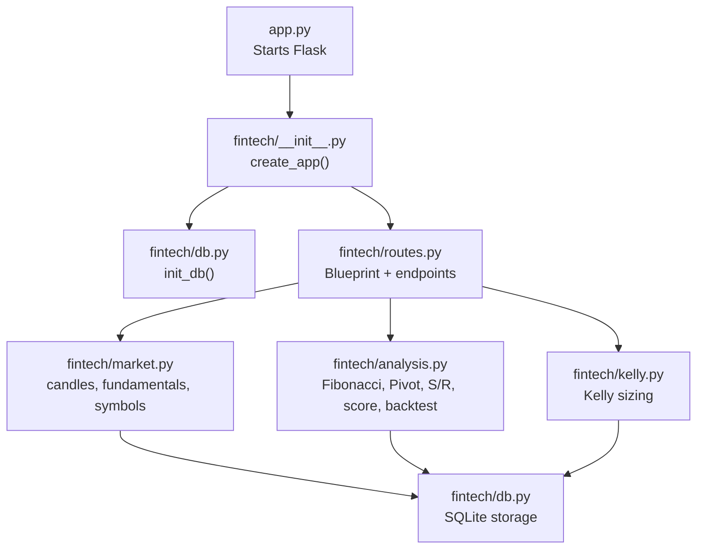
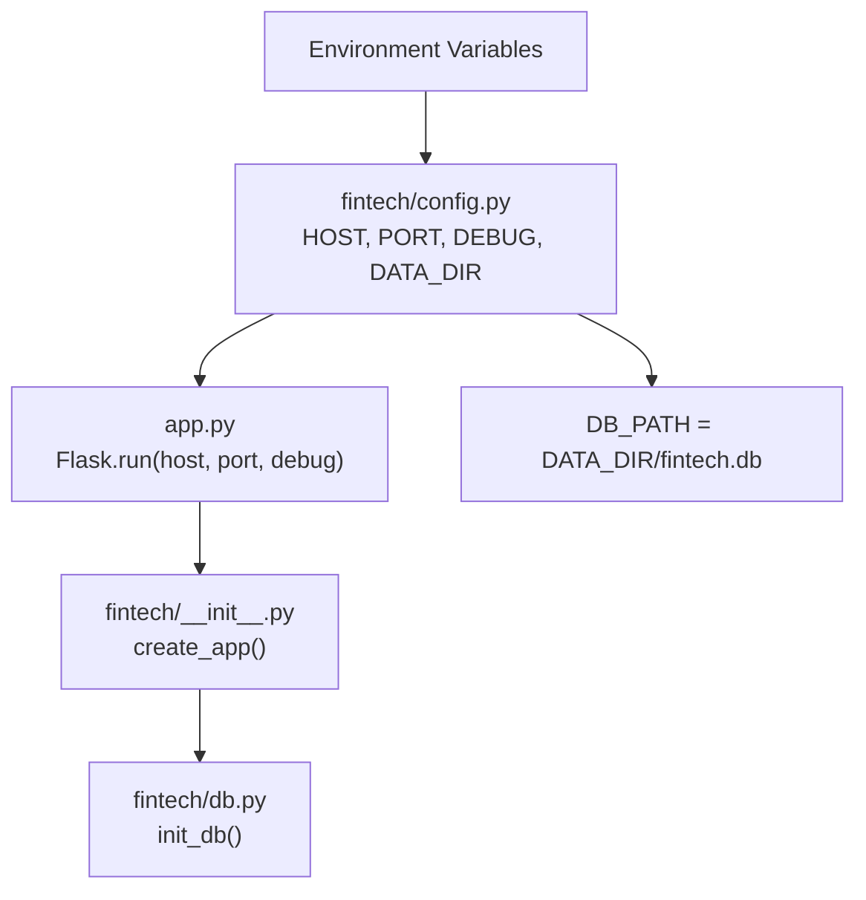
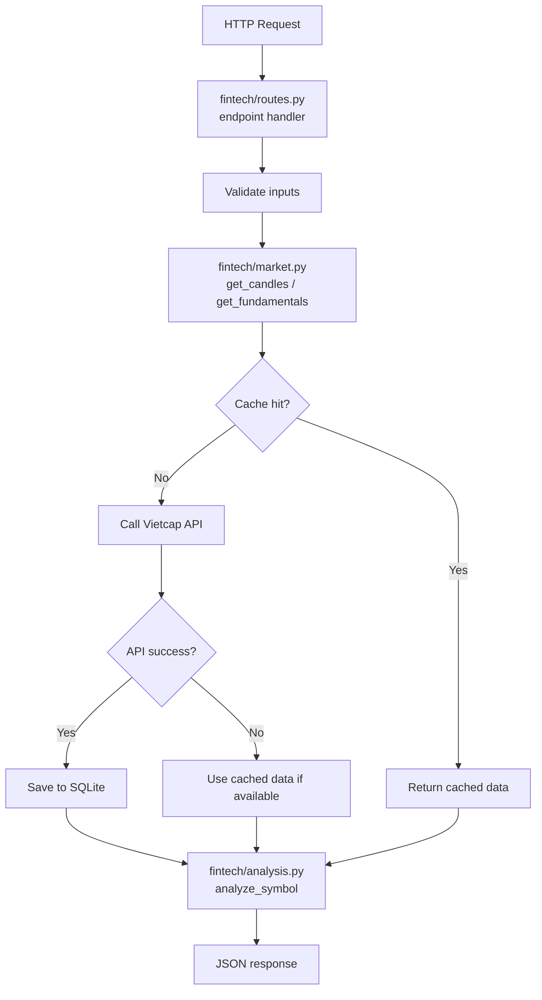

# Getting Started

<cite>
**Referenced Files in This Document**
- [README.md](file://README.md)
- [app.py](file://app.py)
- [requirements.txt](file://requirements.txt)
- [fintech/__init__.py](file://fintech/__init__.py)
- [fintech/config.py](file://fintech/config.py)
- [fintech/routes.py](file://fintech/routes.py)
- [fintech/db.py](file://fintech/db.py)
- [fintech/market.py](file://fintech/market.py)
- [fintech/analysis.py](file://fintech/analysis.py)
- [fintech/kelly.py](file://fintech/kelly.py)
</cite>

## Table of Contents
1. [Introduction](#introduction)
2. [Project Structure](#project-structure)
3. [Installation Requirements](#installation-requirements)
4. [Step-by-Step Setup](#step-by-step-setup)
5. [Quick Start Tutorial](#quick-start-tutorial)
6. [Environment Configuration](#environment-configuration)
7. [Deployment Considerations](#deployment-considerations)
8. [Troubleshooting Guide](#troubleshooting-guide)
9. [Conclusion](#conclusion)

## Introduction
FinViet Pro is a Vietnamese stock market technical analysis web application built with Python and Flask. It combines:
- Fibonacci retracement and extension analysis
- Pivot Points (daily, weekly, monthly)
- Support/resistance clustering from swing highs/lows
- Composite buy/sell scoring across trend, momentum, levels, volume, and pivots
- Kelly Criterion capital management using 1/2 Kelly as recommended by Edward Thorp
- Portfolio management with positions, watchlist, and real-time P/L tracking
- Automated alerting for stop-loss hits, sell signals, target hits, support breaks, and watchlist opportunities
- Stock screening across index groups, exchanges, or custom lists, including dividend yield filters

The app stores all data locally in SQLite under `data/fintech.db` and fetches historical prices, indices, dividends, and company fundamentals from the Vietcap Trading API.

**Section sources**
- [README.md:1-24](file://README.md#L1-L24)

## Project Structure
At a high level:
- `app.py` starts the Flask server using configuration from `fintech/config.py`.
- `fintech/__init__.py` creates the Flask application, initializes the database, registers routes, and sets JSON response headers.
- `fintech/routes.py` defines pages and REST endpoints for dashboard, analysis, screener, portfolio, alerts, and settings.
- `fintech/db.py` manages SQLite schema, settings persistence, symbol/candle/fundamental storage, analyses, screen runs/results, positions, watchlist, alerts, and cache stamps.
- `fintech/market.py` provides cached access to candles, fundamentals, dividend events, symbol list, and index summaries over the Vietcap client.
- `fintech/analysis.py` implements Fibonacci, Pivot Points, support/resistance clustering, composite scoring, backtesting, and actionable buy/sell levels.
- `fintech/kelly.py` implements full Kelly and 1/2 Kelly sizing with risk budget, position cap, and lot rounding.
- `requirements.txt` declares Flask as the only external dependency; other functionality uses the Python standard library.

**Diagram sources**
- [app.py:1-10](file://app.py#L1-L10)
- [fintech/__init__.py:1-22](file://fintech/__init__.py#L1-L22)
- [fintech/routes.py:1-10](file://fintech/routes.py#L1-L10)
- [fintech/market.py:1-10](file://fintech/market.py#L1-L10)
- [fintech/analysis.py:1-23](file://fintech/analysis.py#L1-L23)
- [fintech/kelly.py:1-11](file://fintech/kelly.py#L1-L11)
- [fintech/db.py:1-11](file://fintech/db.py#L1-L11)

**Section sources**
- [README.md:79-105](file://README.md#L79-L105)
- [app.py:1-10](file://app.py#L1-L10)
- [fintech/__init__.py:1-22](file://fintech/__init__.py#L1-L22)
- [fintech/routes.py:1-54](file://fintech/routes.py#L1-L54)
- [fintech/db.py:12-137](file://fintech/db.py#L12-L137)
- [fintech/market.py:1-10](file://fintech/market.py#L1-L10)
- [fintech/analysis.py:1-23](file://fintech/analysis.py#L1-L23)
- [fintech/kelly.py:1-11](file://fintech/kelly.py#L1-L11)

## Installation Requirements
- Python 3.10+ (Python 3.12+ is recommended).
- Flask is the only required third-party package.
- Internet access is needed to fetch market data from Vietcap when not served from cache.

**Section sources**
- [README.md:26-42](file://README.md#L26-L42)
- [requirements.txt:1-2](file://requirements.txt#L1-L2)

## Step-by-Step Setup
1. Install dependencies:
   - Run `pip install -r requirements.txt`.
2. Start the application:
   - Run `python app.py`.
   - On Windows, you can double-click `run.bat`, which installs Flask if missing and opens the browser automatically.
3. Open the application:
   - Visit `http://127.0.0.1:5000` in your browser.

If you want to customize where the SQLite database is stored, set `FINTECH_DATA_DIR` before running the app. By default, the database path is `data/fintech.db`.

**Section sources**
- [README.md:26-42](file://README.md#L26-L42)
- [fintech/config.py:5-25](file://fintech/config.py#L5-L25)

## Quick Start Tutorial
After starting the app, use these steps to explore FinViet Pro:

1. Dashboard
   - View VNINDEX/VN30 summary, portfolio value, new alerts, and recent buying opportunities from the latest screener run.

2. Technical Analysis
   - Enter a stock code such as `FPT`.
   - Review the candlestick chart with Fibonacci zones, Pivot Points, support/resistance clusters, and historical buy/sell arrows.
   - Check the action card showing buy zone, stop-loss, take-profit levels, and risk/reward ratio.
   - Use the Kelly calculator, which auto-fills win probability and payoff from backtesting.

3. Stock Screening
   - Choose a universe: index group (VN30/VN100/HNX30/HOSE/HNX/UPCOM/ETF), exchange, or custom list.
   - Set criteria: signal threshold, minimum score, dividend yield threshold, liquidity, and price filters.
   - Click **Start Screener**, monitor progress, and export results to CSV.

4. Portfolio Management
   - Add positions with suggested entry, stop-loss, and take-profit based on analysis.
   - Track real-time P/L against closing prices, allocation, and watchlist.
   - Click **Scan Alerts Now** to trigger an immediate scan.

5. Alerts
   - Filter by severity or symbol, mark alerts as read, and rescan.

6. Settings
   - Configure equity, Kelly mode (half/full), risk per order, maximum position percentage, lot size, history days, cache hours, scan frequency, and symbol refresh.

**Section sources**
- [README.md:44-57](file://README.md#L44-L57)
- [fintech/routes.py:26-53](file://fintech/routes.py#L26-L53)

## Environment Configuration
FinViet Pro supports environment variables for host, port, debug mode, and data directory:

| Variable | Default | Description |
|---|---:|---|
| `FINTECH_HOST` | `127.0.0.1` | Host address the Flask server binds to. |
| `FINTECH_PORT` | `5000` | Port number the Flask server listens on. |
| `FINTECH_DEBUG` | `0` | Enable debug mode when set to `1`. |
| `FINTECH_DATA_DIR` | `data` | Directory used for the SQLite database file `fintech.db`. |
| `VERCEL` | unset | When set, the app detects serverless mode and uses `/tmp/finviet-pro` unless overridden. |

How they are applied:
- `app.py` reads `HOST`, `PORT`, and `DEBUG` from `fintech.config` and starts Flask with `threaded=True`.
- `fintech/config.py` loads environment variables and determines the data directory and database path.
- `fintech/__init__.py` initializes the database and registers routes when `create_app()` is called.

**Diagram sources**
- [app.py:1-10](file://app.py#L1-L10)
- [fintech/config.py:25-29](file://fintech/config.py#L25-L29)
- [fintech/config.py:5-25](file://fintech/config.py#L5-L25)
- [fintech/__init__.py:7-13](file://fintech/__init__.py#L7-L13)
- [fintech/db.py:169-175](file://fintech/db.py#L169-L175)

**Section sources**
- [README.md:42-42](file://README.md#L42-L42)
- [app.py:1-10](file://app.py#L1-L10)
- [fintech/config.py:5-29](file://fintech/config.py#L5-L29)
- [fintech/__init__.py:7-13](file://fintech/__init__.py#L7-L13)

## Deployment Considerations
Local deployment:
- Run `python app.py` and open the local URL.
- The database is created at `data/fintech.db`.

Serverless deployment on Vercel:
- The project includes a serverless entrypoint and Vercel configuration.
- On Vercel, the filesystem is read-only except `/tmp`, so the app uses `/tmp/finviet-pro` for the database unless `FINTECH_DATA_DIR` points to a persistent volume.
- Serverless functions have a maximum duration limit; large screener runs may be interrupted.
- Background scanning only runs when there is an incoming request; use the web UI to trigger scans.

Health check:
- After deployment, call `/api/health` to verify status, app name, serverless mode, and storage type.

**Section sources**
- [README.md:114-154](file://README.md#L114-L154)
- [fintech/config.py:7-17](file://fintech/config.py#L7-L17)
- [fintech/routes.py:58-68](file://fintech/routes.py#L58-L68)

## Troubleshooting Guide

### Common Setup Issues

1. **Port already in use**
   - Change `FINTECH_PORT` to another available port, then restart the app.

2. **Cannot bind to host**
   - If binding to `127.0.0.1` fails, set `FINTECH_HOST` to `0.0.0.0` for local network access.

3. **Database write errors**
   - Ensure the `data` directory exists and is writable.
   - Set `FINTECH_DATA_DIR` to a writable path if the default location is restricted.

4. **No market data appears**
   - Verify internet access to Vietcap APIs.
   - Use `/api/health` to confirm the server is running.
   - Try refreshing the symbol list through the UI or API endpoint.

5. **Analysis says insufficient history**
   - Increase `history_days` in Settings or wait for more trading days to load.

6. **Screener stops or shows error**
   - Reduce the universe size.
   - Check network connectivity and retry after a short delay.

7. **Alerts do not appear**
   - Trigger a manual scan from the portfolio page.
   - Adjust scan frequency in Settings.

8. **Slow first request on serverless**
   - Cold start latency is expected; subsequent requests should be faster.

### How Errors Are Handled
- Route handlers return structured JSON errors with HTTP status codes.
- Data fetching failures fall back to cached data when available.
- Persistence operations are best-effort; missing saved analysis does not break core analysis.

**Diagram sources**
- [fintech/routes.py:98-133](file://fintech/routes.py#L98-L133)
- [fintech/market.py:20-43](file://fintech/market.py#L20-L43)
- [fintech/analysis.py:598-679](file://fintech/analysis.py#L598-L679)

**Section sources**
- [fintech/routes.py:13-14](file://fintech/routes.py#L13-L14)
- [fintech/routes.py:71-87](file://fintech/routes.py#L71-L87)
- [fintech/routes.py:98-133](file://fintech/routes.py#L98-L133)
- [fintech/market.py:20-43](file://fintech/market.py#L20-L43)
- [fintech/market.py:46-78](file://fintech/market.py#L46-L78)

## Conclusion
FinViet Pro provides a complete workflow for Vietnamese stock technical analysis, capital management, portfolio tracking, and automated alerts. Start by installing Flask, running the app, and exploring the dashboard, analysis, screener, portfolio, alerts, and settings. Use environment variables to control host, port, debug mode, and database location. For production or serverless deployments, follow the Vercel guidance and consider persistent storage for the SQLite database.