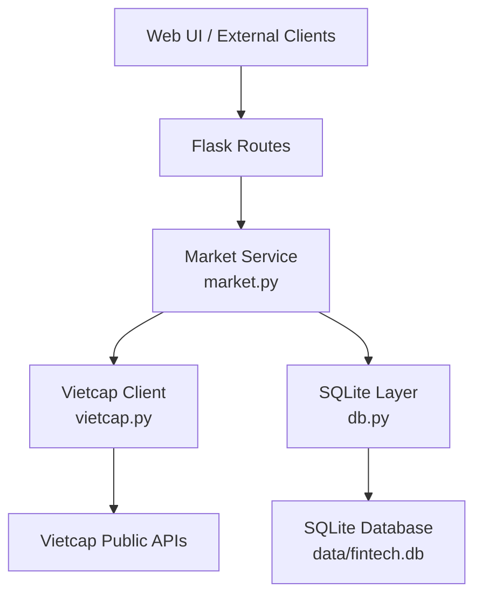
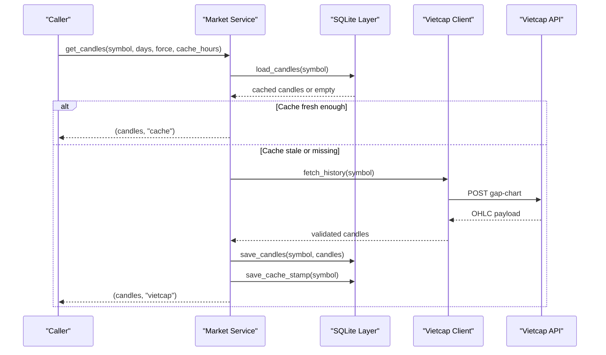
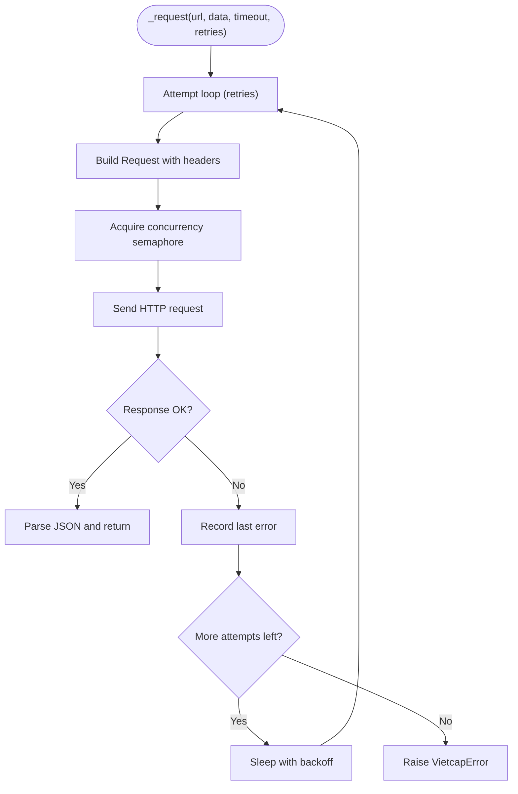
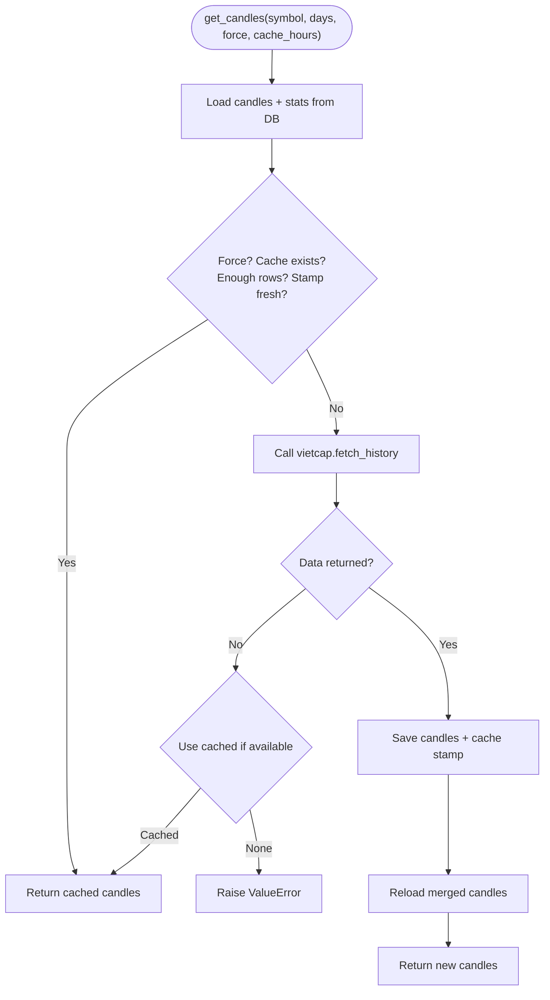
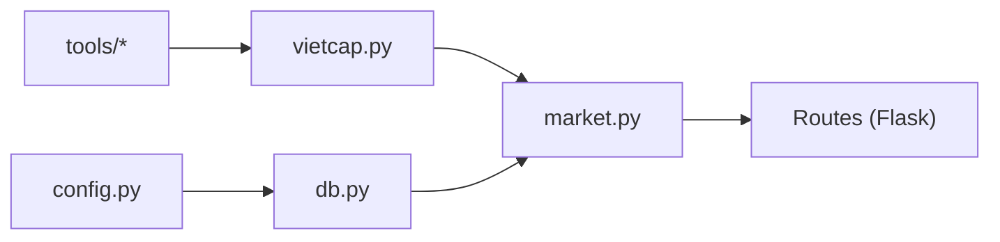

# Market Data Integration

<cite>
**Referenced Files in This Document**
- [README.md](file://README.md)
- [vietcap.py](file://fintech/vietcap.py)
- [market.py](file://fintech/market.py)
- [db.py](file://fintech/db.py)
- [config.py](file://fintech/config.py)
- [api_probe.py](file://tools/api_probe.py)
- [smoke_test.py](file://tools/smoke_test.py)
</cite>

## Table of Contents
1. [Introduction](#introduction)
2. [Project Structure](#project-structure)
3. [Core Components](#core-components)
4. [Architecture Overview](#architecture-overview)
5. [Detailed Component Analysis](#detailed-component-analysis)
6. [Dependency Analysis](#dependency-analysis)
7. [Performance Considerations](#performance-considerations)
8. [Troubleshooting Guide](#troubleshooting-guide)
9. [Conclusion](#conclusion)
10. [Appendices](#appendices)

## Introduction
This document explains the market data integration for FinViet Pro, focusing on the Vietcap Trading API client and the multi-level caching system used to serve Vietnamese stock market data. It covers:

- API endpoint integration for price history, symbol information, dividend events, and company fundamentals.
- A robust caching strategy with configurable expiration times: 6 hours for OHLC candles, 24 hours for fundamentals, and 72 hours for symbol lists.
- Automatic retry mechanisms and concurrency control for API failures.
- Symbol search, metadata enrichment, and exchange normalization across HOSE, HNX, and UPCOM markets.
- Practical retrieval patterns, error handling strategies, rate limiting, performance optimization, data validation, transformation pipelines, and database persistence.

The project is a Python Flask + SQLite application that uses Vietcap’s public endpoints for end-of-day (EOD) prices, indices, dividends, and fundamental snapshots.

**Section sources**
- [README.md:1-10](file://README.md#L1-L10)
- [README.md:69-77](file://README.md#L69-L77)

## Project Structure
At a high level, the market data pipeline consists of:

- Client layer: `vietcap.py` encapsulates HTTP calls to Vietcap endpoints, normalizes responses, and provides domain functions for listings, groups, OHLC history, fundamentals, and dividends.
- Service layer: `market.py` orchestrates caching, fallbacks, and enrichment using the client and database layers.
- Persistence layer: `db.py` defines schema, settings, and CRUD helpers for symbols, OHLCV, fundamentals, dividend events, analyses, screen runs/results, positions, watchlist, alerts, and cache stamps.
- Configuration: `config.py` centralizes environment detection, DB path, default settings, refresh intervals, universe groups, exchanges, index symbols, and signal presentation metadata.
- Tools: `api_probe.py` validates live Vietcap response shapes; `smoke_test.py` performs end-to-end checks against the running server.

**Diagram sources**
- [market.py:1-154](file://fintech/market.py#L1-L154)
- [vietcap.py:1-260](file://fintech/vietcap.py#L1-L260)
- [db.py:1-450](file://fintech/db.py#L1-L450)
- [config.py:1-80](file://fintech/config.py#L1-L80)

**Section sources**
- [README.md:79-105](file://README.md#L79-L105)
- [config.py:1-80](file://fintech/config.py#L1-L80)

## Core Components
- Vietcap client (`vietcap.py`)
  - Provides typed functions for listing symbols, fetching by group, retrieving OHLC candles, company details, and dividend events.
  - Implements retry logic, concurrency throttling via a semaphore, and exchange normalization.
- Market service (`market.py`)
  - Adds caching over the client with time-based freshness checks.
  - Exposes functions for candles, fundamentals, dividend events, symbol list refresh, symbol search, symbol lookup, and index summary.
- Database layer (`db.py`)
  - Defines tables for symbols, OHLCV, fundamentals, dividend events, analyses, screen runs/results, positions, watchlist, alerts, settings, and cache stamps.
  - Provides safe connection management, transactional helpers, and domain-specific queries.
- Configuration (`config.py`)
  - Centralizes defaults including cache refresh intervals (6h OHLC, 24h fundamentals, 72h symbols), universe groups, exchanges, index symbols, and default user settings.

Key responsibilities:
- Normalize and validate external data before persistence.
- Cache aggressively to reduce API calls while ensuring freshness.
- Provide resilient fallbacks when external APIs fail.

**Section sources**
- [vietcap.py:1-260](file://fintech/vietcap.py#L1-L260)
- [market.py:1-154](file://fintech/market.py#L1-L154)
- [db.py:1-450](file://fintech/db.py#L1-L450)
- [config.py:1-80](file://fintech/config.py#L1-L80)

## Architecture Overview
The integration follows a layered architecture:

- Client layer abstracts network I/O and response parsing.
- Service layer composes client calls with caching and enrichment.
- Persistence layer stores normalized data and metadata.
- Configuration controls behavior such as refresh intervals and environment paths.

**Diagram sources**
- [market.py:20-43](file://fintech/market.py#L20-L43)
- [vietcap.py:135-189](file://fintech/vietcap.py#L135-L189)
- [db.py:289-351](file://fintech/db.py#L289-L351)

**Section sources**
- [market.py:20-43](file://fintech/market.py#L20-L43)
- [vietcap.py:135-189](file://fintech/vietcap.py#L135-L189)
- [db.py:289-351](file://fintech/db.py#L289-L351)

## Detailed Component Analysis

### Vietcap Client
Responsibilities:
- Define base URLs and headers for trading and insight services.
- Implement `_request` with retries, exponential backoff, and concurrency limit.
- Normalize exchange codes to HOSE/HNX/UPCOM.
- Fetch full listings, grouped symbols, OHLC candles, company details, and dividend events.
- Validate and transform raw payloads into consistent structures.

Key behaviors:
- Retry mechanism: up to three attempts with incremental sleep delays.
- Concurrency control: global semaphore limits concurrent outbound requests.
- Exchange normalization: maps HSX/HOSE to HOSE, UPX/UPCOM to UPCOM, HNX/HNX30 to HNX.
- Timestamp handling: supports milliseconds and seconds, falls back to business days if timestamps are missing.

**Diagram sources**
- [vietcap.py:46-58](file://fintech/vietcap.py#L46-L58)

**Section sources**
- [vietcap.py:1-260](file://fintech/vietcap.py#L1-L260)

### Market Service Caching Strategy
Responsibilities:
- Provide cached access to OHLC candles, fundamentals, dividend events, and symbol metadata.
- Enforce configurable expiration times:
  - OHLC candles: 6 hours (default).
  - Fundamentals: 24 hours (from config).
  - Symbol lists: 72 hours (from config).
- Gracefully fall back to cached data when API calls fail.

Caching flow for candles:
- Load from SQLite.
- Check stats and cache stamp freshness.
- If fresh, return cached data.
- Otherwise, call Vietcap client, persist results, update cache stamp, and return new data.

**Diagram sources**
- [market.py:20-43](file://fintech/market.py#L20-L43)
- [db.py:289-351](file://fintech/db.py#L289-L351)

Fundamentals caching:
- Load from SQLite.
- If not forced and within 24-hour window, return cached.
- Otherwise, call Vietcap client for company details, enrich fields, persist, optionally fetch and persist dividend events, then reload.

Symbol list refresh:
- Check count and updated timestamp.
- If older than 72 hours or forced, download full listing and upsert into SQLite.

Symbol search and lookup:
- Search leverages SQLite indexes and prioritizes exact matches and exchange ordering.
- Lookup returns metadata; if missing, triggers a live listing refresh and caches it.

Index summary:
- Computes latest close and change for VNINDEX and VN30 using cached candles.

**Section sources**
- [market.py:1-154](file://fintech/market.py#L1-L154)
- [config.py:31-35](file://fintech/config.py#L31-L35)

### Database Layer
Responsibilities:
- Manage SQLite connections with WAL mode and synchronous settings for performance.
- Provide transactional context manager for commit/rollback.
- Store and retrieve symbols, OHLCV, fundamentals, dividend events, analyses, screen runs/results, positions, watchlist, alerts, settings, and cache stamps.

Schema highlights:
- Symbols table includes exchange normalization and organization metadata.
- OHLCV table keyed by symbol and date with an index.
- Fundamentals table stores TTM dividend per share, market cap, rating, target price, sector, extra JSON, and updated_at.
- Dividend events table keyed by symbol and ex_date.
- Cache stamps table tracks per-symbol cache freshness.

Persistence operations:
- Upsert semantics for symbols, OHLCV, fundamentals, and dividend events.
- Safe JSON serialization/deserialization for extra fields.

**Section sources**
- [db.py:12-137](file://fintech/db.py#L12-L137)
- [db.py:148-175](file://fintech/db.py#L148-L175)
- [db.py:234-284](file://fintech/db.py#L234-L284)
- [db.py:289-351](file://fintech/db.py#L289-L351)
- [db.py:356-408](file://fintech/db.py#L356-L408)

### Configuration
Responsibilities:
- Detect deployment environment (local vs Vercel) and set persistent data directory.
- Define DB path, host/port/debug flags.
- Set default cache refresh intervals:
  - CACHE_HOURS = 6 (OHLC).
  - SYMBOLS_REFRESH_HOURS = 72 (symbol lists).
  - FUNDAMENTALS_REFRESH_HOURS = 24 (fundamentals).
- Provide default user settings and universe groups.
- Define supported exchanges and index symbols.

**Section sources**
- [config.py:1-80](file://fintech/config.py#L1-L80)

## Dependency Analysis
Component relationships:

- `market.py` depends on `vietcap.py` for external data and `db.py` for persistence.
- `vietcap.py` is independent except for standard library modules and raises `VietcapError`.
- `db.py` depends on `config.py` for DB path and default settings.
- Tools depend on standard libraries and can be used to validate external API shapes.

**Diagram sources**
- [config.py:1-80](file://fintech/config.py#L1-L80)
- [db.py:1-450](file://fintech/db.py#L1-L450)
- [vietcap.py:1-260](file://fintech/vietcap.py#L1-L260)
- [market.py:1-154](file://fintech/market.py#L1-L154)

**Section sources**
- [config.py:1-80](file://fintech/config.py#L1-L80)
- [db.py:1-450](file://fintech/db.py#L1-L450)
- [vietcap.py:1-260](file://fintech/vietcap.py#L1-L260)
- [market.py:1-154](file://fintech/market.py#L1-L154)

## Performance Considerations
- Concurrency control: The Vietcap client uses a global semaphore to limit concurrent outbound requests, reducing overload risk and improving stability under load.
- Retry with backoff: Network errors trigger incremental sleeps before re-attempting, improving resilience without aggressive polling.
- Aggressive caching:
  - OHLC candles cached for 6 hours.
  - Fundamentals cached for 24 hours.
  - Symbol lists cached for 72 hours.
- SQLite optimizations:
  - WAL journal mode and NORMAL synchronous setting improve write throughput and durability.
  - Indexes on OHLCV symbol/date and other frequently queried columns.
- Batch writes: Bulk insert/upsert operations minimize round-trips and contention.
- Fallbacks: When API calls fail, cached data is returned where available, preventing UI stalls.

[No sources needed since this section provides general guidance]

## Troubleshooting Guide
Common issues and resolutions:

- API connectivity failures:
  - Symptom: `VietcapError` raised during fetch operations.
  - Resolution: Verify network access, check timeouts, and rely on automatic retries/backoff. For development, use `tools/api_probe.py` to validate endpoint shapes.
- Empty or malformed candle data:
  - Symptom: No candles returned or invalid structure.
  - Resolution: Ensure symbol normalization and timeframe parameters; check timestamp parsing and fallback dates.
- Stale cache:
  - Symptom: Outdated prices or fundamentals.
  - Resolution: Force refresh via service functions or adjust cache hours in settings.
- Symbol search returns no results:
  - Symptom: Local symbols table empty or outdated.
  - Resolution: Trigger symbol list refresh; ensure exchange normalization and type filters.
- Vercel ephemeral storage:
  - Symptom: Data loss after cold start.
  - Resolution: Use persistent volume or set `FINTECH_DATA_DIR`; understand `/tmp` limitations.

Operational checks:
- Health endpoint and smoke tests validate overall system state and key workflows.

**Section sources**
- [vietcap.py:42-58](file://fintech/vietcap.py#L42-L58)
- [vietcap.py:135-189](file://fintech/vietcap.py#L135-L189)
- [market.py:20-43](file://fintech/market.py#L20-L43)
- [market.py:94-123](file://fintech/market.py#L94-L123)
- [README.md:139-154](file://README.md#L139-L154)
- [api_probe.py:1-116](file://tools/api_probe.py#L1-L116)
- [smoke_test.py:1-196](file://tools/smoke_test.py#L1-L196)

## Conclusion
FinViet Pro integrates Vietcap’s public APIs through a resilient client and a multi-layered caching strategy. The design emphasizes:

- Robustness: Retries, backoff, and concurrency control protect against transient failures.
- Freshness: Configurable cache lifetimes balance latency and accuracy.
- Usability: Symbol search, metadata enrichment, and exchange normalization simplify downstream analysis.
- Persistence: SQLite stores normalized data efficiently with upsert semantics and indexes.

This architecture enables responsive UI experiences while minimizing external API load and providing reliable fallbacks.

[No sources needed since this section summarizes without analyzing specific files]

## Appendices

### API Endpoints Summary
- Listings: GET `/api/price/symbols/getAll`
- Group symbols: GET `/api/price/symbols/getByGroup?group=...`
- OHLC candles: POST `/api/chart/OHLCChart/gap-chart`
- Company details: GET `/api/iq-insight-service/v1/company/details?ticker=...`
- Dividend events: GET `/api/iq-insight-service/v1/events?ticker=...&eventCode=DIV&fromDate=...&toDate=...`

**Section sources**
- [README.md:69-77](file://README.md#L69-L77)
- [vietcap.py:1-26](file://fintech/vietcap.py#L1-L26)

### Practical Retrieval Patterns
- Price history:
  - Call market service to get cached candles; if stale or missing, fetch from Vietcap and persist.
- Symbol search:
  - Query SQLite with term matching; trigger listing refresh if needed.
- Metadata enrichment:
  - Lookup symbol metadata; if absent, refresh listings and cache.
- Dividends:
  - Load cached dividend events; if missing, fetch from Vietcap and persist.
- Fundamentals:
  - Load cached fundamentals; if stale, fetch company details and optional dividend events.

**Section sources**
- [market.py:20-123](file://fintech/market.py#L20-L123)
- [vietcap.py:78-246](file://fintech/vietcap.py#L78-L246)
- [db.py:234-408](file://fintech/db.py#L234-L408)