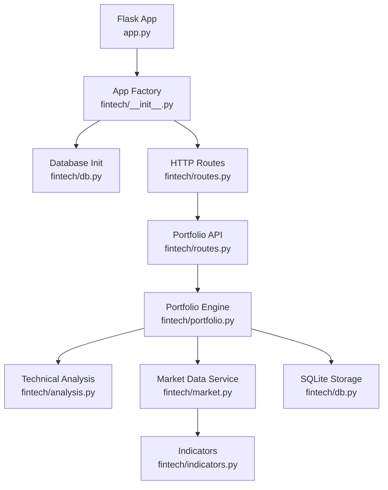
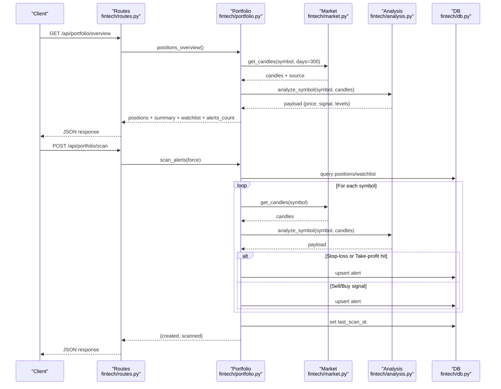
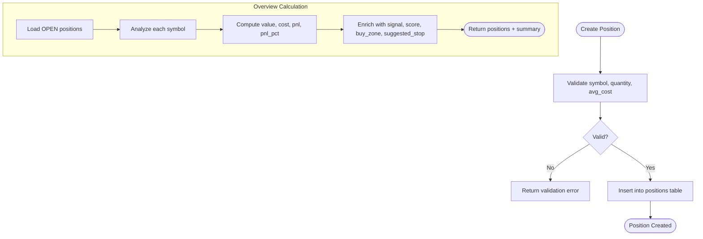
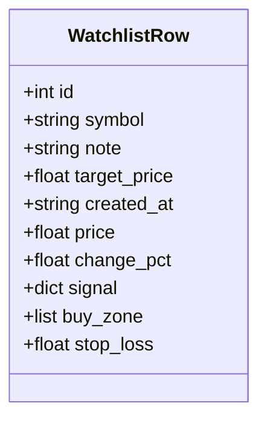
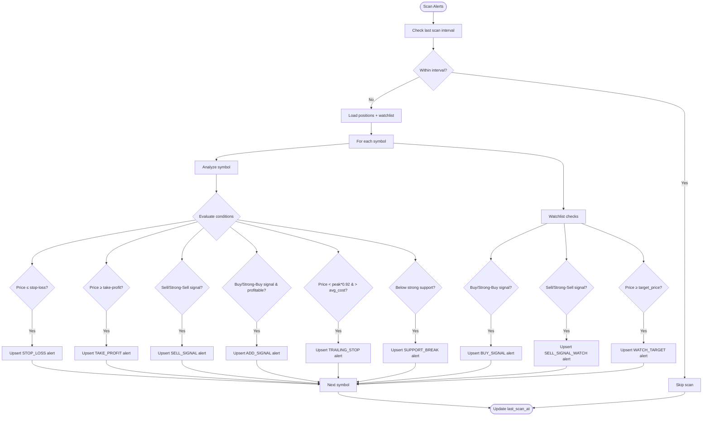
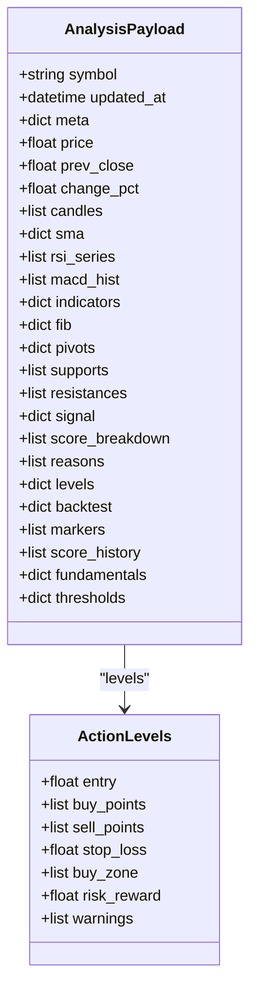
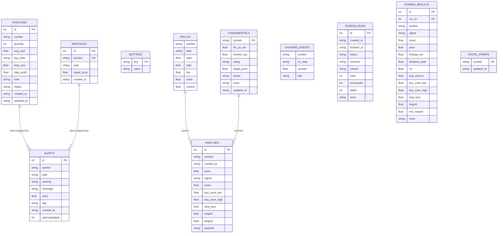
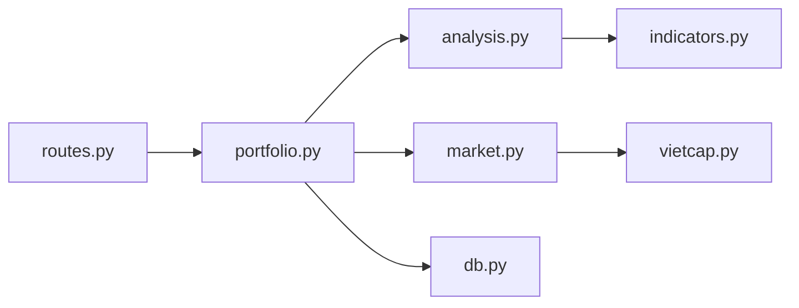

# Portfolio Management

<cite>
**Referenced Files in This Document**
- [README.md](file://README.md)
- [app.py](file://app.py)
- [fintech/__init__.py](file://fintech/__init__.py)
- [fintech/config.py](file://fintech/config.py)
- [fintech/db.py](file://fintech/db.py)
- [fintech/market.py](file://fintech/market.py)
- [fintech/indicators.py](file://fintech/indicators.py)
- [fintech/analysis.py](file://fintech/analysis.py)
- [fintech/portfolio.py](file://fintech/portfolio.py)
- [fintech/routes.py](file://fintech/routes.py)
</cite>

## Table of Contents
1. [Introduction](#introduction)
2. [Project Structure](#project-structure)
3. [Core Components](#core-components)
4. [Architecture Overview](#architecture-overview)
5. [Detailed Component Analysis](#detailed-component-analysis)
6. [Dependency Analysis](#dependency-analysis)
7. [Performance Considerations](#performance-considerations)
8. [Troubleshooting Guide](#troubleshooting-guide)
9. [Conclusion](#conclusion)

## Introduction
This document explains the portfolio management system for FinViet Pro, focusing on position tracking, real-time profit and loss monitoring, watchlist surveillance, and automated alert generation. It also documents how technical analysis results drive intelligent position suggestions, stop-loss and take-profit logic, duplicate prevention, alert acknowledgment workflows, and historical review capabilities. The system is a Flask application backed by SQLite, with market data sourced from Vietcap and cached locally.

The portfolio module manages:
- Open positions with entry price, quantity, stop-loss, take-profit, and notes.
- Real-time P&L based on closing prices and user-defined risk levels.
- A watchlist for symbol tracking, target price monitoring, and buy/sell signal surveillance.
- An alert engine that generates categorized notifications for stop-loss triggers, sell signals, profit-taking opportunities, trailing stops, support breaches, and buy signals for watched symbols.

**Section sources**
- [README.md:12-24](file://README.md#L12-L24)
- [fintech/portfolio.py:1-10](file://fintech/portfolio.py#L1-L10)

## Project Structure
At runtime, the application entry point initializes the Flask app, creates the database schema, registers routes, and serves HTTP endpoints for pages and JSON APIs. The portfolio subsystem integrates with the analysis engine to compute actionable levels and signals, and with the database layer for persistence.

**Diagram sources**
- [app.py:1-10](file://app.py#L1-L10)
- [fintech/__init__.py:7-21](file://fintech/__init__.py#L7-L21)
- [fintech/routes.py:256-337](file://fintech/routes.py#L256-L337)
- [fintech/portfolio.py:1-10](file://fintech/portfolio.py#L1-L10)
- [fintech/analysis.py:598-679](file://fintech/analysis.py#L598-L679)
- [fintech/market.py:20-43](file://fintech/market.py#L20-L43)
- [fintech/indicators.py:1-171](file://fintech/indicators.py#L1-L171)
- [fintech/db.py:169-175](file://fintech/db.py#L169-L175)

**Section sources**
- [app.py:1-10](file://app.py#L1-L10)
- [fintech/__init__.py:7-21](file://fintech/__init__.py#L7-L21)
- [fintech/routes.py:256-337](file://fintech/routes.py#L256-L337)

## Core Components
- Position lifecycle: creation, update, deletion, and overview with real-time P&L.
- Watchlist management: add/remove symbols, optional target price, enriched with analysis.
- Alert engine: scan positions and watchlist, generate categorized alerts with severity, deduplicate per day, and persist acknowledgments.
- Technical analysis integration: Fibonacci retracements/extensions, pivot points, support/resistance clustering, composite scoring, action levels (buy zones, stop-loss, targets), and backtest-derived metrics.
- Database schema: persistent storage for positions, watchlist, alerts, analyses, settings, OHLCV candles, fundamentals, and cache stamps.

Key responsibilities:
- `portfolio.py`: orchestrates position/watchlist/alert operations and uses `_analyze` to fetch analysis payloads.
- `analysis.py`: computes indicators, Fib/Pivot/SR, score, signal, and actionable levels; provides backtest stats used by Kelly sizing elsewhere.
- `market.py`: caches OHLCV and fundamentals, returning source metadata.
- `db.py`: defines schema, generic helpers, and domain stores; WAL mode enabled for concurrency.
- `routes.py`: exposes REST endpoints for portfolio and alerts.

**Section sources**
- [fintech/portfolio.py:28-165](file://fintech/portfolio.py#L28-L165)
- [fintech/analysis.py:43-61](file://fintech/analysis.py#L43-L61)
- [fintech/analysis.py:66-124](file://fintech/analysis.py#L66-L124)
- [fintech/analysis.py:174-186](file://fintech/analysis.py#L174-L186)
- [fintech/analysis.py:191-240](file://fintech/analysis.py#L191-L240)
- [fintech/analysis.py:251-387](file://fintech/analysis.py#L251-L387)
- [fintech/analysis.py:506-593](file://fintech/analysis.py#L506-L593)
- [fintech/market.py:20-43](file://fintech/market.py#L20-L43)
- [fintech/db.py:93-137](file://fintech/db.py#L93-L137)
- [fintech/routes.py:256-337](file://fintech/routes.py#L256-L337)

## Architecture Overview
The portfolio management architecture connects user requests to business logic, analysis, and persistence layers. Positions and watchlist items are enriched with live analysis results, and the alert engine scans both sets to produce categorized notifications.

**Diagram sources**
- [fintech/routes.py:258-271](file://fintech/routes.py#L258-L271)
- [fintech/routes.py:328-337](file://fintech/routes.py#L328-L337)
- [fintech/portfolio.py:30-62](file://fintech/portfolio.py#L30-L62)
- [fintech/portfolio.py:179-278](file://fintech/portfolio.py#L179-L278)
- [fintech/market.py:20-43](file://fintech/market.py#L20-L43)
- [fintech/analysis.py:598-679](file://fintech/analysis.py#L598-L679)
- [fintech/db.py:169-175](file://fintech/db.py#L169-L175)

## Detailed Component Analysis

### Position Lifecycle Management
Positions represent open holdings with entry details and risk parameters. The lifecycle includes:
- Creation: validates symbol, quantity, and average cost; inserts into SQLite with status OPEN.
- Update: modifies quantity, average cost, stop-loss, take-profit, note, and status; enforces existence check.
- Deletion: removes a position by ID.
- Overview: loads all OPEN positions, enriches with latest analysis payload, calculates value, cost, P&L, P&L percentage, suggested stop-loss, distance to stop, buy zone, and current signal/score.

Position data model fields:
- id: auto-increment primary key.
- symbol: ticker code.
- quantity: integer number of shares.
- avg_cost: entry price.
- buy_date: date string.
- stop_loss: optional stop-loss level.
- take_profit: optional take-profit target.
- note: optional free text.
- status: typically OPEN until closed.
- created_at, updated_at: timestamps.

Real-time P&L calculation:
- Value = quantity × current close price.
- Cost = quantity × average cost.
- P&L = value − cost.
- P&L % = (P&L / cost) × 100 when cost > 0.
- Suggested stop-loss can be derived from analysis if not explicitly set.

Stop-loss and take-profit logic:
- Stop-loss trigger: if current price ≤ stop-loss, a critical STOP_LOSS alert is generated.
- Take-profit trigger: if current price ≥ take-profit, a medium TAKE_PROFIT alert is generated.
- Trailing stop: if price drops more than 8% from recent peak while still above average cost, a warning TRAILING_STOP alert is generated.

**Diagram sources**
- [fintech/portfolio.py:83-106](file://fintech/portfolio.py#L83-L106)
- [fintech/portfolio.py:30-62](file://fintech/portfolio.py#L30-L62)

**Section sources**
- [fintech/portfolio.py:83-129](file://fintech/portfolio.py#L83-L129)
- [fintech/db.py:93-104](file://fintech/db.py#L93-L104)

### Watchlist Management
Watchlist entries track symbols for surveillance, optionally with a target price and note. Each row is enriched with analysis results including current price, change percentage, signal, buy zone, and suggested stop-loss.

Watchlist data model fields:
- id: auto-increment primary key.
- symbol: unique ticker code.
- note: optional free text.
- target_price: optional target price for monitoring.
- created_at: timestamp.

Duplicate prevention:
- Adding a watchlist item uses an upsert pattern: if the symbol already exists, it updates note and target_price rather than creating duplicates.

Target price monitoring:
- During alert scanning, if current price ≥ target_price, a WATCH_TARGET alert is generated.

**Diagram sources**
- [fintech/db.py:106-112](file://fintech/db.py#L106-L112)
- [fintech/portfolio.py:134-160](file://fintech/portfolio.py#L134-L160)

**Section sources**
- [fintech/portfolio.py:134-165](file://fintech/portfolio.py#L134-L165)
- [fintech/db.py:106-112](file://fintech/db.py#L106-L112)

### Alert Engine
The alert engine scans positions and watchlist to generate notifications for various events:
- STOP_LOSS: critical alert when price hits stop-loss.
- TAKE_PROFIT: medium alert when price reaches take-profit.
- SELL_SIGNAL: high alert for sell/strong-sell signals on positions.
- ADD_SIGNAL: info alert for profitable buy/strong-buy signals on positions.
- TRAILING_STOP: warning alert for active profit-taking when price drops >8% from recent peak while still profitable.
- SUPPORT_BREAK: warning alert when price breaks below strong support.
- BUY_SIGNAL: medium alert for buy/strong-buy signals on watchlist.
- SELL_SIGNAL_WATCH: info alert for sell/strong-sell signals on watchlist.
- WATCH_TARGET: medium alert when price meets target price.

Alert categorization and severity:
- Severity order: critical, high, warning, medium, info.
- Type codes distinguish event categories.
- Duplicate prevention: alerts are upserted per symbol/type/day using a unique constraint on (symbol, type, day).

Acknowledgment workflow:
- Alerts are initially unacknowledged.
- Individual acknowledgment marks a specific alert as acknowledged.
- Acknowledge-all marks all unacknowledged alerts as acknowledged.
- Unread count reflects non-acknowledged alerts.

**Diagram sources**
- [fintech/portfolio.py:169-278](file://fintech/portfolio.py#L169-L278)
- [fintech/db.py:114-127](file://fintech/db.py#L114-L127)

**Section sources**
- [fintech/portfolio.py:169-310](file://fintech/portfolio.py#L169-L310)
- [fintech/db.py:114-127](file://fintech/db.py#L114-L127)

### Technical Analysis Integration
Technical analysis drives intelligent position suggestions and alert triggers:
- Indicator bundle: SMA, EMA, RSI, MACD, Bollinger Bands, ATR, volume SMA.
- Fibonacci analysis: direction, golden zone, nearest support/resistance, extensions.
- Pivot analysis: daily, weekly, monthly pivot points.
- Support/resistance clustering: weighted clusters with touches and scores.
- Composite scoring: trend, momentum, levels, volume, pivots aggregated into a [-100, 100] score mapped to signals (STRONG_BUY, BUY, HOLD, SELL, STRONG_SELL).
- Actionable levels: buy points, sell points, stop-loss, buy zone, risk/reward ratio, warnings.

Integration points:
- Portfolio overview and watchlist rows call `_analyze`, which retrieves candles via `market.get_candles` and runs `analysis.analyze_symbol`.
- Alert engine uses analysis payload to evaluate stop-loss/take-profit, trailing stop, support break, and signal-based alerts.
- Backtest statistics provide win-rate, payoff, expectancy, and drawdown used by Kelly sizing elsewhere.

**Diagram sources**
- [fintech/analysis.py:598-679](file://fintech/analysis.py#L598-L679)
- [fintech/analysis.py:506-593](file://fintech/analysis.py#L506-L593)

**Section sources**
- [fintech/analysis.py:43-61](file://fintech/analysis.py#L43-L61)
- [fintech/analysis.py:66-124](file://fintech/analysis.py#L66-L124)
- [fintech/analysis.py:174-186](file://fintech/analysis.py#L174-L186)
- [fintech/analysis.py:191-240](file://fintech/analysis.py#L191-L240)
- [fintech/analysis.py:251-387](file://fintech/analysis.py#L251-L387)
- [fintech/analysis.py:506-593](file://fintech/analysis.py#L506-L593)
- [fintech/portfolio.py:12-18](file://fintech/portfolio.py#L12-L18)

### Database Schema for Persistent State
The SQLite schema underpins portfolio state, watchlist, alerts, analyses, settings, OHLCV candles, fundamentals, dividend events, screen runs/results, and cache stamps. Key tables relevant to portfolio management:
- positions: stores open positions with risk parameters and timestamps.
- watchlist: stores tracked symbols with optional target price and note.
- alerts: stores categorized alerts with severity, message, price snapshot, day, acknowledgment flag, and unique constraint for deduplication.
- analyses: persists analysis payloads for historical review.
- settings: stores user configuration such as equity, risk percentage, max position percentage, Kelly mode, history days, cache hours, scan minutes, minimum average volume, lot size, and screener limits.
- ohlcv: stores daily OHLCV data with indexes for efficient queries.
- fundamentals: stores company fundamentals and dividend TTM.
- dividend_events: stores dividend history.
- screen_runs/screen_results: stores screener execution metadata and results.
- cache_stamps: tracks last refresh time for caching strategies.

**Diagram sources**
- [fintech/db.py:12-137](file://fintech/db.py#L12-L137)

**Section sources**
- [fintech/db.py:12-137](file://fintech/db.py#L12-L137)

## Dependency Analysis
The portfolio module depends on:
- `analysis.py` for computing signals, levels, and backtest stats.
- `market.py` for retrieving and caching OHLCV data.
- `db.py` for persistence and settings retrieval.
- `config.py` for constants like signal thresholds and default settings.

Coupling and cohesion:
- Portfolio functions are cohesive around position/watchlist/alert operations.
- Analysis is decoupled but consumed by portfolio for enrichment.
- Market service abstracts external API calls and caching.
- Database layer centralizes schema and access patterns.

Potential circular dependencies:
- No direct cycles observed; imports are directional from routes → portfolio → analysis/market/db.

External dependencies:
- Vietcap API for market data.
- SQLite for local persistence.
- Flask for HTTP routing.

Interface contracts:
- `portfolio.positions_overview()` returns enriched position list and summary.
- `portfolio.scan_alerts()` returns scan results and updates last scan timestamp.
- `analysis.analyze_symbol()` returns a comprehensive payload consumed by UI and stores.

**Diagram sources**
- [fintech/routes.py:256-337](file://fintech/routes.py#L256-L337)
- [fintech/portfolio.py:1-10](file://fintech/portfolio.py#L1-L10)
- [fintech/analysis.py:1-22](file://fintech/analysis.py#L1-L22)
- [fintech/market.py:1-8](file://fintech/market.py#L1-L8)
- [fintech/db.py:1-11](file://fintech/db.py#L1-L11)

**Section sources**
- [fintech/portfolio.py:1-10](file://fintech/portfolio.py#L1-L10)
- [fintech/analysis.py:1-22](file://fintech/analysis.py#L1-L22)
- [fintech/market.py:1-8](file://fintech/market.py#L1-L8)
- [fintech/db.py:1-11](file://fintech/db.py#L1-L11)

## Performance Considerations
- Caching strategy: OHLCV data is cached in SQLite with configurable cache hours; market service returns cached data when fresh, reducing API calls.
- Database performance: WAL mode and synchronous NORMAL improve write throughput and concurrency.
- Alert scanning throttling: scan_minutes setting prevents excessive scans; last_scan_at ensures intervals.
- Analysis optimization: indicator computations are vectorized in pure Python; lookback windows limit computation scope.
- Pagination and limits: alerts_list and recent_analyses use LIMIT to control memory usage.

Recommendations:
- Tune cache_hours and scan_minutes based on deployment environment and volatility.
- Use background tasks or scheduled jobs for continuous scanning if running outside serverless constraints.
- Monitor SQLite file size and consider archiving old analyses and screen results.

[No sources needed since this section provides general guidance]

## Troubleshooting Guide
Common issues and resolutions:
- Missing or stale market data: ensure Vietcap API is reachable; check cache stamps and force refresh if needed.
- Validation errors on position creation: verify symbol, quantity, and avg_cost are valid and positive.
- Alert duplication: rely on unique constraint on (symbol, type, day); acknowledge alerts to clear unread counts.
- Slow scans: increase scan_minutes or reduce universe size; ensure indices exist on alerts(day, acknowledged).
- Serverless limitations: on Vercel, data directory is ephemeral; consider persistent storage via FINTECH_DATA_DIR.

Operational tips:
- Use `/api/health` to verify app status and storage type.
- Review `/api/settings` to adjust scan frequency and risk parameters.
- Inspect `/api/alerts` with include_ack=true for historical review.

**Section sources**
- [fintech/routes.py:58-68](file://fintech/routes.py#L58-L68)
- [fintech/routes.py:368-397](file://fintech/routes.py#L368-L397)
- [fintech/db.py:148-153](file://fintech/db.py#L148-L153)
- [fintech/db.py:124-127](file://fintech/db.py#L124-L127)

## Conclusion
The portfolio management system provides robust position tracking, real-time P&L monitoring, watchlist surveillance, and automated alert generation. It integrates technical analysis to suggest intelligent entry points, stop-loss levels, and take-profit targets. The SQLite-backed schema ensures persistent state, while caching and throttling mechanisms optimize performance. Duplicate prevention and acknowledgment workflows streamline alert handling, and historical review capabilities support informed decision-making.

[No sources needed since this section summarizes without analyzing specific files]