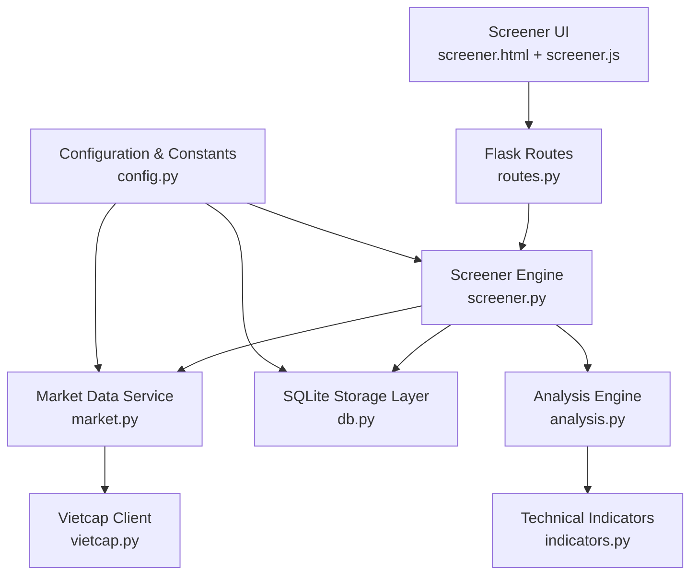
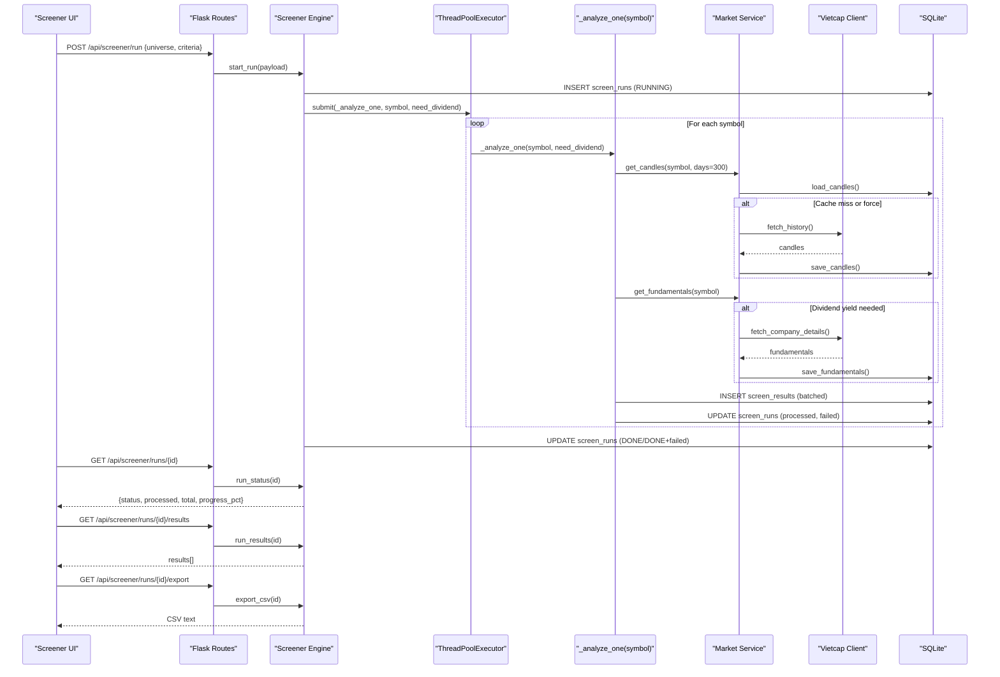
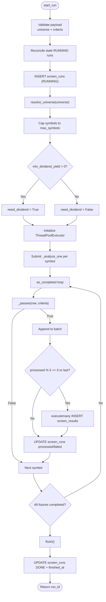
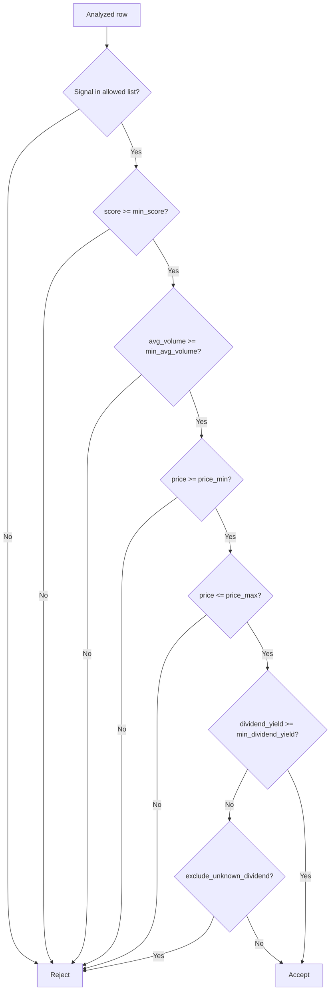
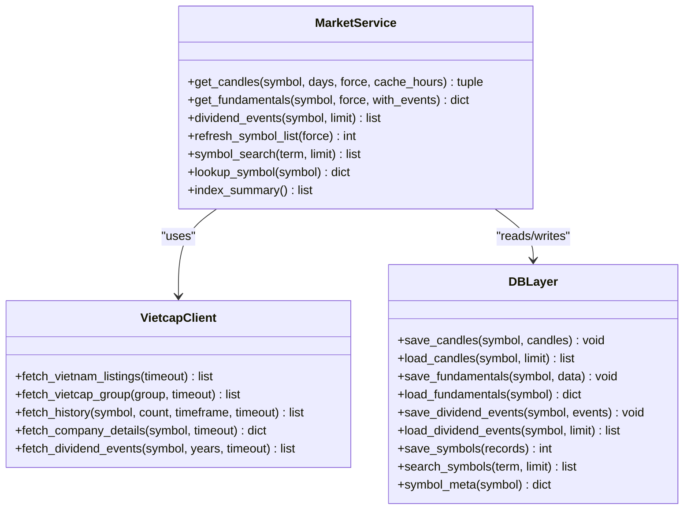
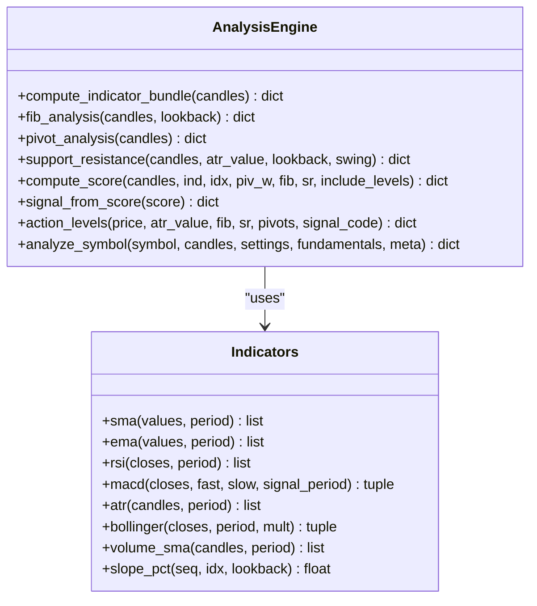
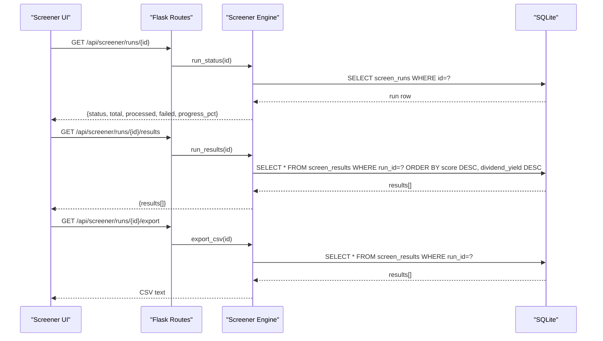
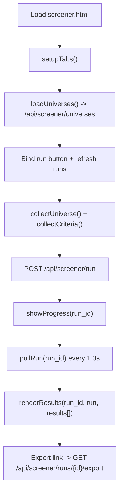
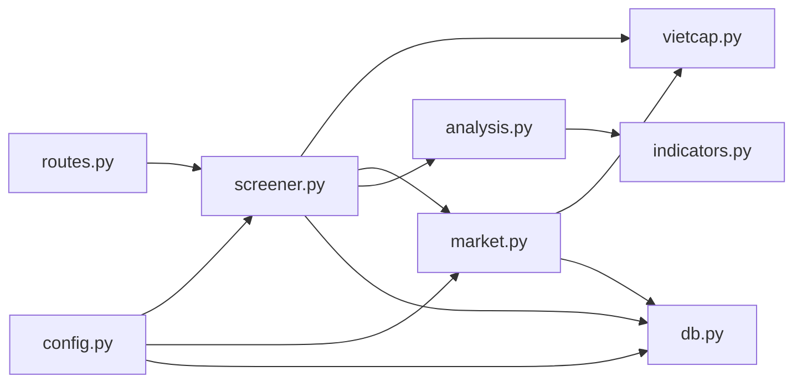

# Stock Screening System

<cite>
**Referenced Files in This Document**
- [README.md](file://README.md)
- [app.py](file://app.py)
- [requirements.txt](file://requirements.txt)
- [run.bat](file://run.bat)
- [fintech/config.py](file://fintech/config.py)
- [fintech/db.py](file://fintech/db.py)
- [fintech/vietcap.py](file://fintech/vietcap.py)
- [fintech/market.py](file://fintech/market.py)
- [fintech/indicators.py](file://fintech/indicators.py)
- [fintech/analysis.py](file://fintech/analysis.py)
- [fintech/screener.py](file://fintech/screener.py)
- [fintech/routes.py](file://fintech/routes.py)
- [fintech/templates/screener.html](file://fintech/templates/screener.html)
- [fintech/static/js/screener.js](file://fintech/static/js/screener.js)
</cite>

## Table of Contents
1. [Introduction](#introduction)
2. [Project Structure](#project-structure)
3. [Core Components](#core-components)
4. [Architecture Overview](#architecture-overview)
5. [Detailed Component Analysis](#detailed-component-analysis)
6. [Dependency Analysis](#dependency-analysis)
7. [Performance Considerations](#performance-considerations)
8. [Troubleshooting Guide](#troubleshooting-guide)
9. [Conclusion](#conclusion)
10. [Appendices](#appendices)

## Introduction
This document explains the stock screening system built for Vietnamese exchanges. It focuses on multi-criteria filtering and universe selection across VN30, VN100, HNX30, HOSE, HNX, UPCOM, and ETF categories. The screener uses a multi-threaded processing engine to scan large universes efficiently, applies technical indicator filters, fundamental data filters, price and volume filters, and dividend yield filters with minimum threshold support. It also documents real-time progress tracking, result formatting, CSV export, performance optimization strategies, memory management patterns, and integration with the market data service.

The screener is part of FinViet Pro, a Flask-based application that combines technical analysis, portfolio management, alerts, and SQLite-backed persistence. Data is sourced from the Vietcap Trading API, with caching to reduce network calls.

**Section sources**
- [README.md:1-24](file://README.md#L1-L24)
- [README.md:69-77](file://README.md#L69-L77)

## Project Structure
The screener spans backend modules (routes, screener logic, market data, indicators, analysis, database, configuration) and frontend assets (HTML template and JavaScript).

**Diagram sources**
- [fintech/routes.py:201-253](file://fintech/routes.py#L201-L253)
- [fintech/screener.py:126-251](file://fintech/screener.py#L126-L251)
- [fintech/market.py:20-78](file://fintech/market.py#L20-L78)
- [fintech/vietcap.py:102-189](file://fintech/vietcap.py#L102-L189)
- [fintech/db.py:62-91](file://fintech/db.py#L62-L91)
- [fintech/analysis.py:598-679](file://fintech/analysis.py#L598-L679)
- [fintech/indicators.py:43-61](file://fintech/indicators.py#L43-L61)
- [fintech/config.py:44-68](file://fintech/config.py#L44-L68)

**Section sources**
- [README.md:79-105](file://README.md#L79-L105)
- [fintech/config.py:44-68](file://fintech/config.py#L44-L68)

## Core Components
- Screener engine: orchestrates universe resolution, concurrent scanning, filtering, progress updates, and CSV export.
- Market data service: provides cached candles and fundamentals, integrating with Vietcap client.
- Technical indicators: pure-Python implementations of SMA, EMA, RSI, MACD, ATR, Bollinger Bands, and volume metrics.
- Analysis engine: computes Fibonacci levels, pivot points, support/resistance clusters, composite signal score, and actionable levels.
- Database layer: schema and helpers for symbols, OHLCV, fundamentals, analyses, screen runs/results, settings, and cache stamps.
- Configuration: default settings, universe groups, exchange lists, signal thresholds, and environment detection.
- Frontend: interactive screener page with universe selection, criteria inputs, progress polling, results table, and CSV download.

Key responsibilities:
- Universe selection supports group-based indices (VN30/VN100/HNX30), exchange-based sets (HOSE/HNX/UPCOM), and custom symbol lists.
- Filtering pipeline includes signal code, score threshold, average volume, price range, and dividend yield with optional exclusion of unknown dividends.
- Threading model uses a thread pool to analyze multiple symbols concurrently while persisting intermediate results and progress.
- Real-time progress is exposed via REST endpoints polled by the frontend.

**Section sources**
- [fintech/screener.py:32-59](file://fintech/screener.py#L32-L59)
- [fintech/screener.py:100-123](file://fintech/screener.py#L100-L123)
- [fintech/screener.py:126-211](file://fintech/screener.py#L126-L211)
- [fintech/market.py:20-78](file://fintech/market.py#L20-L78)
- [fintech/indicators.py:43-61](file://fintech/indicators.py#L43-L61)
- [fintech/analysis.py:598-679](file://fintech/analysis.py#L598-L679)
- [fintech/db.py:62-91](file://fintech/db.py#L62-L91)
- [fintech/config.py:44-68](file://fintech/config.py#L44-L68)

## Architecture Overview
The screener workflow starts at the HTTP route, which validates input and delegates to the screener engine. The engine resolves the target universe, initializes a background run, and spawns a daemon thread to process symbols concurrently. Each worker fetches candles and fundamentals through the market service, computes analysis and indicators, evaluates filter criteria, and persists matched rows. Progress is updated periodically and exposed to the UI via polling. Results can be exported as CSV.

**Diagram sources**
- [fintech/routes.py:206-253](file://fintech/routes.py#L206-L253)
- [fintech/screener.py:126-211](file://fintech/screener.py#L126-L211)
- [fintech/market.py:20-78](file://fintech/market.py#L20-L78)
- [fintech/vietcap.py:135-189](file://fintech/vietcap.py#L135-L189)
- [fintech/db.py:62-91](file://fintech/db.py#L62-L91)

## Detailed Component Analysis

### Screener Engine
The screener engine manages the lifecycle of a screening run:
- Universe resolution: supports group-based indices (VN30/VN100/HNX30), exchange-based sets (HOSE/HNX/UPCOM), and custom symbol lists. It normalizes symbols, removes duplicates, and excludes index entries.
- Max symbols cap: enforces configurable limits (default 250, clamped between 5 and 1200).
- Dividend yield optimization: only fetches fundamentals when a dividend yield threshold is set.
- Concurrent processing: uses ThreadPoolExecutor with a fixed number of workers to analyze symbols in parallel.
- Batch persistence: accumulates matched rows and flushes them periodically to SQLite to reduce I/O overhead.
- Progress tracking: updates processed/failed counts and status transitions (RUNNING → DONE or ERROR).
- Stale run reconciliation: detects abandoned RUNNING runs after server restarts or timeouts and marks them ERROR.

**Diagram sources**
- [fintech/screener.py:126-211](file://fintech/screener.py#L126-L211)
- [fintech/screener.py:214-251](file://fintech/screener.py#L214-L251)

**Section sources**
- [fintech/screener.py:32-59](file://fintech/screener.py#L32-L59)
- [fintech/screener.py:100-123](file://fintech/screener.py#L100-L123)
- [fintech/screener.py:126-211](file://fintech/screener.py#L126-L211)
- [fintech/screener.py:214-251](file://fintech/screener.py#L214-L251)

### Filter Criteria Pipeline
The filter pipeline evaluates each analyzed symbol against user-defined criteria:
- Signal codes: allows selecting one or more signals (STRONG_BUY, BUY, HOLD, SELL, STRONG_SELL).
- Minimum score: numeric threshold applied to the composite score.
- Average volume: minimum average volume over the last 20 bars.
- Price range: minimum and maximum price constraints.
- Dividend yield: minimum dividend yield percentage; optionally excludes symbols with unknown dividend data.

**Diagram sources**
- [fintech/screener.py:100-123](file://fintech/screener.py#L100-L123)

**Section sources**
- [fintech/screener.py:100-123](file://fintech/screener.py#L100-L123)

### Market Data Integration
The market service abstracts caching and retrieval of candle history and fundamentals:
- Candles: loads from SQLite if fresh; otherwise fetches from Vietcap, saves to DB, and returns merged data.
- Fundamentals: loads cached company details; if missing or stale, fetches from Vietcap and persists.
- Dividend events: optional loading and caching of dividend history.
- Symbol list refresh: throttled refresh of listings into SQLite.
- Index summary: latest close and change for VNINDEX and VN30.

**Diagram sources**
- [fintech/market.py:20-123](file://fintech/market.py#L20-L123)
- [fintech/vietcap.py:78-189](file://fintech/vietcap.py#L78-L189)
- [fintech/db.py:234-408](file://fintech/db.py#L234-L408)

**Section sources**
- [fintech/market.py:20-123](file://fintech/market.py#L20-L123)
- [fintech/vietcap.py:78-189](file://fintech/vietcap.py#L78-L189)
- [fintech/db.py:234-408](file://fintech/db.py#L234-L408)

### Technical Indicators and Analysis
Indicators provide core calculations used by the analysis engine:
- SMA/EMA rolling averages.
- RSI (Wilder’s method).
- MACD line, signal, histogram.
- ATR (True Range Average).
- Bollinger Bands (SMA ± k*std).
- Volume SMA and slope metrics.

The analysis engine composes these indicators into a full payload:
- Fibonacci retracement and extension levels.
- Pivot points (daily/weekly/monthly).
- Support/resistance clustering.
- Composite scoring across trend, momentum, levels, volume, and pivots.
- Actionable buy/sell levels, stop loss, risk/reward, and warnings.

**Diagram sources**
- [fintech/indicators.py:14-171](file://fintech/indicators.py#L14-L171)
- [fintech/analysis.py:43-61](file://fintech/analysis.py#L43-L61)
- [fintech/analysis.py:66-124](file://fintech/analysis.py#L66-L124)
- [fintech/analysis.py:174-186](file://fintech/analysis.py#L174-L186)
- [fintech/analysis.py:191-240](file://fintech/analysis.py#L191-L240)
- [fintech/analysis.py:251-372](file://fintech/analysis.py#L251-L372)
- [fintech/analysis.py:506-593](file://fintech/analysis.py#L506-L593)
- [fintech/analysis.py:598-679](file://fintech/analysis.py#L598-L679)

**Section sources**
- [fintech/indicators.py:14-171](file://fintech/indicators.py#L14-L171)
- [fintech/analysis.py:43-61](file://fintech/analysis.py#L43-L61)
- [fintech/analysis.py:66-124](file://fintech/analysis.py#L66-L124)
- [fintech/analysis.py:174-186](file://fintech/analysis.py#L174-L186)
- [fintech/analysis.py:191-240](file://fintech/analysis.py#L191-L240)
- [fintech/analysis.py:251-372](file://fintech/analysis.py#L251-L372)
- [fintech/analysis.py:506-593](file://fintech/analysis.py#L506-L593)
- [fintech/analysis.py:598-679](file://fintech/analysis.py#L598-L679)

### Real-Time Progress Tracking and Result Formatting
- Progress tracking: the screener updates processed/failed counts and status transitions in SQLite. The frontend polls `/api/screener/runs/{id}` every ~1.3 seconds until completion.
- Result formatting: results are sorted by score and dividend yield, enriched with signal labels and reasons, and displayed in a table with clickable rows to open analysis pages.
- CSV export: results are exported with UTF-8 BOM for Excel compatibility, including columns for symbol, signal label, score, price, daily change, RSI, average volume, dividend yield, buy zone bounds, stop loss, target 1, and risk/reward.

**Diagram sources**
- [fintech/routes.py:220-253](file://fintech/routes.py#L220-L253)
- [fintech/screener.py:254-309](file://fintech/screener.py#L254-L309)
- [fintech/db.py:62-91](file://fintech/db.py#L62-L91)

**Section sources**
- [fintech/screener.py:254-309](file://fintech/screener.py#L254-L309)
- [fintech/static/js/screener.js:115-144](file://fintech/static/js/screener.js#L115-L144)
- [fintech/static/js/screener.js:152-183](file://fintech/static/js/screener.js#L152-L183)

### User Interface Integration
The screener UI provides:
- Universe selection tabs: group indices, exchange, or custom symbol list.
- Criteria inputs: signal checkboxes, minimum score, dividend yield threshold, minimum average volume, max symbols, price range, and unknown dividend exclusion toggle.
- Progress bar and stats: shows running status, processed/total counts, and error counts.
- Results table: displays key fields and links to analysis pages.
- Recent runs list: shows past runs with status badges and criteria chips.

**Diagram sources**
- [fintech/templates/screener.html:15-75](file://fintech/templates/screener.html#L15-L75)
- [fintech/static/js/screener.js:19-53](file://fintech/static/js/screener.js#L19-L53)
- [fintech/static/js/screener.js:74-98](file://fintech/static/js/screener.js#L74-L98)
- [fintech/static/js/screener.js:102-144](file://fintech/static/js/screener.js#L102-L144)
- [fintech/static/js/screener.js:152-183](file://fintech/static/js/screener.js#L152-L183)

**Section sources**
- [fintech/templates/screener.html:15-75](file://fintech/templates/screener.html#L15-L75)
- [fintech/static/js/screener.js:19-53](file://fintech/static/js/screener.js#L19-L53)
- [fintech/static/js/screener.js:74-98](file://fintech/static/js/screener.js#L74-L98)
- [fintech/static/js/screener.js:102-144](file://fintech/static/js/screener.js#L102-L144)
- [fintech/static/js/screener.js:152-183](file://fintech/static/js/screener.js#L152-L183)

## Dependency Analysis
The screener depends on several modules:
- Routes expose REST endpoints for universe metadata, run initiation, status polling, results retrieval, and CSV export.
- Screener relies on Vietcap for universe groups and symbols, Market for candles/fundamentals, Analysis for signal computation, and DB for persistence.
- Market integrates Vietcap client and DB layer for caching.
- Indicators are pure functions consumed by Analysis.
- Config provides defaults, universe groups, exchanges, and signal thresholds.

**Diagram sources**
- [fintech/routes.py:201-253](file://fintech/routes.py#L201-L253)
- [fintech/screener.py:12-13](file://fintech/screener.py#L12-L13)
- [fintech/market.py:6-7](file://fintech/market.py#L6-L7)
- [fintech/analysis.py:15-22](file://fintech/analysis.py#L15-L22)
- [fintech/config.py:44-68](file://fintech/config.py#L44-L68)

**Section sources**
- [fintech/routes.py:201-253](file://fintech/routes.py#L201-L253)
- [fintech/screener.py:12-13](file://fintech/screener.py#L12-L13)
- [fintech/market.py:6-7](file://fintech/market.py#L6-L7)
- [fintech/analysis.py:15-22](file://fintech/analysis.py#L15-L22)
- [fintech/config.py:44-68](file://fintech/config.py#L44-L68)

## Performance Considerations
- Concurrency control: ThreadPoolExecutor with MAX_WORKERS=6 balances throughput and resource usage.
- Batch inserts: matched rows are accumulated and flushed every 5 processed symbols or at completion to reduce SQLite write overhead.
- Cache strategy: candles and fundamentals are cached in SQLite with configurable TTLs to minimize network calls.
- Universe caps: max_symbols is clamped to prevent excessive scans; default 250, range 5–1200.
- Dividend optimization: fundamentals are fetched only when dividend yield filtering is enabled.
- Serverless considerations: stale run reconciliation prevents conflicts after instance restarts; long-running scans may be interrupted due to serverless time limits.

Optimization recommendations:
- Tune MAX_WORKERS based on CPU cores and API rate limits.
- Adjust cache_hours and FUNDAMENTALS_REFRESH_HOURS to balance freshness vs. latency.
- Use narrower universes or stricter criteria to reduce scan time.
- Monitor SQLite WAL mode and synchronous settings for write performance.

[No sources needed since this section provides general guidance]

## Troubleshooting Guide
Common issues and resolutions:
- No symbols found for selected universe: ensure the group/exchange/custom list contains valid symbols; the resolver excludes INDEX entries and requires at least one symbol.
- Running conflict: a previous run may still be active; stale run reconciliation marks old RUNNING runs as ERROR after STALE_RUN_MINUTES.
- Data errors: Vietcap API failures are caught and handled; cached data may be returned if available.
- Progress polling errors: UI handles connection failures gracefully and stops polling.
- CSV export not opening correctly: ensure Excel recognizes UTF-8 BOM; the exporter writes BOM for compatibility.

Operational checks:
- Health endpoint: verify serverless/local status and storage type.
- Symbols refresh: trigger manual refresh if search results are outdated.
- Settings validation: ensure screener_max_symbols and other settings are within allowed ranges.

**Section sources**
- [fintech/screener.py:32-59](file://fintech/screener.py#L32-L59)
- [fintech/screener.py:214-251](file://fintech/screener.py#L214-L251)
- [fintech/market.py:20-78](file://fintech/market.py#L20-L78)
- [fintech/static/js/screener.js:115-144](file://fintech/static/js/screener.js#L115-L144)
- [fintech/routes.py:58-68](file://fintech/routes.py#L58-L68)

## Conclusion
The stock screening system provides a robust, multi-threaded engine for scanning Vietnamese exchange universes with flexible filtering criteria. It integrates technical indicators, fundamental data, and dividend yield thresholds, while offering real-time progress tracking, result formatting, and CSV export. The architecture emphasizes efficient caching, batch persistence, and resilient error handling, making it suitable for both local and serverless deployments. Users can interactively configure universes and criteria, monitor progress, and export results for further analysis.

[No sources needed since this section summarizes without analyzing specific files]

## Appendices

### Practical Screening Queries
- Strong buy signals with dividend yield ≥ 6%: select STRONG_BUY and BUY signals, set min_dividend_yield to 6, enable exclude_unknown_dividend, and choose VN30 or HOSE universe.
- High liquidity stocks priced between 20,000 and 50,000 VND: set price_min and price_max accordingly, increase min_avg_volume, and select HNX or UPCOM universe.
- ETFs with moderate scores: select HOLD or BUY signals, set min_score to 0, and choose ETF universe.

[No sources needed since this section provides conceptual examples]