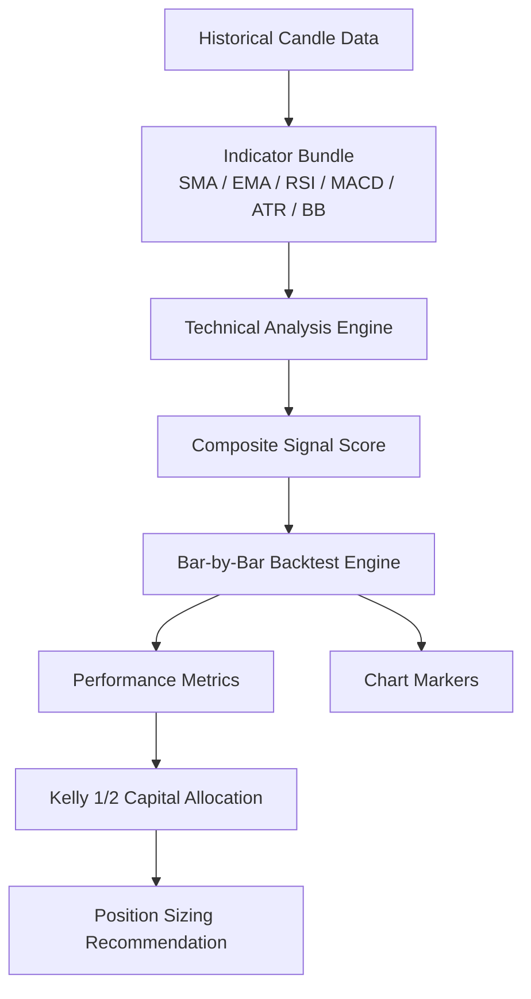
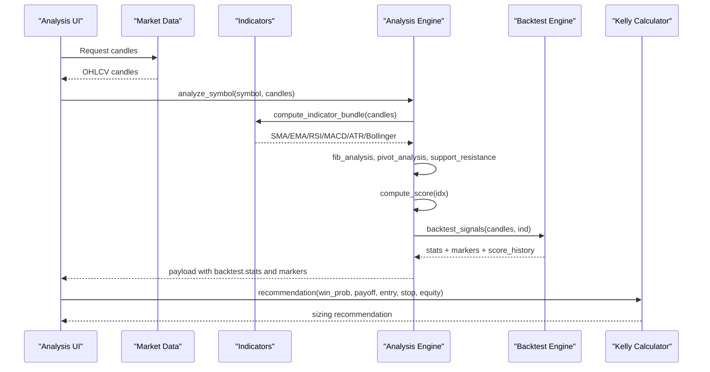
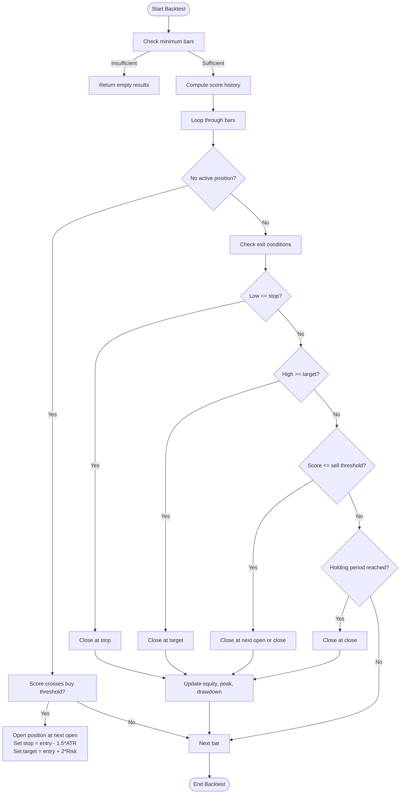
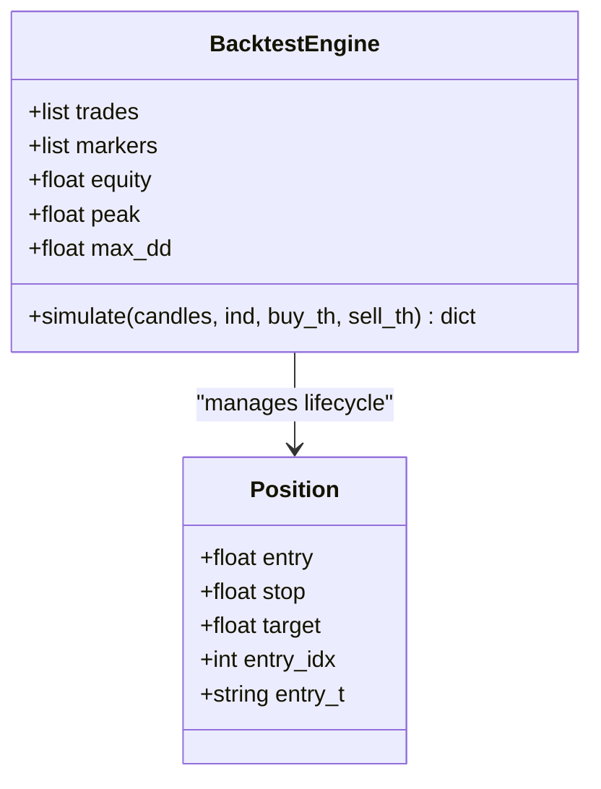
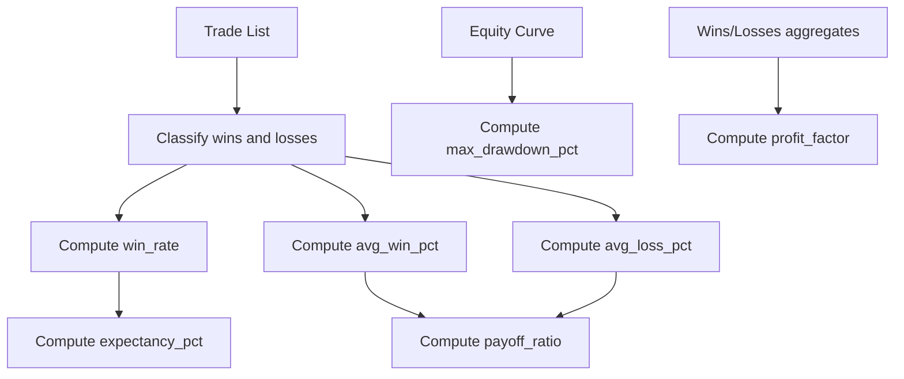
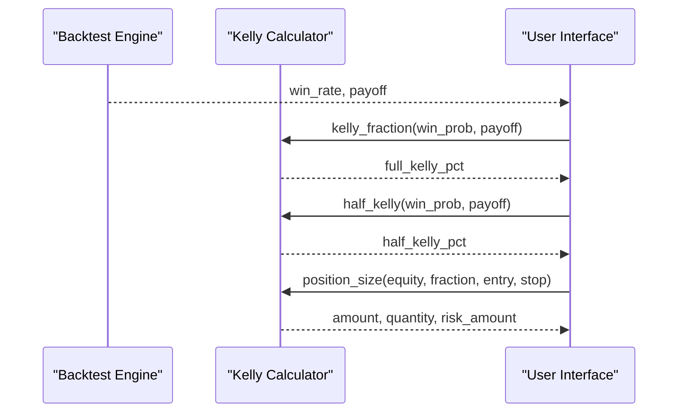
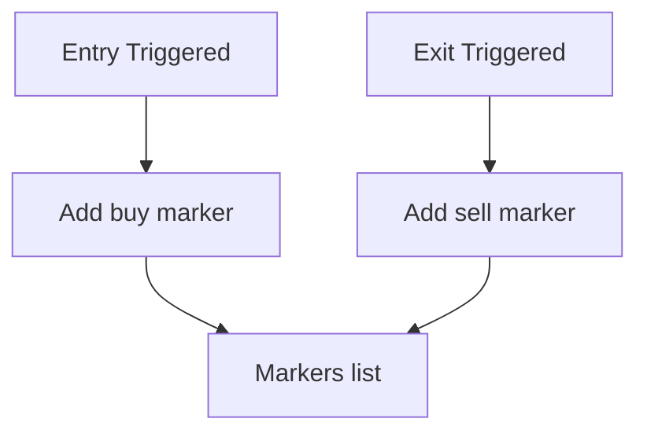
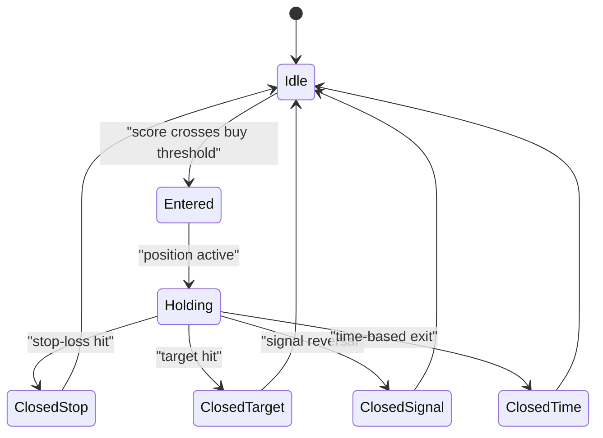
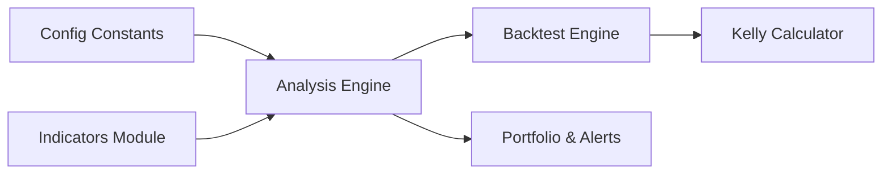

# Backtesting Framework

<cite>
**Referenced Files in This Document**
- [analysis.py](file://fintech/analysis.py)
- [indicators.py](file://fintech/indicators.py)
- [kelly.py](file://fintech/kelly.py)
- [portfolio.py](file://fintech/portfolio.py)
- [README.md](file://README.md)
</cite>

## Table of Contents
1. [Introduction](#introduction)
2. [Project Structure](#project-structure)
3. [Core Components](#core-components)
4. [Architecture Overview](#architecture-overview)
5. [Detailed Component Analysis](#detailed-component-analysis)
6. [Dependency Analysis](#dependency-analysis)
7. [Performance Considerations](#performance-considerations)
8. [Troubleshooting Guide](#troubleshooting-guide)
9. [Conclusion](#conclusion)

## Introduction
This document explains the backtesting framework used by the application to simulate historical trading signals and evaluate performance. The core engine is a bar-by-bar simulation that processes historical candle data, computes composite technical scores, generates virtual trades when signal thresholds are crossed, manages positions with stop-loss and target levels, and calculates performance metrics such as win rate, average win/loss percentages, payoff ratio, expectancy, maximum drawdown, and profit factor.

The backtest is designed to feed Kelly criterion capital allocation logic with realistic win probability and payoff estimates derived from historical price behavior. It also produces chart markers so that buy/sell points can be overlaid on price charts for visual validation.

## Project Structure
The backtesting functionality lives primarily in the technical analysis module, which consumes precomputed indicators and configuration constants. Related modules include:
- Indicator calculations (moving averages, RSI, MACD, ATR, Bollinger Bands).
- Kelly fraction and position sizing utilities.
- Portfolio and alert scanning that reuse the same analysis pipeline.

**Diagram sources**
- [analysis.py:43-61](file://fintech/analysis.py#L43-L61)
- [analysis.py:392-490](file://fintech/analysis.py#L392-L490)
- [indicators.py:14-171](file://fintech/indicators.py#L14-L171)
- [kelly.py:15-98](file://fintech/kelly.py#L15-L98)

**Section sources**
- [README.md:18-24](file://README.md#L18-L24)
- [README.md:59-67](file://README.md#L59-L67)

## Core Components
- Bar-by-bar simulation engine: iterates through recent bars, computes score history, opens positions on buy threshold crossings, and closes positions based on stop-loss, target hit, signal reversal, or time-based exit.
- Position management logic: entry at next open after signal crossing; stop-loss set using ATR multiples; target profit set as a multiple of risk; exits triggered by low touching stop, high touching target, sell threshold breach, or holding period limit.
- Performance metrics calculation: win rate, average win/loss percentages, payoff ratio, expectancy, maximum drawdown, and profit factor.
- Kelly integration: uses backtest-derived win probability and payoff to compute full and half-Kelly fractions, then translates into recommended position size constrained by risk budget and position cap.
- Chart markers: generated buy/sell markers for overlay visualization.

**Section sources**
- [analysis.py:392-490](file://fintech/analysis.py#L392-L490)
- [kelly.py:15-98](file://fintech/kelly.py#L15-L98)

## Architecture Overview
The backtesting workflow integrates indicator computation, scoring, simulation, and capital allocation.

**Diagram sources**
- [analysis.py:598-679](file://fintech/analysis.py#L598-L679)
- [analysis.py:392-490](file://fintech/analysis.py#L392-L490)
- [indicators.py:43-61](file://fintech/indicators.py#L43-L61)
- [kelly.py:66-98](file://fintech/kelly.py#L66-L98)

## Detailed Component Analysis

### Bar-by-Bar Simulation Engine
The simulation engine performs the following steps:
- Validates minimum data length and selects a recent window of bars.
- Precomputes score history for each bar using the composite scoring function.
- Iterates through bars to manage position lifecycle:
  - Entry condition: current score crosses above the buy threshold while previous score was below it; entry executes at the next bar’s open.
  - Stop-loss placement: computed as entry minus 1.5 times the ATR at the entry index; fallback volatility estimate if ATR is unavailable.
  - Target profit: set as entry plus twice the risk distance (2R).
  - Exit triggers:
    - Stop-loss hit: low touches or breaches stop.
    - Target hit: high reaches or exceeds target.
    - Signal reversal: score drops to or below the sell threshold.
    - Time-based exit: holding period reaches a fixed number of bars.
- Tracks equity curve, peak equity, and maximum drawdown across simulated trades.
- Produces trade records and chart markers for visualization.

**Diagram sources**
- [analysis.py:392-490](file://fintech/analysis.py#L392-L490)

**Section sources**
- [analysis.py:392-490](file://fintech/analysis.py#L392-L490)

### Position Management Logic
- Entry conditions:
  - Composite score must cross above the configured buy threshold.
  - Entry price is the next bar’s open; ensures forward-looking execution without look-ahead bias within the simulation constraints.
- Stop-loss placement:
  - Uses ATR at the entry index multiplied by 1.5.
  - If ATR is missing, falls back to a percentage-based volatility estimate.
- Target profit levels:
  - Set at 2 times the risk distance from entry (2R).
- Exit triggers:
  - Stop-loss: triggered when the bar’s low touches or breaches the stop level.
  - Target hit: triggered when the bar’s high reaches or exceeds the target.
  - Signal reversal: triggered when the score drops to or below the sell threshold.
  - Time-based exit: triggered after a fixed holding period measured in bars.

**Diagram sources**
- [analysis.py:406-461](file://fintech/analysis.py#L406-L461)

**Section sources**
- [analysis.py:406-461](file://fintech/analysis.py#L406-L461)

### Performance Metrics Calculation
The backtest computes the following metrics when trades exist:
- Win rate: proportion of winning trades among all trades.
- Average win percentage: mean return of winning trades.
- Average loss percentage: mean return of losing trades.
- Payoff ratio: average win divided by absolute average loss (when both wins and losses exist).
- Expectancy: weighted sum of win and loss returns using win probability.
- Maximum drawdown: worst peak-to-trough decline in simulated equity.
- Profit factor: total gains over total losses (wins count × avg_win vs losses count × |avg_loss|).

These metrics are returned alongside trade history and markers for downstream use.

**Diagram sources**
- [analysis.py:463-484](file://fintech/analysis.py#L463-L484)

**Section sources**
- [analysis.py:463-484](file://fintech/analysis.py#L463-L484)

### Kelly Criterion Integration
The backtest provides win probability and payoff ratio inputs to the Kelly calculator:
- Full Kelly fraction: f* = p − q/b, where p is win probability, q = 1 − p, b is payoff ratio.
- Half-Kelly: Thorp-recommended fractional Kelly for smoother equity curves and reduced drawdowns.
- Position sizing:
  - Converts Kelly fraction into dollar amount based on equity.
  - Caps position size by risk budget per trade and maximum position percentage.
  - Rounds quantity to lot sizes.

**Diagram sources**
- [kelly.py:15-63](file://fintech/kelly.py#L15-L63)
- [kelly.py:66-98](file://fintech/kelly.py#L66-L98)

**Section sources**
- [kelly.py:15-98](file://fintech/kelly.py#L15-L98)

### Chart Markers Generation
The backtest generates markers for buy and sell events:
- Buy marker: recorded at entry date with type and label indicating purchase.
- Sell marker: recorded at exit date with type and label indicating sale.
- Markers are included in the analysis payload for chart overlay.

**Diagram sources**
- [analysis.py:418-457](file://fintech/analysis.py#L418-L457)

**Section sources**
- [analysis.py:418-457](file://fintech/analysis.py#L418-L457)

### Practical Example: Trade Lifecycle
A typical trade lifecycle in the backtest follows these stages:
1. Signal detection: composite score crosses above buy threshold.
2. Entry execution: order placed at next bar’s open.
3. Risk management: stop-loss set at 1.5×ATR below entry; target set at 2R above entry.
4. Monitoring: daily checks against stop, target, signal reversal, and time-based exit.
5. Exit: position closed upon trigger; return calculated; equity updated.
6. Reporting: trade recorded; marker added; metrics aggregated.

**Diagram sources**
- [analysis.py:416-461](file://fintech/analysis.py#L416-L461)

**Section sources**
- [analysis.py:416-461](file://fintech/analysis.py#L416-L461)

## Dependency Analysis
The backtesting framework depends on:
- Indicator calculations for trend, momentum, volatility, and volume context.
- Configuration constants defining signal thresholds and metadata.
- Portfolio and alert scanning that reuse the same analysis pipeline for real-time monitoring.

**Diagram sources**
- [analysis.py:15-22](file://fintech/analysis.py#L15-L22)
- [analysis.py:43-61](file://fintech/analysis.py#L43-L61)
- [kelly.py:15-98](file://fintech/kelly.py#L15-L98)
- [portfolio.py:12-18](file://fintech/portfolio.py#L12-L18)

**Section sources**
- [analysis.py:15-22](file://fintech/analysis.py#L15-L22)
- [analysis.py:43-61](file://fintech/analysis.py#L43-L61)
- [portfolio.py:12-18](file://fintech/portfolio.py#L12-L18)

## Performance Considerations
- Minimum data requirements:
  - Backtest requires at least 90 bars to produce meaningful results; otherwise, it returns empty outputs.
  - Indicator bundle computation benefits from longer histories for stable moving averages and oscillators.
- Lookback windows:
  - Fibonacci analysis uses a configurable lookback window to identify swing anchors.
  - Support/resistance clustering uses a lookback window to detect significant levels.
- Simulation constraints:
  - Entry at next open avoids intra-bar look-ahead bias but may differ from real-world slippage and fill quality.
  - Fixed holding period limits exposure to prolonged sideways markets.
- Real-world trading performance:
  - Historical backtests do not account for transaction costs, slippage, liquidity constraints, or market impact.
  - Results should be treated as indicative; forward testing and paper trading are recommended before live deployment.

[No sources needed since this section provides general guidance]

## Troubleshooting Guide
Common issues and resolutions:
- Insufficient historical data:
  - Ensure at least 90 bars are available; otherwise, backtest returns empty results.
  - Increase history_days setting to fetch more candles.
- Missing or invalid indicators:
  - Verify indicator computations are valid; ATR fallback prevents crashes but may affect stop/target accuracy.
- Threshold misconfiguration:
  - Adjust buy/sell thresholds to match strategy aggressiveness; overly strict thresholds reduce trade frequency.
- Excessive drawdown:
  - Review stop-loss settings and target multiples; consider reducing position size via Kelly fraction or risk budget.
- Alert noise:
  - Tune scan intervals and severity filters to avoid repetitive notifications.

**Section sources**
- [analysis.py:392-398](file://fintech/analysis.py#L392-L398)
- [analysis.py:420-421](file://fintech/analysis.py#L420-L421)
- [portfolio.py:179-278](file://fintech/portfolio.py#L179-L278)

## Conclusion
The backtesting framework provides a robust bar-by-bar simulation engine that transforms historical candle data into actionable insights. By combining composite technical scoring, disciplined position management, and rigorous performance metrics, it supports informed capital allocation through the Kelly criterion. While the simulation offers valuable guidance, users should remain aware of its constraints and validate strategies further before deploying in live markets.

[No sources needed since this section summarizes without analyzing specific files]