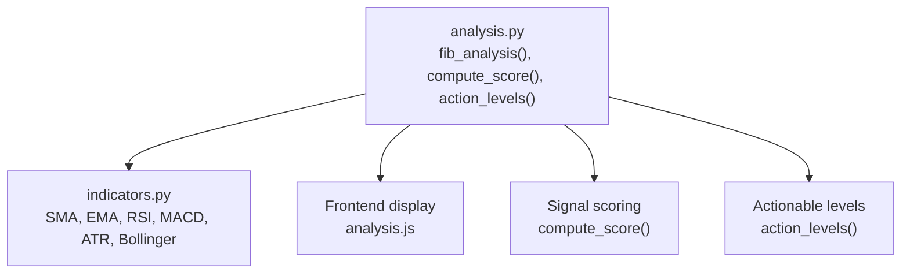
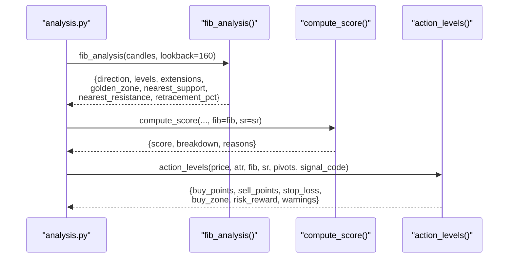
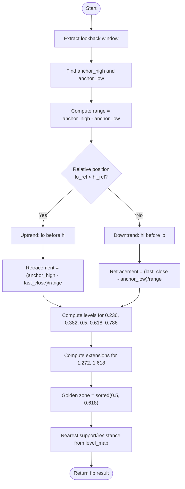
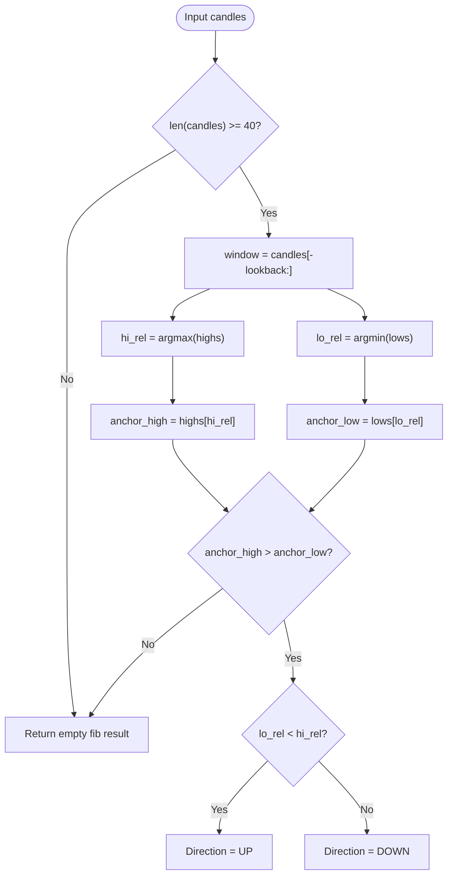
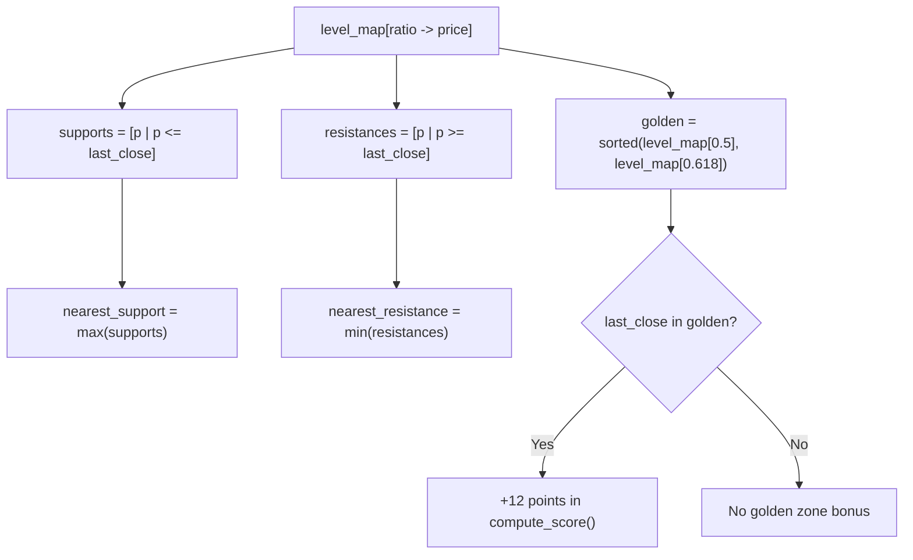
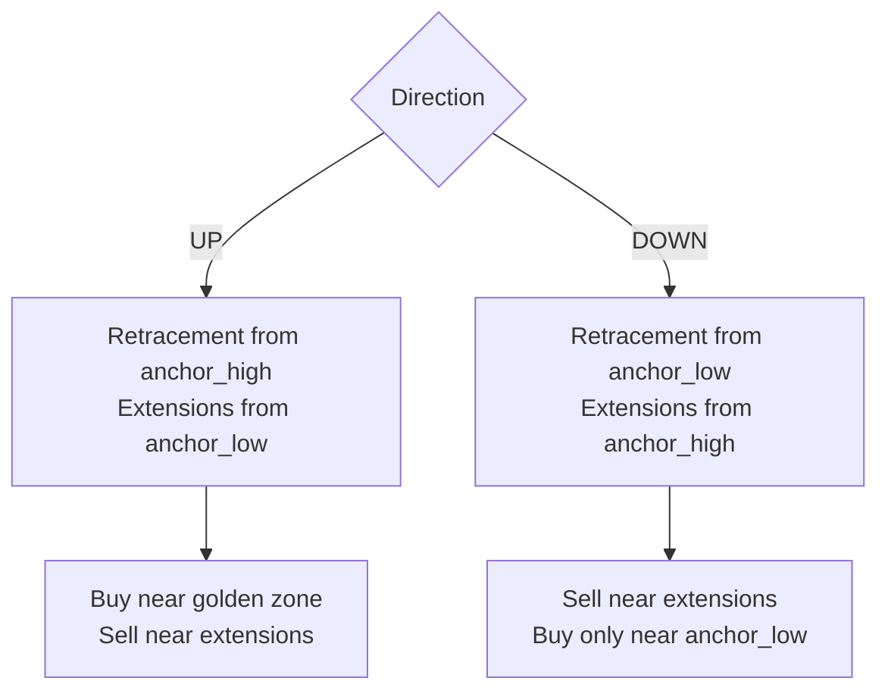
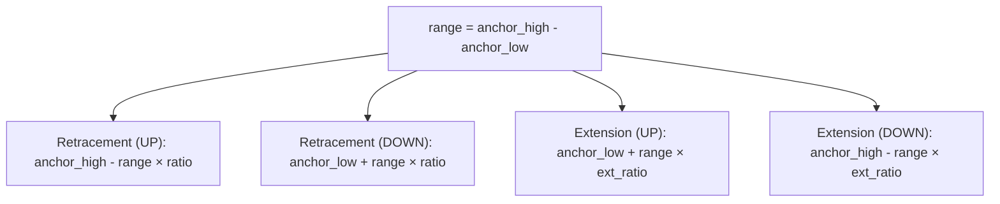
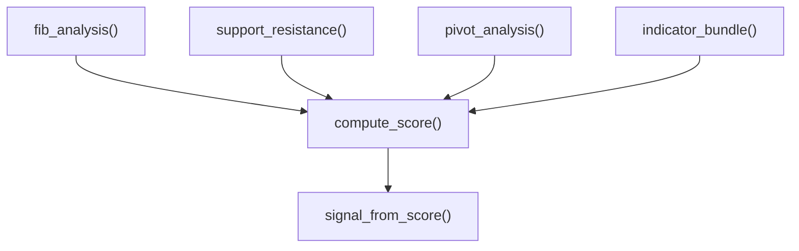
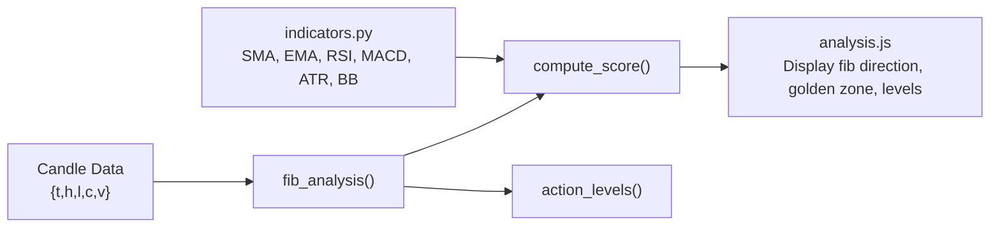

# Fibonacci Analysis

<cite>
**Referenced Files in This Document**
- [analysis.py](file://fintech/analysis.py)
- [indicators.py](file://fintech/indicators.py)
- [README.md](file://README.md)
- [analysis.js](file://fintech/static/js/analysis.js)
</cite>

## Table of Contents
1. [Introduction](#introduction)
2. [Project Structure](#project-structure)
3. [Core Components](#core-components)
4. [Architecture Overview](#architecture-overview)
5. [Detailed Component Analysis](#detailed-component-analysis)
6. [Dependency Analysis](#dependency-analysis)
7. [Performance Considerations](#performance-considerations)
8. [Troubleshooting Guide](#troubleshooting-guide)
9. [Conclusion](#conclusion)

## Introduction
This document explains the Fibonacci analysis component that computes swing-anchored retracement and extension levels, identifies the golden zone between 0.5 and 0.618, derives support/resistance from those levels, calculates nearest levels, and integrates with a broader signal scoring system. It also covers how uptrend versus downtrend structures affect level positioning, how range calculation determines price targets, and what data and performance considerations are required for accurate swing detection in real-time processing.

The implementation is part of a technical analysis engine that combines Fibonacci levels with pivot points, support/resistance clustering, trend/momentum indicators, volume context, and backtesting to produce actionable buy/sell levels and composite scores.

**Section sources**
- [README.md:16-16](file://README.md#L16-L16)

## Project Structure
The Fibonacci logic lives in the technical analysis module alongside other components such as indicator computation, pivot point calculation, support/resistance clustering, score aggregation, and action-level derivation. The frontend JavaScript displays Fibonacci direction, anchor points, golden zone, current retracement percentage, and per-level prices relative to the latest close.

**Diagram sources**
- [analysis.py:66-124](file://fintech/analysis.py#L66-L124)
- [analysis.py:251-372](file://fintech/analysis.py#L251-L372)
- [analysis.py:506-593](file://fintech/analysis.py#L506-L593)
- [indicators.py:14-152](file://fintech/indicators.py#L14-L152)
- [analysis.js:162-182](file://fintech/static/js/analysis.js#L162-L182)

**Section sources**
- [analysis.py:1-10](file://fintech/analysis.py#L1-L10)
- [analysis.py:66-124](file://fintech/analysis.py#L66-L124)
- [analysis.js:162-182](file://fintech/static/js/analysis.js#L162-L182)

## Core Components
- Fibonacci ratios and extensions:
  - Ratios: 0.236, 0.382, 0.5, 0.618, 0.786
  - Extensions: 1.272, 1.618
- Swing anchoring:
  - Identifies highest high and lowest low within a lookback window
  - Determines trend direction based on relative positions of anchor points
- Golden zone:
  - Between 0.5 and 0.618 retracement levels
- Support/resistance derivation:
  - Levels below last close become supports; above become resistances
- Nearest level calculations:
  - Nearest support and resistance derived from level map
- Integration with scoring:
  - Golden zone proximity and 0.786 break influence composite score
- Actionable levels:
  - Buy points at key retracements; sell targets at extensions; stop loss near 0.786 or strong supports

**Section sources**
- [analysis.py:24-25](file://fintech/analysis.py#L24-L25)
- [analysis.py:66-124](file://fintech/analysis.py#L66-L124)
- [analysis.py:308-337](file://fintech/analysis.py#L308-L337)
- [analysis.py:506-593](file://fintech/analysis.py#L506-L593)

## Architecture Overview
The Fibonacci analysis pipeline starts with candle data, extracts a recent window, finds anchors (swing high/low), computes retracement and extension levels, and returns structured results used by scoring and action-level modules.

**Diagram sources**
- [analysis.py:66-124](file://fintech/analysis.py#L66-L124)
- [analysis.py:251-372](file://fintech/analysis.py#L251-L372)
- [analysis.py:506-593](file://fintech/analysis.py#L506-L593)

## Detailed Component Analysis

### Mathematical Foundation of Fibonacci Ratios and Extensions
- Retracements measure pullbacks from an anchor swing:
  - Uptrend: retracement = (anchor_high - last_close) / range
  - Downtrend: retracement = (last_close - anchor_low) / range
- Price at each ratio:
  - Uptrend: anchor_high - range × ratio
  - Downtrend: anchor_low + range × ratio
- Extensions project beyond the anchor swing:
  - Uptrend: anchor_low + range × extension_ratio
  - Downtrend: anchor_high - range × extension_ratio
- Golden zone:
  - Sorted pair of 0.5 and 0.618 levels; used to identify favorable pullback zones
- Nearest levels:
  - Supports: all levels ≤ last close; nearest is maximum among them
  - Resistances: all levels ≥ last close; nearest is minimum among them

**Diagram sources**
- [analysis.py:66-124](file://fintech/analysis.py#L66-L124)

**Section sources**
- [analysis.py:66-124](file://fintech/analysis.py#L66-L124)

### Swing Anchoring Methodology
- Lookback window:
  - Default lookback is 160 bars; if fewer than 40 candles exist, the function returns empty results
- Anchor selection:
  - Highest high and lowest low within the window define the swing range
- Trend direction:
  - If the index of the lowest low precedes the highest high, the structure is considered an uptrend
  - Otherwise, it is treated as a downtrend
- Edge cases:
  - If anchor_high ≤ anchor_low, no valid range exists; return empty result

**Diagram sources**
- [analysis.py:66-82](file://fintech/analysis.py#L66-L82)

**Section sources**
- [analysis.py:66-82](file://fintech/analysis.py#L66-L82)

### Golden Zone Identification and Support/Resistance Derivation
- Golden zone:
  - Computed as the sorted values of the 0.5 and 0.618 levels
  - Used to determine whether the current price lies in a favorable retracement area
- Support/resistance:
  - Supports are levels ≤ last close; nearest support is the maximum among them
  - Resistances are levels ≥ last close; nearest resistance is the minimum among them
- Scoring integration:
  - Being inside the golden zone adds positive points
  - Proximity to nearest support adds additional positive points
  - Breaking below the 0.786 level subtracts significant points, indicating damaged uptrend structure

**Diagram sources**
- [analysis.py:98-124](file://fintech/analysis.py#L98-L124)
- [analysis.py:308-319](file://fintech/analysis.py#L308-L319)

**Section sources**
- [analysis.py:98-124](file://fintech/analysis.py#L98-L124)
- [analysis.py:308-319](file://fintech/analysis.py#L308-L319)

### Uptrend vs Downtrend Level Positioning
- Uptrend:
  - Retracement levels are measured downward from anchor_high
  - Extensions project upward from anchor_low
  - Golden zone and nearest support are typically relevant for buying opportunities
- Downtrend:
  - Retracement levels are measured upward from anchor_low
  - Extensions project downward from anchor_high
  - Scoring penalizes downtrend structure; buy points may be limited to anchor_low probing

**Diagram sources**
- [analysis.py:82-96](file://fintech/analysis.py#L82-L96)
- [analysis.py:320-321](file://fintech/analysis.py#L320-L321)
- [analysis.py:515-546](file://fintech/analysis.py#L515-L546)

**Section sources**
- [analysis.py:82-96](file://fintech/analysis.py#L82-L96)
- [analysis.py:320-321](file://fintech/analysis.py#L320-L321)
- [analysis.py:515-546](file://fintech/analysis.py#L515-L546)

### Role of Range Calculation in Determining Price Targets
- Range = anchor_high - anchor_low
- Retracements:
  - Price = anchor_high - range × ratio (uptrend)
  - Price = anchor_low + range × ratio (downtrend)
- Extensions:
  - Price = anchor_low + range × extension_ratio (uptrend)
  - Price = anchor_high - range × extension_ratio (downtrend)
- These formulas ensure consistent scaling across different assets and timeframes

**Diagram sources**
- [analysis.py:81-96](file://fintech/analysis.py#L81-L96)

**Section sources**
- [analysis.py:81-96](file://fintech/analysis.py#L81-L96)

### Integration with the Broader Signal Scoring System
- Fibonacci contributes to the composite score through:
  - Golden zone presence (+12 points)
  - Proximity to nearest support (+6 points)
  - Break below 0.786 (-10 points)
  - Downtrend penalty (-8 points)
- Other components include trend, momentum, volume, and pivot points
- The final score maps to signals like STRONG_BUY, BUY, HOLD, SELL, STRONG_SELL

**Diagram sources**
- [analysis.py:66-124](file://fintech/analysis.py#L66-L124)
- [analysis.py:174-186](file://fintech/analysis.py#L174-L186)
- [analysis.py:191-240](file://fintech/analysis.py#L191-L240)
- [analysis.py:251-372](file://fintech/analysis.py#L251-L372)
- [analysis.py:375-387](file://fintech/analysis.py#L375-L387)

**Section sources**
- [analysis.py:251-372](file://fintech/analysis.py#L251-L372)
- [analysis.py:375-387](file://fintech/analysis.py#L375-L387)

### Practical Examples
- Uptrend example:
  - Anchor high occurs after anchor low
  - Retracement levels fall below anchor high; golden zone provides buy zones
  - Extensions above anchor low serve as profit targets
- Downtrend example:
  - Anchor high occurs before anchor low
  - Retracement levels rise above anchor low; golden zone less relevant for buys
  - Extensions below anchor high serve as short targets; buy points limited to anchor_low probing

These examples align with the directional logic and level computations implemented in the Fibonacci analysis function.

**Section sources**
- [analysis.py:82-96](file://fintech/analysis.py#L82-L96)
- [analysis.py:515-546](file://fintech/analysis.py#L515-L546)

## Dependency Analysis
The Fibonacci component depends on:
- Candle data structure with fields: t (date), h (high), l (low), c (close), v (volume)
- Indicator utilities for SMA, EMA, RSI, MACD, ATR, Bollinger Bands
- Frontend display for presenting Fibonacci metrics

**Diagram sources**
- [analysis.py:66-124](file://fintech/analysis.py#L66-L124)
- [indicators.py:14-152](file://fintech/indicators.py#L14-L152)
- [analysis.js:162-182](file://fintech/static/js/analysis.js#L162-L182)

**Section sources**
- [analysis.py:66-124](file://fintech/analysis.py#L66-L124)
- [indicators.py:14-152](file://fintech/indicators.py#L14-L152)
- [analysis.js:162-182](file://fintech/static/js/analysis.js#L162-L182)

## Performance Considerations
- Real-time processing:
  - Fibonacci analysis uses a fixed lookback window (default 160); ensure sufficient history to avoid empty results
  - Minimal computational overhead: finding max/min over a window and simple arithmetic operations
- Data requirements:
  - At least 40 candles are required to compute meaningful Fibonacci levels
  - For robust scoring and backtesting, more history improves stability
- Optimization tips:
  - Pre-filter candles to the latest N days before analysis
  - Cache indicator bundles when computing multiple signals for the same dataset

**Section sources**
- [analysis.py:66-70](file://fintech/analysis.py#L66-L70)
- [analysis.py:598-605](file://fintech/analysis.py#L598-L605)

## Troubleshooting Guide
- Empty Fibonacci results:
  - Cause: fewer than 40 candles provided
  - Resolution: increase history length or adjust lookback parameter
- Invalid range:
  - Cause: anchor_high ≤ anchor_low
  - Resolution: verify data integrity and ensure proper OHLC values
- Missing nearest levels:
  - Cause: no levels below or above last close
  - Resolution: check price movement relative to computed levels
- Scoring anomalies:
  - Cause: missing or invalid indicator series
  - Resolution: validate indicator bundle computation and ensure non-null values

**Section sources**
- [analysis.py:66-82](file://fintech/analysis.py#L66-L82)
- [analysis.py:98-124](file://fintech/analysis.py#L98-L124)

## Conclusion
The Fibonacci analysis component provides a robust framework for swing-anchored retracement and extension calculations. It identifies the golden zone between 0.5 and 0.618, derives support/resistance levels, computes nearest levels, and integrates with a comprehensive scoring system. By understanding the mathematical foundation, swing anchoring methodology, and practical implications of uptrend versus downtrend structures, users can effectively apply these levels for trading decisions and risk management. Proper data preparation and awareness of performance constraints ensure reliable real-time processing.