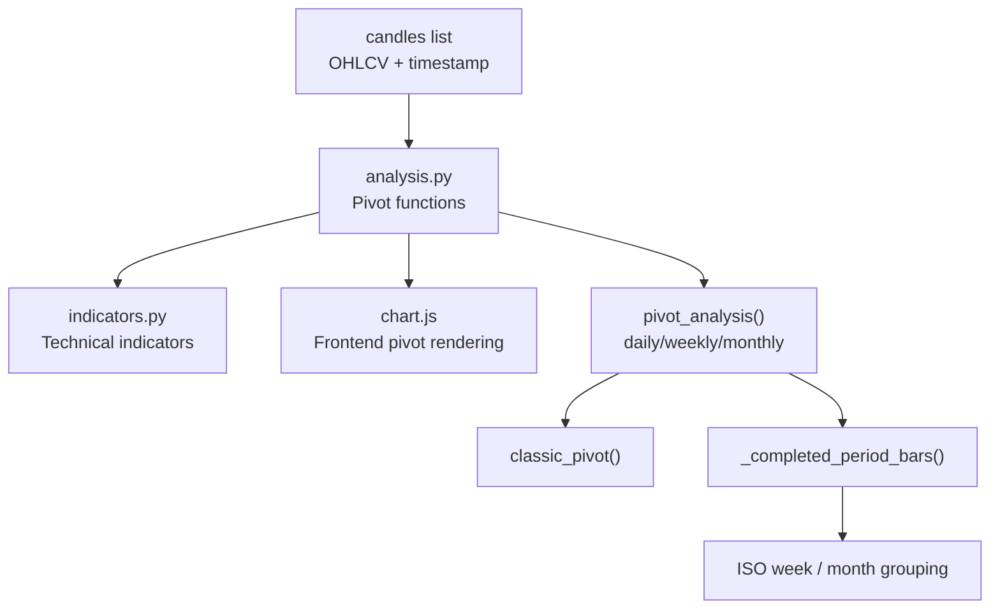
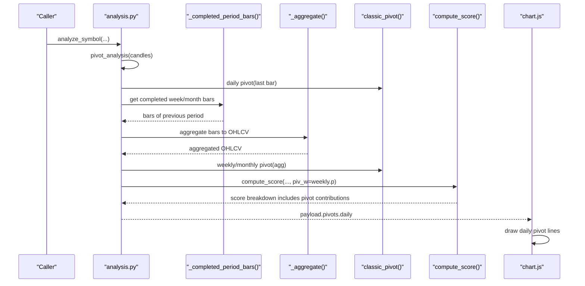
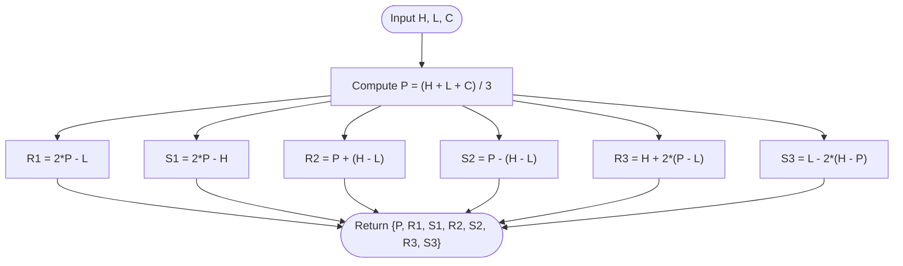
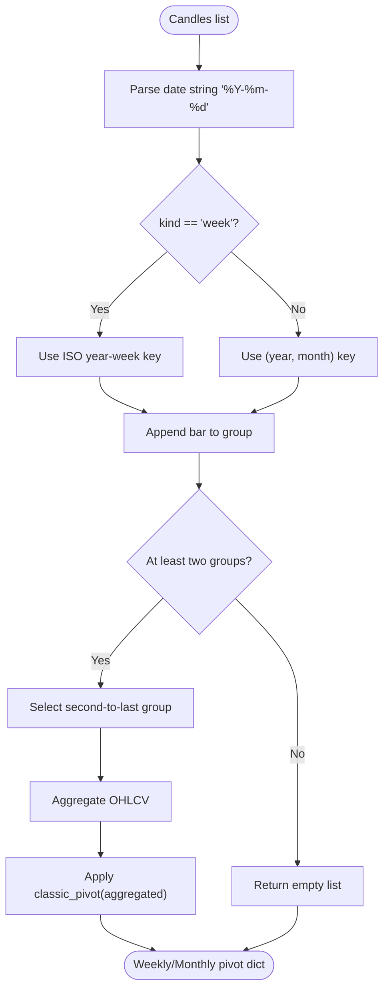
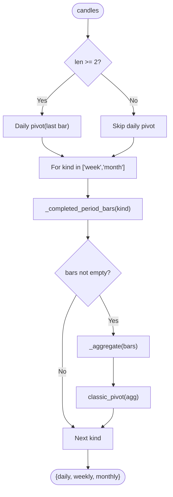
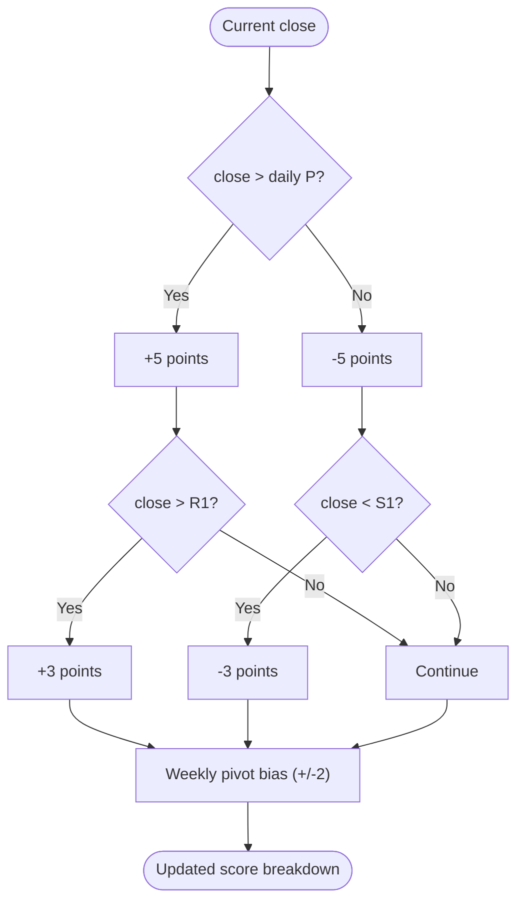
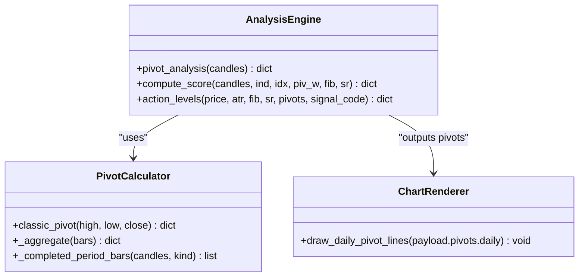
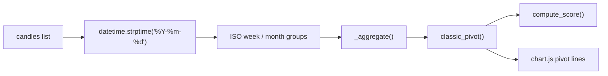

# Pivot Points System

<cite>
**Referenced Files in This Document**
- [analysis.py](file://fintech/analysis.py)
- [indicators.py](file://fintech/indicators.py)
- [chart.js](file://fintech/static/js/chart.js)
</cite>

## Table of Contents
1. [Introduction](#introduction)
2. [Project Structure](#project-structure)
3. [Core Components](#core-components)
4. [Architecture Overview](#architecture-overview)
5. [Detailed Component Analysis](#detailed-component-analysis)
6. [Dependency Analysis](#dependency-analysis)
7. [Performance Considerations](#performance-considerations)
8. [Troubleshooting Guide](#troubleshooting-guide)
9. [Conclusion](#conclusion)
10. [Appendices](#appendices)

## Introduction
This document explains the pivot points system implemented in the analysis engine. It focuses on classic pivot point calculations across daily, weekly, and monthly timeframes, including:
- The mathematical formula for pivot computation and derivation of support and resistance levels.
- Aggregation logic for weekly and monthly pivots using completed period bars.
- ISO week handling and month grouping.
- Time-based bar selection algorithms that exclude current periods and handle date parsing.
- Practical examples showing how different timeframe pivots provide multi-scale support/resistance levels.
- The relationship between pivot levels and price action.
- Integration with the composite scoring system.
- Edge cases in date handling and data completeness requirements.

The pivot logic is part of a broader technical analysis pipeline that also computes Fibonacci levels, swing-based support/resistance clusters, volume metrics, and a composite buy/sell score.

## Project Structure
The pivot points functionality lives primarily in the analysis module, which orchestrates indicator computations, level derivations, scoring, and backtesting. The charting layer consumes the computed pivots to render horizontal lines on the price chart.

**Diagram sources**
- [analysis.py:127-186](file://fintech/analysis.py#L127-L186)
- [analysis.py:152-171](file://fintech/analysis.py#L152-L171)
- [chart.js:153-165](file://fintech/static/js/chart.js#L153-L165)

**Section sources**
- [analysis.py:1-10](file://fintech/analysis.py#L1-L10)
- [analysis.py:127-186](file://fintech/analysis.py#L127-L186)
- [chart.js:153-165](file://fintech/static/js/chart.js#L153-L165)

## Core Components
- Classic pivot calculation function that derives P, R1–R3, S1–S3 from high, low, close.
- Aggregation helper that consolidates multiple bars into one OHLCV summary.
- Completed-period selector that groups bars by ISO week or calendar month and returns the latest completed group.
- Pivot analysis orchestrator that computes daily pivots from the last bar and weekly/monthly pivots from aggregated completed periods.
- Scoring integration that uses daily and weekly pivots to adjust the composite signal score.
- Frontend renderer that draws daily pivot lines (P, S1, S2, R1, R2).

Key responsibilities:
- Pure math for pivot levels.
- Robust date parsing and grouping for weekly/monthly aggregation.
- Excluding the current incomplete period from weekly/monthly calculations.
- Providing pivot-derived signals to the composite scoring engine.

**Section sources**
- [analysis.py:129-139](file://fintech/analysis.py#L129-L139)
- [analysis.py:142-149](file://fintech/analysis.py#L142-L149)
- [analysis.py:152-171](file://fintech/analysis.py#L152-L171)
- [analysis.py:174-186](file://fintech/analysis.py#L174-L186)
- [analysis.py:353-367](file://fintech/analysis.py#L353-L367)
- [chart.js:153-165](file://fintech/static/js/chart.js#L153-L165)

## Architecture Overview
The pivot system integrates into the analysis pipeline as follows:
- Input: a sorted list of candlestick dictionaries containing at least open, high, low, close, volume, and a date string.
- Daily pivots: computed directly from the most recent bar.
- Weekly/monthly pivots: computed from the latest completed period’s aggregated OHLCV.
- Output: a dictionary with daily, weekly, and monthly pivot levels.
- Downstream consumers:
  - Composite scoring adjusts scores based on price position relative to daily and weekly pivots.
  - Actionable levels include daily pivot S1/S2 as buy candidates and R1/R2 as sell targets.
  - Charting renders daily pivot lines for visual reference.

**Diagram sources**
- [analysis.py:174-186](file://fintech/analysis.py#L174-L186)
- [analysis.py:152-171](file://fintech/analysis.py#L152-L171)
- [analysis.py:142-149](file://fintech/analysis.py#L142-L149)
- [analysis.py:129-139](file://fintech/analysis.py#L129-L139)
- [analysis.py:353-367](file://fintech/analysis.py#L353-L367)
- [chart.js:153-165](file://fintech/static/js/chart.js#L153-L165)

## Detailed Component Analysis

### Classic Pivot Calculation
The classic pivot function computes:
- Pivot: P = (H + L + C) / 3
- Resistance levels:
  - R1 = 2P − L
  - R2 = P + (H − L)
  - R3 = H + 2(P − L)
- Support levels:
  - S1 = 2P − H
  - S2 = P − (H − L)
  - S3 = L − 2(H − P)

These formulas are applied consistently for daily, weekly, and monthly pivots depending on the input high, low, and close values.

**Diagram sources**
- [analysis.py:129-139](file://fintech/analysis.py#L129-L139)

**Section sources**
- [analysis.py:129-139](file://fintech/analysis.py#L129-L139)

### Aggregation Logic for Weekly and Monthly Pivots
Weekly and monthly pivots are derived from the latest completed period’s bars:
- Bars are grouped by ISO week or calendar month.
- The latest completed group is selected; the current incomplete period is excluded.
- The group is aggregated into a single OHLCV summary:
  - Open: first bar’s open
  - High: maximum high across the group
  - Low: minimum low across the group
  - Close: last bar’s close
  - Volume: sum of volumes
- The aggregated OHLCV is passed to the classic pivot calculator.

**Diagram sources**
- [analysis.py:152-171](file://fintech/analysis.py#L152-L171)
- [analysis.py:142-149](file://fintech/analysis.py#L142-L149)
- [analysis.py:129-139](file://fintech/analysis.py#L129-L139)

**Section sources**
- [analysis.py:142-149](file://fintech/analysis.py#L142-L149)
- [analysis.py:152-171](file://fintech/analysis.py#L152-L171)

### Time-Based Bar Selection Algorithms
The completed-period selector performs:
- Date parsing using a strict "%Y-%m-%d" format.
- ISO week grouping via standard library ISO calendar methods when kind equals "week".
- Calendar month grouping via (year, month) tuples when kind equals "month".
- Stable ordering by appending bars in sequence, preserving chronological order within each group.
- Selection of the penultimate group to ensure only completed periods are used.

Edge cases handled:
- Invalid or missing dates are skipped without raising exceptions.
- If fewer than two groups exist, no weekly/monthly pivot is produced.

**Section sources**
- [analysis.py:152-171](file://fintech/analysis.py#L152-L171)

### Pivot Analysis Orchestrator
The pivot analysis function:
- Computes daily pivots from the last available bar if there are at least two candles.
- Iterates over weekly and monthly kinds, retrieving completed period bars and aggregating them.
- Applies the classic pivot formula to the aggregated OHLCV.
- Returns a dictionary with keys "daily", "weekly", and "monthly", where unavailable pivots are null.

**Diagram sources**
- [analysis.py:174-186](file://fintech/analysis.py#L174-L186)
- [analysis.py:152-171](file://fintech/analysis.py#L152-L171)
- [analysis.py:142-149](file://fintech/analysis.py#L142-L149)
- [analysis.py:129-139](file://fintech/analysis.py#L129-L139)

**Section sources**
- [analysis.py:174-186](file://fintech/analysis.py#L174-L186)

### Relationship Between Pivot Levels and Price Action
Price action relative to pivot levels influences the composite score:
- If the current close is above the daily pivot, a positive contribution is added; otherwise, negative.
- Crossing above R1 adds additional bullish momentum; dropping below S1 adds bearish pressure.
- Weekly pivot position contributes a smaller but meaningful bias to the overall score.

**Diagram sources**
- [analysis.py:353-367](file://fintech/analysis.py#L353-L367)

**Section sources**
- [analysis.py:353-367](file://fintech/analysis.py#L353-L367)

### Integration With the Composite Scoring System
The pivot system feeds into the composite scoring mechanism:
- Daily pivot proximity and breakout conditions contribute up to approximately ±8 points.
- Weekly pivot position provides an additional small bias.
- The final score is clamped to a bounded range and translated into actionable signals.

**Diagram sources**
- [analysis.py:129-139](file://fintech/analysis.py#L129-L139)
- [analysis.py:142-149](file://fintech/analysis.py#L142-L149)
- [analysis.py:152-171](file://fintech/analysis.py#L152-L171)
- [analysis.py:353-367](file://fintech/analysis.py#L353-L367)
- [chart.js:153-165](file://fintech/static/js/chart.js#L153-L165)

**Section sources**
- [analysis.py:353-367](file://fintech/analysis.py#L353-L367)
- [chart.js:153-165](file://fintech/static/js/chart.js#L153-L165)

### Practical Examples of Multi-Scale Support/Resistance
- Daily pivots reflect intraday structure and immediate support/resistance around the last bar’s range.
- Weekly pivots capture medium-term structure based on the prior week’s aggregated range.
- Monthly pivots capture long-term structure based on the prior month’s aggregated range.

Example interpretation:
- If price is above daily P and weekly P, both short-term and medium-term biases are bullish.
- If price breaks above daily R1 while remaining below weekly R1, it may indicate near-term strength constrained by weekly resistance.
- If price falls below daily S1 but holds above weekly S2, the weekly support may act as a stronger floor.

These multi-scale levels help traders identify confluence zones where daily, weekly, and monthly supports/resistances align.

[No sources needed since this section provides conceptual examples]

## Dependency Analysis
The pivot system depends on:
- Candle data with valid date strings and OHLCV fields.
- Standard library datetime for date parsing and ISO week extraction.
- Indicator utilities for other components (e.g., ATR), though pivots themselves are independent of indicator series.

**Diagram sources**
- [analysis.py:152-171](file://fintech/analysis.py#L152-L171)
- [analysis.py:142-149](file://fintech/analysis.py#L142-L149)
- [analysis.py:129-139](file://fintech/analysis.py#L129-L139)
- [analysis.py:353-367](file://fintech/analysis.py#L353-L367)
- [chart.js:153-165](file://fintech/static/js/chart.js#L153-L165)

**Section sources**
- [analysis.py:152-171](file://fintech/analysis.py#L152-L171)
- [analysis.py:129-139](file://fintech/analysis.py#L129-L139)
- [chart.js:153-165](file://fintech/static/js/chart.js#L153-L165)

## Performance Considerations
- Date parsing occurs per bar during grouping; invalid dates are skipped efficiently.
- Grouping preserves order and avoids repeated scans by appending bars sequentially.
- Aggregation computes min/max/sum once per completed period.
- Pivot calculations are O(1) per timeframe.
- Overall complexity per symbol is dominated by candle count and grouping operations.

[No sources needed since this section provides general guidance]

## Troubleshooting Guide
Common issues and resolutions:
- Missing or malformed dates:
  - Ensure all candle timestamps match the expected "%Y-%m-%d" format.
  - Invalid entries are skipped; ensure sufficient valid bars remain to form at least two groups for weekly/monthly pivots.
- Insufficient data:
  - Weekly/monthly pivots require at least two completed periods; otherwise, they will be null.
  - Daily pivots require at least two candles; otherwise, daily pivot computation is skipped.
- Data completeness:
  - Ensure OHLCV fields are present and numeric; aggregation relies on high, low, close, and volume.
- Chart rendering:
  - Daily pivot lines are drawn only if daily pivots are available in the payload.

**Section sources**
- [analysis.py:152-171](file://fintech/analysis.py#L152-L171)
- [analysis.py:174-186](file://fintech/analysis.py#L174-L186)
- [chart.js:153-165](file://fintech/static/js/chart.js#L153-L165)

## Conclusion
The pivot points system provides robust, multi-timeframe support and resistance levels grounded in classic pivot mathematics. It aggregates completed weekly and monthly periods using ISO week and calendar month grouping, excludes the current incomplete period, and integrates seamlessly with the composite scoring engine and frontend visualization. By combining daily, weekly, and monthly pivots, traders can assess multi-scale market structure and make informed decisions about support/resistance confluences and trend biases.

[No sources needed since this section summarizes without analyzing specific files]

## Appendices

### Mathematical Reference
- Pivot: P = (H + L + C) / 3
- Resistances:
  - R1 = 2P − L
  - R2 = P + (H − L)
  - R3 = H + 2(P − L)
- Supports:
  - S1 = 2P − H
  - S2 = P − (H − L)
  - S3 = L − 2(H − P)

**Section sources**
- [analysis.py:129-139](file://fintech/analysis.py#L129-L139)