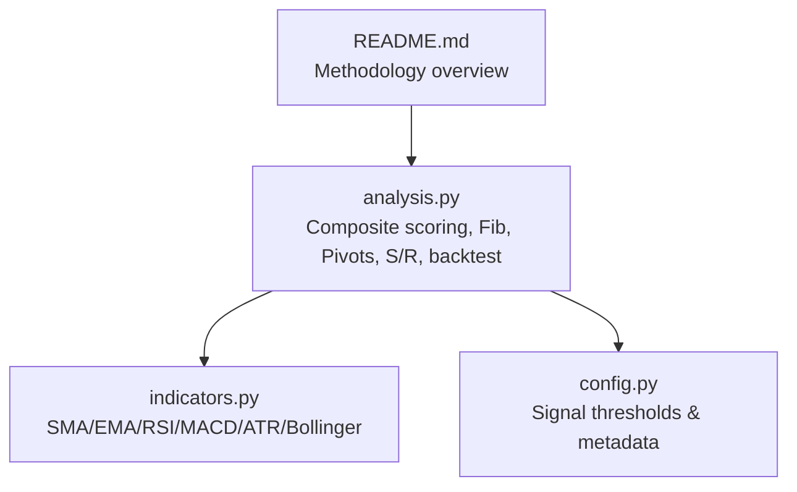
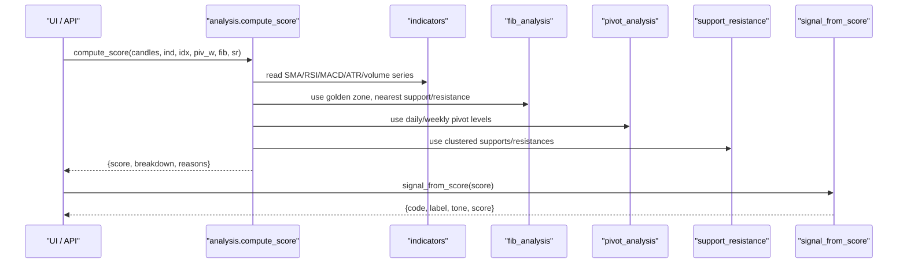
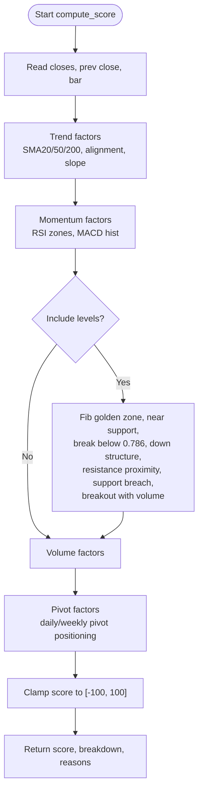
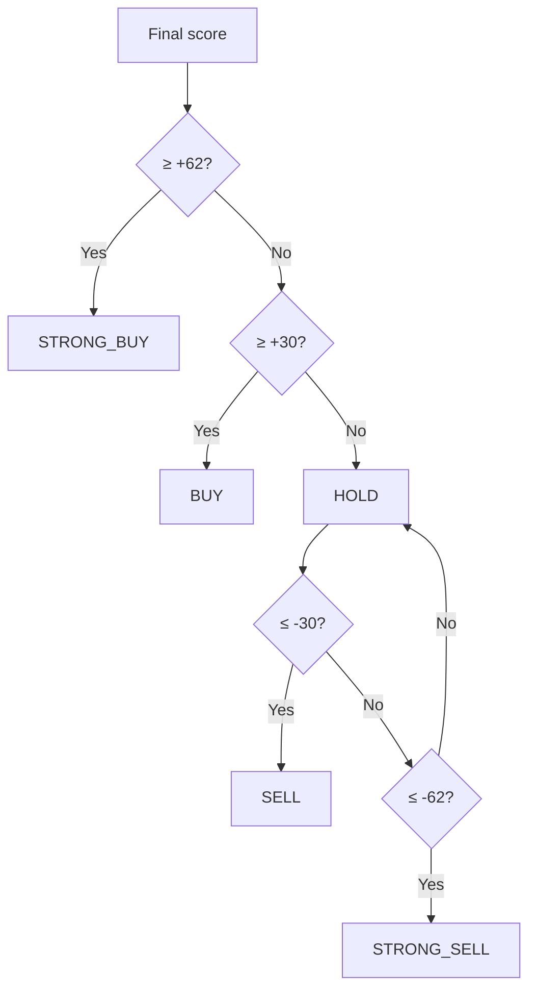
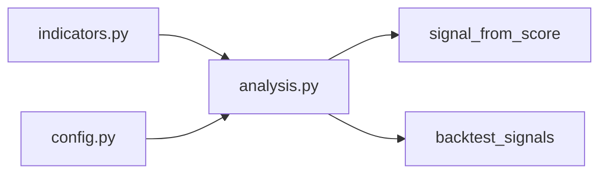

# Signal Scoring System

<cite>
**Referenced Files in This Document**
- [analysis.py](file://fintech/analysis.py)
- [config.py](file://fintech/config.py)
- [indicators.py](file://fintech/indicators.py)
- [README.md](file://README.md)
</cite>

## Table of Contents
1. [Introduction](#introduction)
2. [Project Structure](#project-structure)
3. [Core Components](#core-components)
4. [Architecture Overview](#architecture-overview)
5. [Detailed Component Analysis](#detailed-component-analysis)
6. [Dependency Analysis](#dependency-analysis)
7. [Performance Considerations](#performance-considerations)
8. [Troubleshooting Guide](#troubleshooting-guide)
9. [Conclusion](#conclusion)

## Introduction
This document explains the composite signal scoring system that converts multi-factor technical analysis into a single score on a -100 to +100 scale, then maps that score to actionable trading signals: STRONG_BUY, BUY, HOLD, SELL, and STRONG_SELL. The system aggregates weighted contributions from trend, momentum, levels, volume, and pivot information. It is designed for Vietnamese equity analysis using daily candle data sourced from Vietcap, with Fibonacci retracement/extension zones, classic pivot points, support/resistance clustering, RSI/MACD/SMA indicators, and volume behavior.

The scoring methodology emphasizes transparency: each factor contributes a bounded number of points, and the final score is clamped to [-100, 100]. The thresholds are calibrated so that strong bullish confluence yields scores above +62, moderate bullish conditions exceed +30, neutral conditions remain between -30 and +30, and bearish conditions fall below -30 or -62 for strong sell signals.

## Project Structure
The scoring engine lives in the technical analysis module, which consumes indicator series and structural market levels (Fibonacci, pivots, support/resistance). Configuration defines signal thresholds and presentation metadata. Indicator math is implemented separately for reuse across components.

**Diagram sources**
- [analysis.py:1-10](file://fintech/analysis.py#L1-L10)
- [indicators.py:1-10](file://fintech/indicators.py#L1-L10)
- [config.py:37-41](file://fintech/config.py#L37-L41)
- [README.md:59-67](file://README.md#L59-L67)

**Section sources**
- [README.md:79-105](file://README.md#L79-L105)
- [analysis.py:1-10](file://fintech/analysis.py#L1-L10)

## Core Components
- Composite scoring function computes a weighted sum across five categories:
  - Trend: SMA relationships and slope (~±30)
  - Momentum: RSI zones and MACD histogram (~±26)
  - Levels: Fibonacci golden zone, proximity to support/resistance, breakout confirmation (variable, context-dependent)
  - Volume: volume ratio relative to average, aligned with price direction (~±8)
  - Pivots: daily and weekly pivot positioning (~±8)
- Signal classification maps the final score to one of five codes with labels and tones.
- Backtesting simulates trades based on score thresholds to estimate win rate, payoff, and expectancy for capital sizing.

Key responsibilities:
- `compute_score`: Aggregates factor contributions and returns score, breakdown, and reasons.
- `signal_from_score`: Converts score to code, label, tone, and rounded score.
- `fib_analysis`, `pivot_analysis`, `support_resistance`: Provide structural context used by scoring.
- `backtest_signals`: Simulates entry/exit rules driven by score thresholds.

**Section sources**
- [analysis.py:251-372](file://fintech/analysis.py#L251-L372)
- [analysis.py:375-387](file://fintech/analysis.py#L375-L387)
- [analysis.py:392-490](file://fintech/analysis.py#L392-L490)
- [config.py:37-41](file://fintech/config.py#L37-L41)
- [config.py:72-79](file://fintech/config.py#L72-L79)

## Architecture Overview
The scoring pipeline integrates multiple technical layers:

**Diagram sources**
- [analysis.py:251-372](file://fintech/analysis.py#L251-L372)
- [analysis.py:375-387](file://fintech/analysis.py#L375-L387)
- [analysis.py:66-124](file://fintech/analysis.py#L66-L124)
- [analysis.py:174-186](file://fintech/analysis.py#L174-L186)
- [analysis.py:191-240](file://fintech/analysis.py#L191-L240)
- [indicators.py:14-32](file://fintech/indicators.py#L14-L32)
- [indicators.py:57-77](file://fintech/indicators.py#L57-L77)
- [indicators.py:80-93](file://fintech/indicators.py#L80-L93)

## Detailed Component Analysis

### Composite Score Methodology
The composite score is built by adding point contributions from five groups. Each group has an approximate maximum contribution, ensuring the total remains interpretable and bounded within [-100, 100] after clamping.

- Trend (~±30):
  - Price vs SMA20: ±6
  - Price vs SMA50: ±8
  - Price vs SMA200: ±8
  - SMA20 vs SMA50 alignment: ±5
  - SMA50 slope over lookback: ±3
- Momentum (~±26):
  - RSI zone: up to ±10 depending on overbought/oversold and accumulation zones
  - RSI change over short lag: ±3
  - MACD histogram sign: ±6
  - MACD histogram expansion/contraction: ±3
- Levels (contextual, variable):
  - Golden zone (Fib 0.5–0.618) in uptrend: +12
  - Near Fib support (within ~1.5%): +6
  - Break below Fib 0.786 in uptrend: -10
  - Downward Fib structure: -8
  - Proximity to strong resistance: -10
  - Support breach with multiple touches: -6
  - Breakout above recent high with volume spike: +12
- Volume (~±8):
  - Rising price with elevated volume: +6 or +3
  - Falling price with elevated volume: -6 or -3
- Pivots (~±8):
  - Above/below daily pivot: ±5
  - Above R1 or below S1: ±3
  - Weekly pivot position: ±2

The function clamps the aggregated score to [-100, 100], sorts breakdown by absolute contribution, and returns reasons for display.

**Diagram sources**
- [analysis.py:251-372](file://fintech/analysis.py#L251-L372)

**Section sources**
- [analysis.py:269-372](file://fintech/analysis.py#L269-L372)

### Factor Breakdown Details

#### Trend Factors
- SMA relationships:
  - Price above SMA20 adds positive bias; below subtracts.
  - Price above SMA50 adds stronger positive bias; below subtracts.
  - Price above SMA200 adds long-term bullish confirmation; below subtracts.
  - SMA20 > SMA50 indicates short-term trend alignment; otherwise negative.
- Slope:
  - Positive SMA50 slope over lookback adds small bullish confirmation; negative subtracts.

These contribute approximately ±30 when all align.

**Section sources**
- [analysis.py:269-282](file://fintech/analysis.py#L269-L282)
- [indicators.py:14-32](file://fintech/indicators.py#L14-L32)
- [indicators.py:162-171](file://fintech/indicators.py#L162-L171)

#### Momentum Factors
- RSI zones:
  - Overbought (≥70) penalizes buying strength.
  - Strong zone (60–70) slightly penalizes due to exhaustion risk.
  - Neutral zone (45–60) no impact.
  - Accumulation zone (30–45) rewards potential reversal setup.
  - Oversold (<30) rewards potential bounce.
- RSI change:
  - Rising RSI adds small bullish momentum; falling subtracts.
- MACD histogram:
  - Positive histogram adds bullish momentum; negative subtracts.
  - Expanding histogram adds further bullish confirmation; contracting subtracts.

These contribute approximately ±26 when fully aligned.

**Section sources**
- [analysis.py:283-307](file://fintech/analysis.py#L283-L307)
- [indicators.py:57-77](file://fintech/indicators.py#L57-L77)
- [indicators.py:80-93](file://fintech/indicators.py#L80-L93)

#### Levels: Fibonacci Golden Zone, Support/Resistance, Breakouts
- Fibonacci golden zone detection:
  - In uptrend, if price lies within 0.5–0.618 retracement, add significant bullish points.
  - If price is very close to nearest Fib support (within ~1.5%), add moderate bullish points.
  - If price breaks below Fib 0.786 in uptrend, subtract significant points indicating damaged structure.
  - If Fib structure is downward, subtract points reflecting bearish context.
- Support/resistance proximity:
  - Near strong resistance (within ~2%) subtracts points.
  - Breach of support with multiple touches subtracts points.
- Breakout confirmation:
  - Break above recent high with volume ratio ≥1.4× adds significant bullish points.

Context inclusion is critical: level-based scoring only applies when `include_levels=True` and relevant context (Fib, S/R) is provided.

**Section sources**
- [analysis.py:308-337](file://fintech/analysis.py#L308-L337)
- [analysis.py:66-124](file://fintech/analysis.py#L66-L124)
- [analysis.py:191-240](file://fintech/analysis.py#L191-L240)

#### Volume Factors
- Volume ratio relative to 20-day average:
  - Rising price with volume ≥1.5× adds strong bullish confirmation.
  - Rising price with volume ≥1.0× adds mild bullish confirmation.
  - Falling price with volume ≥1.5× adds strong bearish confirmation.
  - Falling price with volume ≥1.0× adds mild bearish confirmation.

Maximum contribution approximately ±8.

**Section sources**
- [analysis.py:338-352](file://fintech/analysis.py#L338-L352)
- [indicators.py:151-152](file://fintech/indicators.py#L151-L152)

#### Pivot Factors
- Daily pivot positioning:
  - Price above daily pivot adds bullish points; below subtracts.
  - Price above R1 adds additional bullish points; below S1 subtracts.
- Weekly pivot positioning:
  - Price above weekly pivot adds small bullish points; below subtracts.

Maximum contribution approximately ±8.

**Section sources**
- [analysis.py:353-367](file://fintech/analysis.py#L353-L367)
- [analysis.py:129-139](file://fintech/analysis.py#L129-L139)
- [analysis.py:174-186](file://fintech/analysis.py#L174-L186)

### Signal Classification Thresholds
The final score is mapped to one of five signal codes:

- STRONG_BUY: score ≥ +62
- BUY: score ≥ +30
- HOLD: -30 < score < +30
- SELL: score ≤ -30
- STRONG_SELL: score ≤ -62

Each code includes:
- Label: human-readable text (e.g., “MUA MẠNH”, “BÁN MẠNH”)
- Short label: compact representation
- Tone: “up”, “neutral”, or “down”

**Diagram sources**
- [analysis.py:375-387](file://fintech/analysis.py#L375-L387)
- [config.py:37-41](file://fintech/config.py#L37-L41)
- [config.py:72-79](file://fintech/config.py#L72-L79)

**Section sources**
- [analysis.py:375-387](file://fintech/analysis.py#L375-L387)
- [config.py:37-41](file://fintech/config.py#L37-L41)
- [config.py:72-79](file://fintech/config.py#L72-L79)

### Practical Examples and Conflict Resolution

#### Example 1: Conflicting Signals
Suppose:
- Trend: Price above SMA20 (+6), but below SMA200 (-8) → net -2
- Momentum: RSI at 65 (-2), MACD histogram positive (+6), expanding (+3) → net +7
- Levels: Near resistance (-10), Fib golden zone not applicable
- Volume: Rising price with volume ≥1.5× (+6)
- Pivots: Below daily pivot (-5), below S1 (-3)

Aggregated score: -2 + 7 - 10 + 6 - 5 - 3 = -7 → HOLD

Resolution logic:
- Negative levels and pivot factors outweigh positive momentum and volume.
- The system favors caution when structural levels suggest resistance or downside risk.

#### Example 2: Context Inclusion Importance
If `include_levels=False`, level-based contributions (golden zone, resistance proximity, breakout) are skipped. This can significantly alter the score, especially in range-bound markets where levels dominate directional bias.

For example, without levels:
- Trend: +6 (above SMA20)
- Momentum: +7 (as above)
- Volume: +6
- Pivots: -8
Score: +11 → still HOLD, but closer to BUY threshold.

Including levels would likely push it lower due to resistance proximity and pivot weakness.

#### Example 3: Translation to Actionable Signals
A score of +65 maps to STRONG_BUY with label “MUA MẠNH” and tone “up”. A score of -65 maps to STRONG_SELL with label “BÁN MẠNH” and tone “down”. Scores between -30 and +30 map to HOLD with tone “neutral”.

The UI uses these labels and tones to color-code signals and provide concise explanations via the reasons list.

**Section sources**
- [analysis.py:251-372](file://fintech/analysis.py#L251-L372)
- [analysis.py:375-387](file://fintech/analysis.py#L375-L387)
- [config.py:72-79](file://fintech/config.py#L72-L79)

### Mathematical Rationale Behind Weights and Thresholds
- Weight assignments reflect perceived reliability and impact:
  - Trend weights emphasize long-term alignment (SMA200) and intermediate alignment (SMA50), with shorter-term confirmation (SMA20).
  - Momentum weights capture both state (RSI zone) and acceleration (MACD histogram expansion).
  - Levels are context-dependent because structural levels often dominate price behavior near key zones.
  - Volume weights confirm directional moves; extreme volume spikes amplify confidence.
  - Pivot weights provide mechanical reference points for intraday/short-term bias.
- Threshold calibration:
  - +62/-62 thresholds require strong confluence across multiple factors, reducing false positives.
  - +30/-30 thresholds allow moderate setups to trigger actionable signals while maintaining discipline.
  - The -30/+30 neutral band prevents overreaction to noisy signals.
- Clamping to [-100, 100] ensures interpretability and consistent mapping to signal codes.

**Section sources**
- [analysis.py:269-372](file://fintech/analysis.py#L269-L372)
- [config.py:37-41](file://fintech/config.py#L37-L41)
- [README.md:59-67](file://README.md#L59-L67)

## Dependency Analysis
The scoring system depends on:
- Indicator series: SMA, EMA, RSI, MACD, ATR, Bollinger, volume SMA.
- Structural analysis: Fibonacci retracement/extension, pivot points, support/resistance clustering.
- Configuration: signal thresholds and metadata.

**Diagram sources**
- [indicators.py:1-171](file://fintech/indicators.py#L1-L171)
- [analysis.py:1-10](file://fintech/analysis.py#L1-L10)
- [analysis.py:375-387](file://fintech/analysis.py#L375-L387)
- [analysis.py:392-490](file://fintech/analysis.py#L392-L490)
- [config.py:37-41](file://fintech/config.py#L37-L41)

**Section sources**
- [analysis.py:1-10](file://fintech/analysis.py#L1-L10)
- [indicators.py:1-171](file://fintech/indicators.py#L1-L171)
- [config.py:37-41](file://fintech/config.py#L37-L41)

## Performance Considerations
- Indicator computation is vectorized per-bar with None-padding for warm-up periods.
- Scoring is O(1) per bar given precomputed indicators and structural levels.
- Fibonacci and support/resistance computations operate on windows (e.g., 160 bars for Fib, 220 for S/R), making them more expensive but infrequent compared to per-bar scoring.
- Backtesting iterates over recent bars and recomputes scores without levels for efficiency.

Recommendations:
- Cache indicator bundles and structural analyses when possible.
- Limit backtest window to reduce computation time.
- Use include_levels selectively to balance accuracy and performance.

[No sources needed since this section provides general guidance]

## Troubleshooting Guide
Common issues and resolutions:
- Missing indicator values:
  - Ensure sufficient history (≥60 bars minimum for full analysis).
  - Check for NaN or None values in input candles.
- Weak or conflicting signals:
  - Review breakdown reasons to understand dominant factors.
  - Adjust include_levels to see how structural context affects the score.
- Threshold sensitivity:
  - Tune thresholds in config if necessary, but maintain symmetry around zero for balanced buy/sell classification.
- Volume anomalies:
  - Verify volume data integrity; missing volume can mute volume-based contributions.

**Section sources**
- [analysis.py:598-605](file://fintech/analysis.py#L598-L605)
- [analysis.py:251-372](file://fintech/analysis.py#L251-L372)
- [config.py:37-41](file://fintech/config.py#L37-L41)

## Conclusion
The composite signal scoring system provides a transparent, multi-factor approach to generating actionable trading signals. By aggregating weighted contributions from trend, momentum, levels, volume, and pivots, it produces a robust score that reflects market context and technical confluence. The thresholds ensure disciplined classification into STRONG_BUY, BUY, HOLD, SELL, and STRONG_SELL, with clear labels and tones for user interpretation. Practical examples demonstrate how conflicting signals are resolved through structured weighting and contextual inclusion, enabling traders to translate raw scores into informed decisions.

[No sources needed since this section summarizes without analyzing specific files]