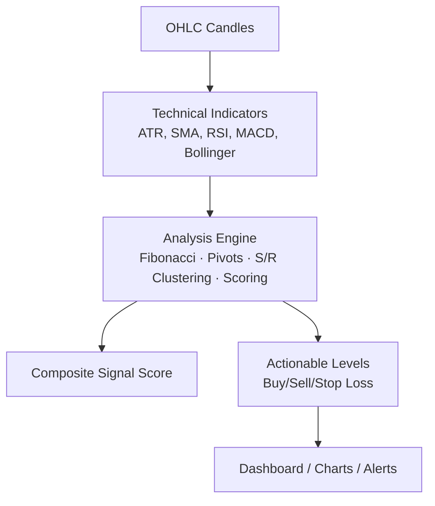
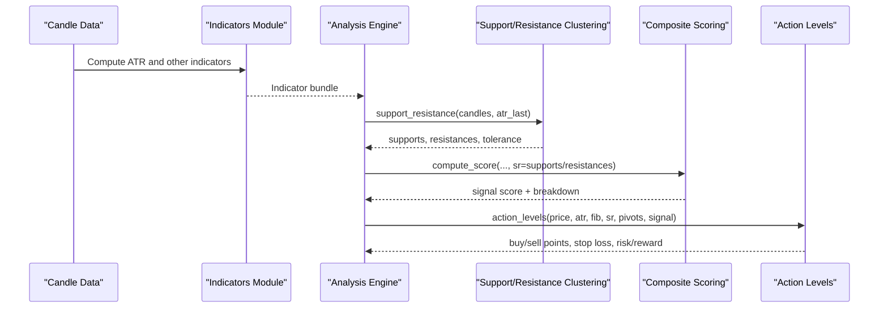
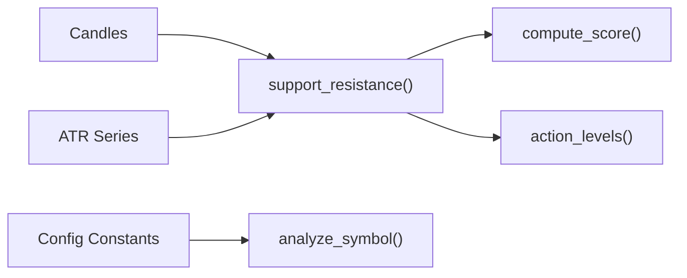

# Support/Resistance Clustering

<cite>
**Referenced Files in This Document**
- [analysis.py](file://fintech/analysis.py)
- [indicators.py](file://fintech/indicators.py)
- [config.py](file://fintech/config.py)
- [README.md](file://README.md)
</cite>

## Table of Contents
1. [Introduction](#introduction)
2. [Project Structure](#project-structure)
3. [Core Components](#core-components)
4. [Architecture Overview](#architecture-overview)
5. [Detailed Component Analysis](#detailed-component-analysis)
6. [Dependency Analysis](#dependency-analysis)
7. [Performance Considerations](#performance-considerations)
8. [Troubleshooting Guide](#troubleshooting-guide)
9. [Conclusion](#conclusion)

## Introduction
This document explains the support and resistance clustering system used by the technical analysis engine. The system detects swing highs and lows through a fractal-style local maxima/minima algorithm, groups nearby price levels into clusters using dynamic tolerance derived from both price percentage and Average True Range, and computes weighted average prices and strength scores that consider touch frequency and recency. It also documents how supports and resistances are filtered relative to the current price, how the clustering integrates with Fibonacci, Pivot Point, scoring, and actionable level generation, and how sensitivity versus noise is balanced for large datasets.

The implementation is part of a broader Python Flask application focused on Vietnamese stock technical analysis, including Fibonacci retracement/extension, classic pivots, composite signal scoring, backtesting, Kelly sizing, portfolio management, alerts, and screening.

**Section sources**
- [README.md:1-24](file://README.md#L1-L24)
- [README.md:59-67](file://README.md#L59-L67)

## Project Structure
At a high level, the clustering logic lives in the technical analysis module, which consumes OHLC candle data and indicator series such as ATR. The clustering result feeds into the composite score and action-level generator.

**Diagram sources**
- [analysis.py:43-61](file://fintech/analysis.py#L43-L61)
- [analysis.py:66-124](file://fintech/analysis.py#L66-L124)
- [analysis.py:174-186](file://fintech/analysis.py#L174-L186)
- [analysis.py:191-240](file://fintech/analysis.py#L191-L240)
- [analysis.py:251-372](file://fintech/analysis.py#L251-L372)
- [analysis.py:506-593](file://fintech/analysis.py#L506-L593)

**Section sources**
- [README.md:79-105](file://README.md#L79-L105)
- [analysis.py:1-10](file://fintech/analysis.py#L1-L10)

## Core Components
- Swing point identification: Local maxima/minima detection over a configurable swing window.
- Clustering methodology: Groups nearby price levels based on a tolerance threshold combining price percentage and ATR.
- Weighting system: Recency-weighted averaging of cluster points plus a strength score reflecting total weight and touch count.
- Filtering logic: Supports below current price; resistances above current price; distance filters avoid extreme outliers.
- Integration points: Consumes ATR from indicators, participates in composite scoring, and supplies levels to action-level generation.

Key responsibilities:
- `support_resistance`: Main clustering function.
- `compute_indicator_bundle` and `indicators.atr`: Provide ATR and other indicators.
- `analyze_symbol`: Orchestrates analysis pipeline and includes clustering results in final payload.

**Section sources**
- [analysis.py:191-240](file://fintech/analysis.py#L191-L240)
- [analysis.py:43-61](file://fintech/analysis.py#L43-L61)
- [indicators.py:111-122](file://fintech/indicators.py#L111-L122)
- [analysis.py:598-679](file://fintech/analysis.py#L598-L679)

## Architecture Overview
The clustering system is embedded within the analysis pipeline. Candle data is first transformed into indicator series (including ATR), then used to compute Fibonacci levels, pivot points, and support/resistance clusters. These outputs feed into the composite score and actionable levels.

**Diagram sources**
- [analysis.py:43-61](file://fintech/analysis.py#L43-L61)
- [analysis.py:191-240](file://fintech/analysis.py#L191-L240)
- [analysis.py:251-372](file://fintech/analysis.py#L251-L372)
- [analysis.py:506-593](file://fintech/analysis.py#L506-L593)

## Detailed Component Analysis

### Swing Point Identification Algorithm
The algorithm scans a sliding window of candles and identifies swing highs and swing lows using a local extrema approach:
- For each bar index `i`, it compares the high against neighboring highs within a symmetric window defined by the swing parameter.
- If the high is greater than or equal to all neighbors in the window, it is marked as a swing high.
- Similarly, if the low is less than or equal to all neighbors, it is marked as a swing low.
- The swing parameter controls sensitivity: larger values reduce false swings but may miss short-term reversals.

Complexity considerations:
- Naive comparison per bar involves scanning neighbors, leading to O(n × swing) operations.
- Sorting points by price before clustering adds O(m log m), where m is the number of detected swing points.

Practical implications:
- Small swing values increase sensitivity to micro-reversals, potentially creating more clusters.
- Larger swing values smooth out noise, focusing on more significant structural highs/lows.

**Section sources**
- [analysis.py:191-208](file://fintech/analysis.py#L191-L208)

### Clustering Methodology
After detecting swing points, the algorithm sorts them by price and groups nearby levels into clusters:
- Tolerance threshold: `max(last_close * 0.008, atr_v * 0.6)`
  - Price-based component: 0.8% of the latest close ensures a minimum grouping band even when volatility is low.
  - Volatility-based component: 0.6×ATR adapts tolerance to market conditions; higher volatility widens tolerance, reducing fragmentation.
- Clustering rule: A new point is added to the last cluster if its price is within tolerance of the cluster’s last price; otherwise, a new cluster starts.

Dynamic adjustment:
- In calm markets, the price-based floor prevents overly tight clustering.
- In volatile markets, ATR expands tolerance, merging nearby levels that would otherwise be separate clusters.

Output:
- Each cluster yields a representative level with weighted average price, touch count, score, last date, and distance percentage.

**Section sources**
- [analysis.py:209-217](file://fintech/analysis.py#L209-L217)

### Weighting System and Strength Scores
Each swing point in a cluster contributes to the weighted average price:
- Recency weight: `1.0 + 1.5 * (point_index / max(1, n))`
  - More recent touches receive higher weights, emphasizing current market structure.
- Total weight: Sum of individual weights across the cluster.
- Weighted average price: Sum of (price × weight) divided by total weight.
- Strength score: Rounded total weight, capturing both touch frequency and recency.

Additional metrics:
- Touch count: Number of swing points grouped into the cluster.
- Last date: Date of the most recent touch in the cluster.
- Distance percentage: Percentage difference between the cluster price and the latest close.

Interpretation:
- Higher scores indicate stronger, more recent, and frequently touched levels.
- Distance percentage helps prioritize levels near the current price while filtering out distant extremes.

**Section sources**
- [analysis.py:218-235](file://fintech/analysis.py#L218-L235)

### Filtering Logic for Supports vs Resistances
After computing cluster levels:
- Supports: Levels below the latest close and within a reasonable negative distance threshold (`distance_pct > -25`).
- Resistances: Levels above the latest close and within a reasonable positive distance threshold (`distance_pct < 25`).
- Sorting: Both lists are sorted by descending score and then by absolute distance to prioritize strong, nearby levels.
- Limiting: Only top 4 supports and 4 resistances are retained for downstream use.

Purpose:
- Ensures only relevant, non-extreme levels influence scoring and actionable decisions.
- Balances sensitivity (more levels considered) with noise reduction (filtering far-away or weak clusters).

**Section sources**
- [analysis.py:236-240](file://fintech/analysis.py#L236-L240)

### Practical Examples and Psychological Levels
While the code does not explicitly detect psychological round numbers, clustering naturally groups price levels where multiple swing highs/lows occur. Common scenarios include:
- Round-number zones (e.g., 100, 1000 VND) often attract repeated reactions, forming clusters with higher touch counts and scores.
- Recent swing anchors (from Fibonacci analysis) can align with clustered levels, reinforcing their significance.
- When ATR increases, tolerance widens, merging nearby levels around key psychological zones into single robust clusters.

Integration with Fibonacci and Pivots:
- Fibonacci golden zone and nearest support/resistance influence scoring and action levels.
- Classic pivots provide additional reference points that complement clustered supports/resistances.

**Section sources**
- [analysis.py:66-124](file://fintech/analysis.py#L66-L124)
- [analysis.py:174-186](file://fintech/analysis.py#L174-L186)
- [analysis.py:506-593](file://fintech/analysis.py#L506-L593)

### Balance Between Sensitivity and Noise Reduction
Sensitivity tuning:
- Swing parameter: Controls local extrema detection granularity.
- Tolerance composition: Combines fixed price percentage and ATR-based volatility scaling.
- Distance filters: Exclude extreme clusters beyond ±25% from current price.

Noise reduction strategies:
- Minimum price-based tolerance prevents over-clustering in low-volatility environments.
- ATR-based tolerance adapts to changing market conditions.
- Sorting by score and limiting output reduces clutter in downstream components.

Recommendations:
- Use larger swing values for trending assets to avoid micro-noise.
- Monitor ATR spikes; widening tolerance may merge distinct levels, requiring manual review.
- Adjust lookback window to balance historical context with computational efficiency.

**Section sources**
- [analysis.py:191-240](file://fintech/analysis.py#L191-L240)

### Performance Optimization for Large Datasets
Current implementation characteristics:
- Swing detection uses nested loops over neighbor windows, resulting in O(n × swing) complexity.
- Sorting swing points by price adds O(m log m).
- Clustering is linear in the number of points after sorting.

Optimization opportunities:
- Precompute min/max over sliding windows using deque-based algorithms to reduce O(n × swing) to O(n).
- Avoid repeated float conversions by normalizing inputs once.
- Cache ATR values and reuse across analyses.
- Parallelize symbol-level analysis in screening workflows.

Trade-offs:
- Optimizations improve scalability but may complicate readability and maintenance.
- For typical dataset sizes (~220 lookback bars), current performance is acceptable.

**Section sources**
- [analysis.py:191-240](file://fintech/analysis.py#L191-L240)
- [indicators.py:111-122](file://fintech/indicators.py#L111-L122)

### Integration with Broader Technical Analysis Framework
Clustering results participate in:
- Composite scoring: Near resistances penalize bullish signals; broken supports penalize bullish signals.
- Actionable levels: Strong clustered supports inform buy points and stop-loss placement.
- Backtesting: Historical signals use ATR-based stops and targets, indirectly influenced by clustered levels.

Pipeline orchestration:
- `analyze_symbol` computes indicators, Fibonacci, pivots, and clustering, then generates scores and action levels.
- Final payload includes supports, resistances, signal, and levels for UI display and alerting.

**Section sources**
- [analysis.py:251-372](file://fintech/analysis.py#L251-L372)
- [analysis.py:506-593](file://fintech/analysis.py#L506-L593)
- [analysis.py:598-679](file://fintech/analysis.py#L598-L679)

## Dependency Analysis
The clustering system depends on:
- Candle data: OHLC format with timestamps.
- ATR series: From `indicators.atr`, providing volatility context.
- Configuration constants: Signal thresholds and default settings.

**Diagram sources**
- [analysis.py:191-240](file://fintech/analysis.py#L191-L240)
- [analysis.py:251-372](file://fintech/analysis.py#L251-L372)
- [analysis.py:506-593](file://fintech/analysis.py#L506-L593)
- [analysis.py:598-679](file://fintech/analysis.py#L598-L679)
- [config.py:37-41](file://fintech/config.py#L37-L41)

**Section sources**
- [analysis.py:191-240](file://fintech/analysis.py#L191-L240)
- [config.py:37-41](file://fintech/config.py#L37-L41)

## Performance Considerations
- Dataset size: Typical lookback of ~220 bars keeps computation manageable.
- ATR calculation: Uses Wilder’s smoothing, efficient for rolling volatility.
- Memory usage: Lists of points and clusters are small relative to full history.
- Scalability: Screening multiple symbols benefits from parallelization at the application layer.

[No sources needed since this section provides general guidance]

## Troubleshooting Guide
Common issues and resolutions:
- No clusters detected:
  - Check swing parameter; too large may miss local extrema.
  - Verify candle data quality and sufficient length.
- Excessive clusters:
  - Increase swing value or tolerance components.
  - Review ATR values; extremely low volatility may require adjusting price-based tolerance.
- Weak or distant levels:
  - Inspect distance percentage filters; ensure they align with trading strategy.
  - Confirm sorting by score prioritizes meaningful levels.

Validation steps:
- Print intermediate outputs: swing points, tolerance, cluster sizes, and final supports/resistances.
- Compare with visual chart annotations to confirm alignment with known support/resistance zones.

**Section sources**
- [analysis.py:191-240](file://fintech/analysis.py#L191-L240)

## Conclusion
The support/resistance clustering system provides a robust, adaptive framework for identifying and weighting key price levels. By combining fractal-based swing detection, dynamic tolerance from ATR and price percentage, and recency-aware weighting, it balances sensitivity and noise reduction effectively. Integrated with Fibonacci, pivots, scoring, and actionable level generation, it forms a core component of the technical analysis pipeline, enabling informed trading decisions grounded in statistical level detection.

[No sources needed since this section summarizes without analyzing specific files]