# Technical Analysis Engine

<cite>
**Referenced Files in This Document**
- [analysis.py](file://fintech/analysis.py)
- [indicators.py](file://fintech/indicators.py)
- [screener.py](file://fintech/screener.py)
- [market.py](file://fintech/market.py)
- [config.py](file://fintech/config.py)
- [routes.py](file://fintech/routes.py)
- [analysis.js](file://fintech/static/js/analysis.js)
- [chart.js](file://fintech/static/js/chart.js)
</cite>

## Table of Contents
1. [Introduction](#introduction)
2. [Project Structure](#project-structure)
3. [Core Components](#core-components)
4. [Architecture Overview](#architecture-overview)
5. [Detailed Component Analysis](#detailed-component-analysis)
6. [Dependency Analysis](#dependency-analysis)
7. [Performance Considerations](#performance-considerations)
8. [Troubleshooting Guide](#troubleshooting-guide)
9. [Conclusion](#conclusion)

## Introduction
This document explains the technical analysis engine that powers multi-factor stock analysis for the application. It covers:
- Fibonacci retracement and extension calculations anchored to swing highs/lows
- Pivot Point computation across daily, weekly, and monthly timeframes
- Support/resistance clustering derived from fractal swing points
- A composite signal scoring system on a -100 to +100 scale with explicit weight assignments and classification thresholds
- Technical indicators: RSI, MACD, Bollinger Bands, ATR, and moving averages
- Backtesting framework for win-rate, payoff, expectancy, and drawdown used by position sizing
- Frontend integration for visualization and user interaction

The goal is to make the methodology, algorithms, data flows, and performance characteristics clear for both developers and traders.

## Project Structure
At runtime, the HTTP layer exposes endpoints that fetch market data, run the analysis engine, and return structured payloads consumed by the frontend. The core modules are:
- Market data service: cached candles and fundamentals
- Technical analysis engine: indicators, levels, signals, backtests
- Screener: background scans over universes
- Configuration: thresholds, defaults, and constants
- Frontend: analysis page and charting utilities

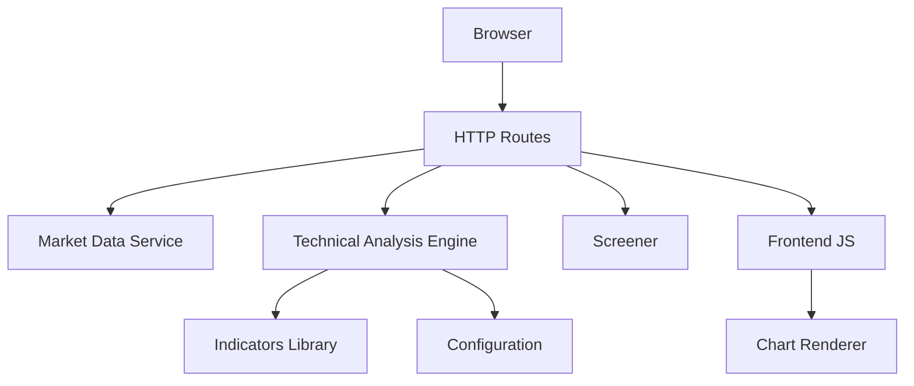

**Diagram sources**
- [routes.py:98-133](file://fintech/routes.py#L98-L133)
- [market.py:20-43](file://fintech/market.py#L20-L43)
- [analysis.py:598-679](file://fintech/analysis.py#L598-L679)
- [indicators.py:14-171](file://fintech/indicators.py#L14-L171)
- [analysis.js:20-53](file://fintech/static/js/analysis.js#L20-L53)
- [chart.js:73-228](file://fintech/static/js/chart.js#L73-L228)

**Section sources**
- [routes.py:1-398](file://fintech/routes.py#L1-L398)
- [market.py:1-154](file://fintech/market.py#L1-L154)
- [analysis.py:1-680](file://fintech/analysis.py#L1-L680)
- [indicators.py:1-171](file://fintech/indicators.py#L1-L171)
- [config.py:1-80](file://fintech/config.py#L1-L80)
- [analysis.js:1-315](file://fintech/static/js/analysis.js#L1-L315)
- [chart.js:1-296](file://fintech/static/js/chart.js#L1-L296)

## Core Components
- Market data service: provides cached OHLCV candles and company fundamentals, with refresh policies and fallback behavior.
- Technical analysis engine: computes indicator bundles, Fibonacci levels, pivot points, support/resistance clusters, composite scores, actionable levels, and backtest statistics.
- Screener: runs parallel scans across symbol universes, applies filters, and persists results.
- Frontend: renders charts, signal panels, Fibonacci tables, pivot tables, support/resistance lists, and backtest stats; integrates Kelly sizing.

Key responsibilities:
- Data acquisition and caching
- Indicator computation
- Multi-factor scoring and signal classification
- Actionable level generation (buy/sell zones, stop loss, risk/reward)
- Backtesting simulation for win-rate and payoff
- Visualization and user workflows

**Section sources**
- [market.py:20-78](file://fintech/market.py#L20-L78)
- [analysis.py:43-61](file://fintech/analysis.py#L43-L61)
- [analysis.py:66-124](file://fintech/analysis.py#L66-L124)
- [analysis.py:129-186](file://fintech/analysis.py#L129-L186)
- [analysis.py:191-240](file://fintech/analysis.py#L191-L240)
- [analysis.py:251-387](file://fintech/analysis.py#L251-L387)
- [analysis.py:392-490](file://fintech/analysis.py#L392-L490)
- [analysis.py:495-593](file://fintech/analysis.py#L495-L593)
- [analysis.py:598-679](file://fintech/analysis.py#L598-L679)
- [screener.py:32-97](file://fintech/screener.py#L32-L97)
- [screener.py:126-211](file://fintech/screener.py#L126-L211)

## Architecture Overview
The end-to-end flow for analyzing a symbol:
1. Frontend requests analysis via API.
2. Routes fetch candles and fundamentals through the market service.
3. Analysis engine computes indicators, Fibonacci, pivots, S/R, score, signal, action levels, and backtest.
4. Payload is returned to the frontend for rendering.
5. Charts render price, SMA, Fibonacci, pivots, S/R, markers, and volume overlays.

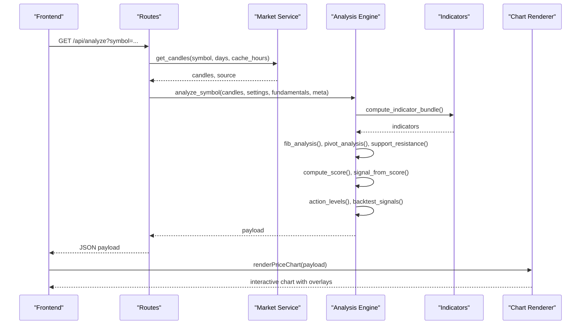

**Diagram sources**
- [routes.py:98-133](file://fintech/routes.py#L98-L133)
- [market.py:20-43](file://fintech/market.py#L20-L43)
- [analysis.py:598-679](file://fintech/analysis.py#L598-L679)
- [indicators.py:14-171](file://fintech/indicators.py#L14-L171)
- [chart.js:73-228](file://fintech/static/js/chart.js#L73-L228)

## Detailed Component Analysis

### Fibonacci Retracements and Extensions with Swing Anchoring
- Swing anchoring: identifies the highest high and lowest low within a lookback window to define the range.
- Direction detection: uptrend if the relative low index precedes the relative high index; downtrend otherwise.
- Retracement levels: standard ratios applied to the swing range to compute support-like levels in uptrends and resistance-like levels in downtrends.
- Extension targets: computed beyond the swing range for profit-taking levels.
- Golden zone: the 0.5–0.618 band is highlighted as a priority buy zone in uptrends.
- Nearest support/resistance: closest levels below/above the current close.

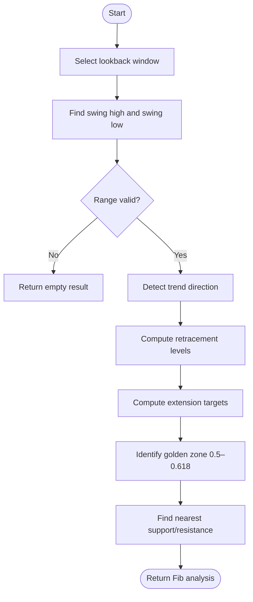

**Diagram sources**
- [analysis.py:66-124](file://fintech/analysis.py#L66-L124)

**Section sources**
- [analysis.py:66-124](file://fintech/analysis.py#L66-L124)

### Pivot Points Across Daily/Weekly/Monthly Timeframes
- Daily pivot: computed from the latest bar’s high, low, close.
- Weekly/monthly pivots: aggregate completed periods’ bars into OHLCV aggregates, then compute classic pivot levels.
- Output includes P, R1–R3, S1–S3 for each timeframe.

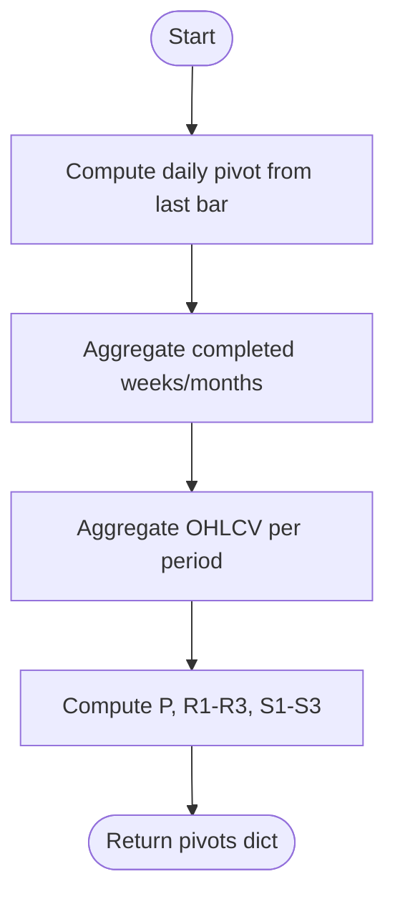

**Diagram sources**
- [analysis.py:129-186](file://fintech/analysis.py#L129-L186)

**Section sources**
- [analysis.py:129-186](file://fintech/analysis.py#L129-L186)

### Support/Resistance Clustering from Fractal Analysis
- Fractal detection: identifies swing highs/lows using a symmetric window around each bar.
- Clustering: groups nearby levels using a tolerance based on ATR or price percentage.
- Weighting: recent touches receive higher weights; weighted average price per cluster is computed.
- Filtering: returns top supports and resistances within distance bounds and minimum touch counts.

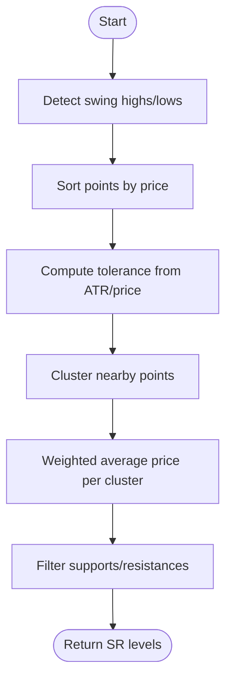

**Diagram sources**
- [analysis.py:191-240](file://fintech/analysis.py#L191-L240)

**Section sources**
- [analysis.py:191-240](file://fintech/analysis.py#L191-L240)

### Composite Signal Scoring System (-100 to +100)
The scoring function combines multiple factors with explicit point contributions:
- Trend (max ~±30):
  - Price vs SMA20/SMA50/SMA200
  - SMA20 vs SMA50 alignment
  - Slope of SMA50
- Momentum (max ~±26):
  - RSI bands and movement
  - MACD histogram sign and change
- Levels (context-dependent):
  - Fibonacci golden zone proximity
  - Near Fibonacci support/resistance
  - Breakout with volume surge
  - Proximity to strong S/R levels
- Volume (max ~±8):
  - Volume ratio vs SMA20 with directional confirmation
- Pivots (max ~±8):
  - Price vs daily pivot and R1/S1
  - Weekly pivot bias

Score clamping ensures [-100, +100]. Classification thresholds:
- STRONG_BUY ≥ 62
- BUY ≥ 30
- SELL ≤ -30
- STRONG_SELL ≤ -62
- HOLD otherwise

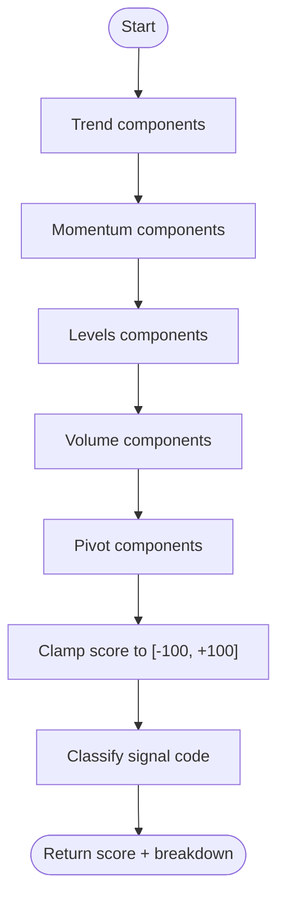

**Diagram sources**
- [analysis.py:251-387](file://fintech/analysis.py#L251-L387)
- [config.py:37-41](file://fintech/config.py#L37-L41)

**Section sources**
- [analysis.py:251-387](file://fintech/analysis.py#L251-L387)
- [config.py:37-41](file://fintech/config.py#L37-L41)

### Technical Indicators Implementation
- Moving averages: SMA and EMA implementations with None-padding aligned to input series.
- RSI: Wilder’s RSI with smoothing over gains/losses.
- MACD: Fast and slow EMAs, signal line EMA, and histogram.
- ATR: True range followed by smoothed average.
- Bollinger Bands: SMA mid-band plus/minus multiples of rolling standard deviation.
- Volume SMA: Simple moving average of volume.
- Helpers: last value extraction and percent slope calculation.

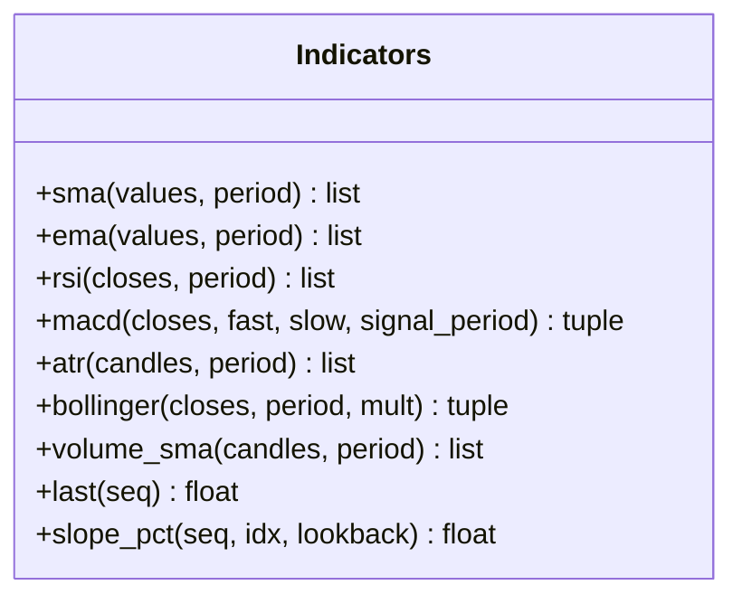

**Diagram sources**
- [indicators.py:14-171](file://fintech/indicators.py#L14-L171)

**Section sources**
- [indicators.py:14-171](file://fintech/indicators.py#L14-L171)

### Actionable Levels (Buy/Sell Zones, Stop Loss, Risk/Reward)
- Buy candidates: Fibonacci retracement levels in uptrends, anchor lows in downtrends, strong supports, daily pivot S1/S2.
- Sell candidates: Fibonacci extensions, anchor highs, strong resistances, daily pivot R1/R2.
- Stop loss: derived from ATR and strongest supports; capped to avoid excessive distance.
- Risk/reward: computed against first sell target and stop loss.
- Warnings: contextual guidance for sell signals, downtrend structure, and wide stops.

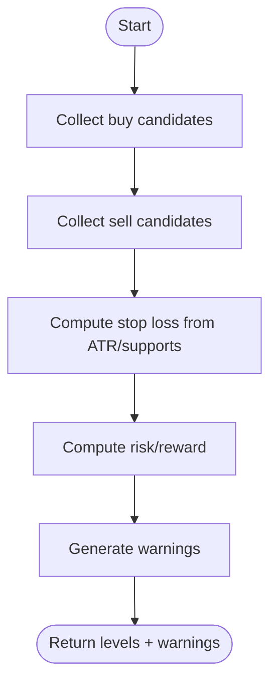

**Diagram sources**
- [analysis.py:495-593](file://fintech/analysis.py#L495-L593)

**Section sources**
- [analysis.py:495-593](file://fintech/analysis.py#L495-L593)

### Backtesting Framework for Win-Rate and Payoff
- Simulation: bar-by-bar evaluation using score thresholds to enter/exit positions.
- Entry: triggered when score crosses above buy threshold; uses next open price.
- Exit conditions: stop loss at 1.5× ATR, target at 2× risk, signal-based exit, or time-based exit after 60 bars.
- Metrics: trades count, wins/losses, win rate, average win/loss, payoff ratio, expectancy, max drawdown, profit factor.
- Score history: recorded for UI display and Kelly prefill.

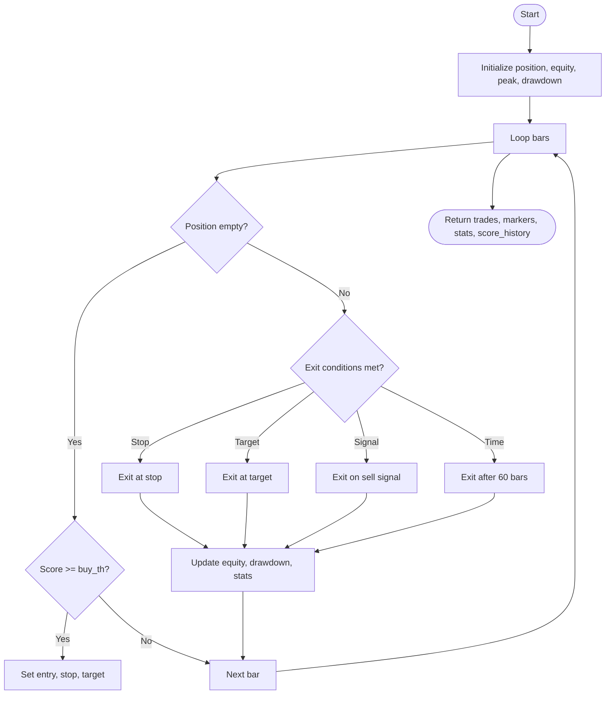

**Diagram sources**
- [analysis.py:392-490](file://fintech/analysis.py#L392-L490)

**Section sources**
- [analysis.py:392-490](file://fintech/analysis.py#L392-L490)

### Frontend Integration and Visualization
- Analysis page: calls /api/analyze, renders header, chart, signal panel, levels, Fibonacci table, pivot table, S/R list, indicators, backtest stats, and dividends.
- Chart renderer: draws candlesticks, volume, SMAs, Fibonacci lines/extensions, pivot levels, S/R lines, buy zone, stop loss, take-profit levels, and markers.
- Kelly calculator: pre-filled with backtest win-rate and payoff; posts to /api/kelly/calc.

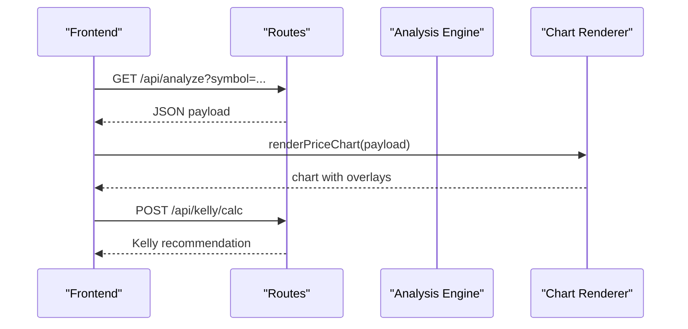

**Diagram sources**
- [analysis.js:20-53](file://fintech/static/js/analysis.js#L20-L53)
- [chart.js:73-228](file://fintech/static/js/chart.js#L73-L228)
- [routes.py:158-196](file://fintech/routes.py#L158-L196)

**Section sources**
- [analysis.js:20-315](file://fintech/static/js/analysis.js#L20-L315)
- [chart.js:73-296](file://fintech/static/js/chart.js#L73-L296)
- [routes.py:158-196](file://fintech/routes.py#L158-L196)

## Dependency Analysis
High-level dependencies between modules:
- Routes depend on market, analysis, screener, portfolio, vietcap, db, config.
- Analysis depends on indicators and config.
- Screener depends on analysis, market, vietcap, db, config.
- Market depends on vietcap and db.
- Frontend JS depends on routes APIs and chart renderer.

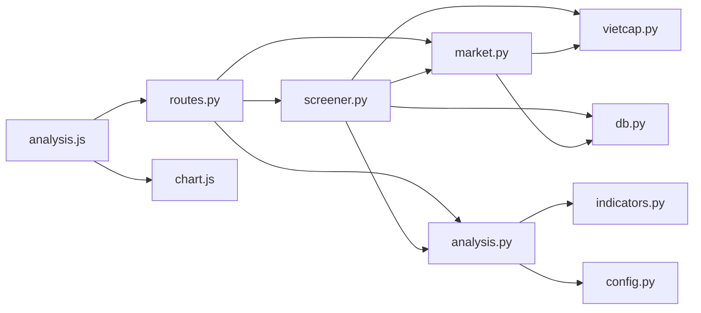

**Diagram sources**
- [routes.py:1-398](file://fintech/routes.py#L1-L398)
- [analysis.py:1-680](file://fintech/analysis.py#L1-L680)
- [screener.py:1-310](file://fintech/screener.py#L1-L310)
- [market.py:1-154](file://fintech/market.py#L1-L154)
- [analysis.js:1-315](file://fintech/static/js/analysis.js#L1-L315)
- [chart.js:1-296](file://fintech/static/js/chart.js#L1-L296)

**Section sources**
- [routes.py:1-398](file://fintech/routes.py#L1-L398)
- [analysis.py:1-680](file://fintech/analysis.py#L1-L680)
- [screener.py:1-310](file://fintech/screener.py#L1-L310)
- [market.py:1-154](file://fintech/market.py#L1-L154)

## Performance Considerations
- Caching strategy:
  - Candles cached with configurable hours; fallback to cache on network errors.
  - Fundamentals refreshed less frequently to reduce external calls.
- Indicator computation:
  - Pure Python arrays with None-padding; efficient rolling computations for SMA/EMA/RSI/ATR/Bollinger.
  - Avoid recomputation by bundling indicators once per analysis.
- Backtesting:
  - Limited to recent bars to keep simulation fast; score history computed once and reused.
- Screener concurrency:
  - ThreadPoolExecutor with bounded workers; batched DB writes; progress updates; error isolation per symbol.
- Frontend rendering:
  - Lightweight chart library; selective overlays; linked zoom/pan between main and sub-charts.

Recommendations:
- Keep lookback windows reasonable for real-time responsiveness.
- Use cached data where possible; force refresh only when necessary.
- Limit backtest window size for interactive use; allow larger windows for offline analysis.
- Monitor screener worker pool saturation and adjust MAX_WORKERS based on environment capacity.

[No sources needed since this section provides general guidance]

## Troubleshooting Guide
Common issues and resolutions:
- Insufficient historical data:
  - Symptom: analysis raises an error indicating insufficient bars.
  - Resolution: increase history_days or ensure data availability.
- No signals or weak signals:
  - Symptom: HOLD or borderline scores.
  - Resolution: review score breakdown reasons; adjust thresholds cautiously; verify data freshness.
- Missing chart overlays:
  - Symptom: Fibonacci/pivot/S/R lines not visible.
  - Resolution: check payload fields; ensure chart renderer receives required layers; confirm internet access for chart library.
- Screener stuck or stale:
  - Symptom: RUNNING status persists.
  - Resolution: reconcile stale runs; wait for completion; check serverless restart behavior.

Operational checks:
- Health endpoint confirms app status and storage mode.
- Recent analyses endpoint helps verify persistence.
- Settings API allows tuning parameters like history_days and cache_hours.

**Section sources**
- [analysis.py:598-605](file://fintech/analysis.py#L598-L605)
- [routes.py:58-68](file://fintech/routes.py#L58-L68)
- [routes.py:136-138](file://fintech/routes.py#L136-L138)
- [routes.py:374-398](file://fintech/routes.py#L374-L398)
- [screener.py:214-235](file://fintech/screener.py#L214-L235)

## Conclusion
The technical analysis engine integrates robust indicator calculations, multi-factor scoring, and practical trading aids such as Fibonacci levels, pivot points, support/resistance clustering, and backtested metrics. Its architecture separates concerns cleanly: market data caching, indicator computation, signal generation, and visualization. The scoring system provides transparent reasoning and consistent classification thresholds, while the backtesting framework supplies win-rate and payoff inputs for position sizing. With careful configuration and caching strategies, the system can deliver responsive, real-time analysis suitable for interactive trading workflows.

[No sources needed since this section summarizes without analyzing specific files]