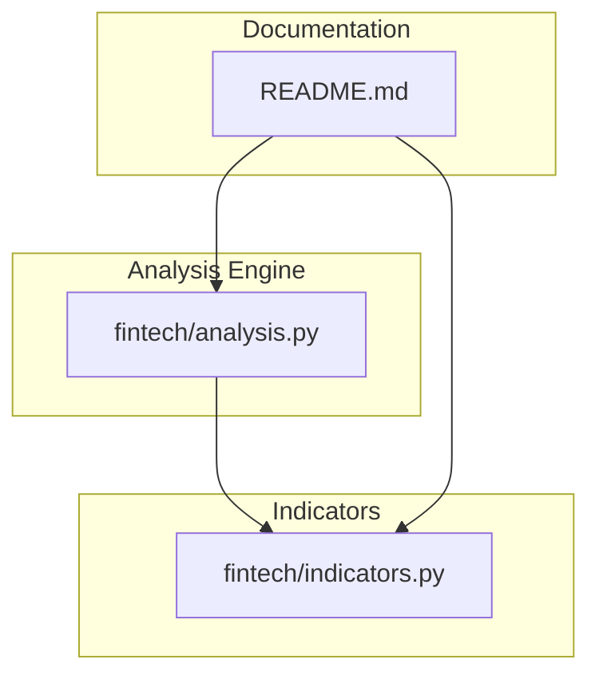
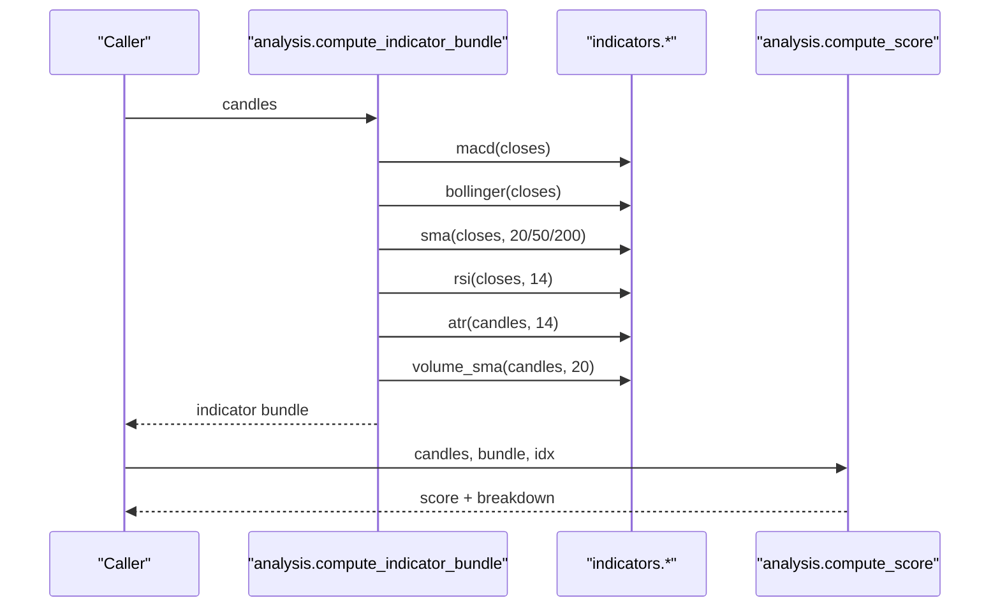
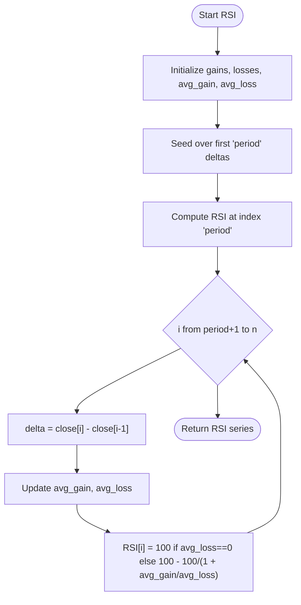
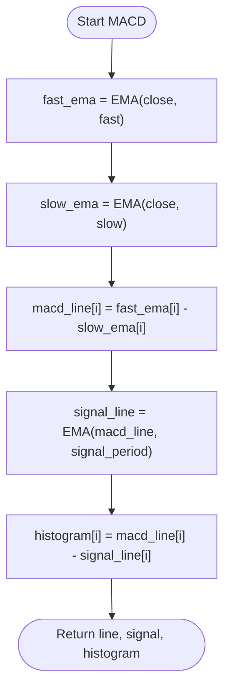
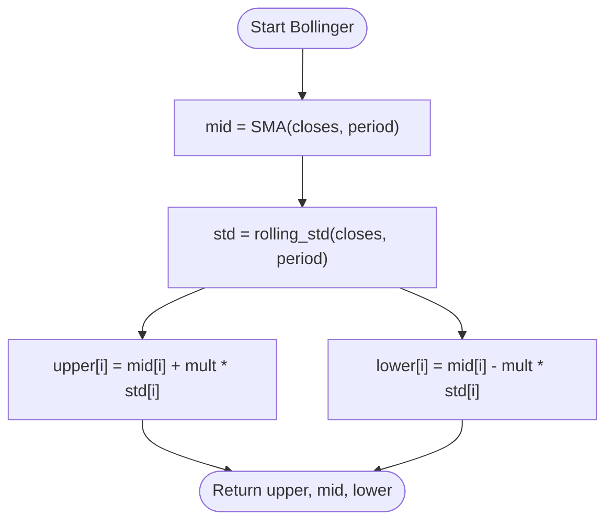
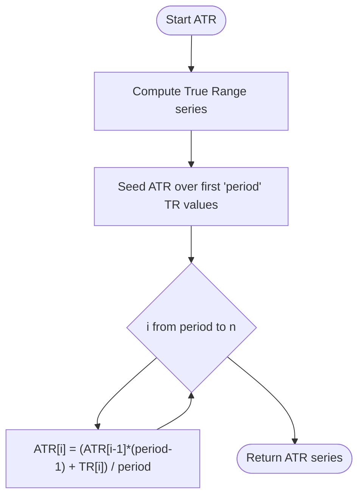
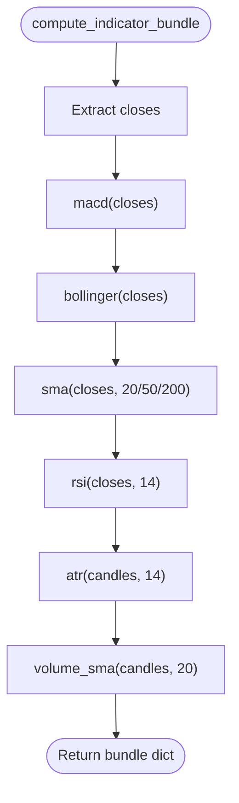
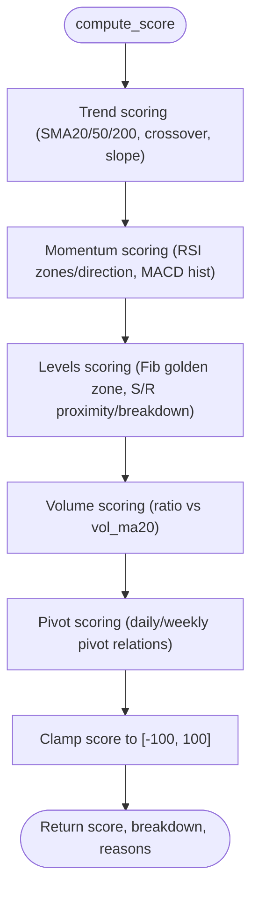
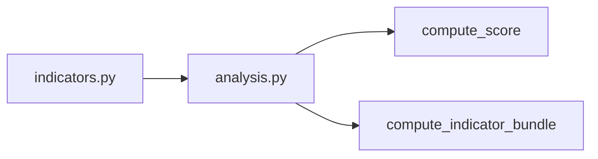

# Technical Indicators Library

<cite>
**Referenced Files in This Document**
- [indicators.py](file://fintech/indicators.py)
- [analysis.py](file://fintech/analysis.py)
- [README.md](file://README.md)
</cite>

## Table of Contents
1. [Introduction](#introduction)
2. [Project Structure](#project-structure)
3. [Core Components](#core-components)
4. [Architecture Overview](#architecture-overview)
5. [Detailed Component Analysis](#detailed-component-analysis)
6. [Dependency Analysis](#dependency-analysis)
7. [Performance Considerations](#performance-considerations)
8. [Troubleshooting Guide](#troubleshooting-guide)
9. [Conclusion](#conclusion)
10. [Appendices](#appendices)

## Introduction
This document explains the technical indicators library used by the project for momentum, volatility, trend, and volume analysis. It focuses on:
- RSI with configurable periods
- MACD with line, signal, and histogram components
- Bollinger Bands with standard deviation
- ATR for volatility measurement
- Moving averages including SMA across multiple periods, EMA, slope calculations, and volume-weighted averages
- The indicator bundle computation that calculates all required metrics efficiently
- Numerical precision handling, memory optimization strategies, and practical examples showing how each indicator contributes to the overall signal scoring system
- Parameter tuning guidelines and performance considerations for real-time charting applications

The implementation is written in pure Python and returns None-padded arrays aligned to input series so that missing or invalid values are handled safely.

## Project Structure
The indicators live in a dedicated module and are consumed by the analysis engine, which computes composite signals, backtests, and actionable levels.

**Diagram sources**
- [indicators.py:1-171](file://fintech/indicators.py#L1-L171)
- [analysis.py:1-680](file://fintech/analysis.py#L1-L680)
- [README.md:79-105](file://README.md#L79-L105)

**Section sources**
- [README.md:79-105](file://README.md#L79-L105)

## Core Components
The core indicator functions provide:
- Simple and exponential moving averages
- Momentum indicators: RSI and MACD
- Volatility indicators: ATR and Bollinger Bands
- Volume analysis via volume SMA
- Utilities for last value retrieval and percent slope calculation

Key responsibilities:
- Return lists aligned to input length, using None for unavailable values
- Provide robust handling of missing data and NaN inputs
- Offer configurable parameters for common trading timeframes

**Section sources**
- [indicators.py:14-171](file://fintech/indicators.py#L14-L171)

## Architecture Overview
The analysis pipeline builds an indicator bundle once per symbol, then uses those series to compute scores, signals, and action levels.

**Diagram sources**
- [analysis.py:43-61](file://fintech/analysis.py#L43-L61)
- [analysis.py:251-372](file://fintech/analysis.py#L251-L372)
- [indicators.py:80-93](file://fintech/indicators.py#L80-L93)
- [indicators.py:137-148](file://fintech/indicators.py#L137-L148)
- [indicators.py:14-32](file://fintech/indicators.py#L14-L32)
- [indicators.py:57-77](file://fintech/indicators.py#L57-L77)
- [indicators.py:111-122](file://fintech/indicators.py#L111-L122)
- [indicators.py:151-152](file://fintech/indicators.py#L151-L152)

## Detailed Component Analysis

### Moving Averages: SMA and EMA
- SMA implements a rolling window average with running sum and count reset on missing values. It outputs None until the full period is available.
- EMA seeds with an SMA over the first period, then applies exponential smoothing with multiplier 2/(period+1).

Complexity:
- SMA: O(n) time, O(1) extra space beyond output array
- EMA: O(n) time, O(1) extra space beyond output array

Precision and safety:
- Both handle None and NaN gracefully
- Output arrays are preallocated with None placeholders

Use cases:
- Trend identification (price vs SMA20/50/200)
- Crossover logic (SMA20 vs SMA50)
- Slope-based trend strength via percent change over lookback

**Section sources**
- [indicators.py:14-32](file://fintech/indicators.py#L14-L32)
- [indicators.py:35-54](file://fintech/indicators.py#L35-L54)

### RSI (Relative Strength Index)
Wilder’s RSI with configurable period defaults to 14. It computes smoothed average gains and losses and maps them into a 0–100 scale.

Behavior:
- Returns None until at least period+1 closes are available
- Handles zero average loss by capping RSI at 100

Signal contribution:
- Overbought/oversold thresholds influence momentum scoring
- Directional changes relative to prior values add momentum points

**Diagram sources**
- [indicators.py:57-77](file://fintech/indicators.py#L57-L77)

**Section sources**
- [indicators.py:57-77](file://fintech/indicators.py#L57-L77)

### MACD (Moving Average Convergence Divergence)
MACD returns three aligned series:
- MACD line: fast EMA minus slow EMA
- Signal line: EMA of MACD line
- Histogram: MACD line minus signal line

Parameters:
- Fast EMA period defaults to 12
- Slow EMA period defaults to 26
- Signal period defaults to 9

Signal contribution:
- Histogram sign and expansion/contraction contribute to momentum scoring

**Diagram sources**
- [indicators.py:80-93](file://fintech/indicators.py#L80-L93)
- [indicators.py:35-54](file://fintech/indicators.py#L35-L54)

**Section sources**
- [indicators.py:80-93](file://fintech/indicators.py#L80-L93)

### Bollinger Bands
Bollinger Bands consist of:
- Mid band: SMA(period)
- Upper band: mid + mult × rolling_std
- Lower band: mid − mult × rolling_std

Standard deviation:
- Computed over a rolling window of size period
- Uses population variance (divides by period)

Signal contribution:
- Price position relative to bands informs trend strength and potential reversals
- Band width reflects volatility expansion/contraction

**Diagram sources**
- [indicators.py:137-148](file://fintech/indicators.py#L137-L148)
- [indicators.py:125-134](file://fintech/indicators.py#L125-L134)
- [indicators.py:14-32](file://fintech/indicators.py#L14-L32)

**Section sources**
- [indicators.py:125-148](file://fintech/indicators.py#L125-L148)

### ATR (Average True Range)
ATR measures volatility using Wilder’s smoothing over True Range values.

True Range:
- For the first bar: high − low
- For subsequent bars: max(high−low, |high−prev_close|, |low−prev_close|)

Signal contribution:
- Used for stop-loss placement and risk management
- Influences support/resistance tolerance and breakout validation

**Diagram sources**
- [indicators.py:96-122](file://fintech/indicators.py#L96-L122)

**Section sources**
- [indicators.py:96-122](file://fintech/indicators.py#L96-L122)

### Volume-Weighted Averages
Volume SMA provides a simple moving average of volume, enabling volume ratio analysis against current bar volume.

Signal contribution:
- Volume surges confirm breakouts and trend strength
- Low volume on moves may indicate weakness

**Section sources**
- [indicators.py:151-152](file://fintech/indicators.py#L151-L152)

### Slope Calculations
Percent slope over a lookback window helps quantify trend direction and strength.

Usage:
- Applied to MA series (e.g., SMA50) to add trend momentum points in scoring

**Section sources**
- [indicators.py:162-170](file://fintech/indicators.py#L162-L170)

### Indicator Bundle Computation
The bundle aggregates all required series in one pass per symbol:
- Closes extraction
- MACD line, signal, histogram
- Bollinger upper, mid, lower
- SMA20, SMA50, SMA200
- RSI(14)
- ATR(14)
- Volume SMA(20)

Benefits:
- Avoids recomputing overlapping series
- Centralizes memory allocation for downstream consumers

**Diagram sources**
- [analysis.py:43-61](file://fintech/analysis.py#L43-L61)
- [indicators.py:80-93](file://fintech/indicators.py#L80-L93)
- [indicators.py:137-148](file://fintech/indicators.py#L137-L148)
- [indicators.py:14-32](file://fintech/indicators.py#L14-L32)
- [indicators.py:57-77](file://fintech/indicators.py#L57-L77)
- [indicators.py:111-122](file://fintech/indicators.py#L111-L122)
- [indicators.py:151-152](file://fintech/indicators.py#L151-L152)

**Section sources**
- [analysis.py:43-61](file://fintech/analysis.py#L43-L61)

### Signal Scoring System
The scoring system combines:
- Trend: price vs SMA20/50/200, SMA20 vs SMA50, SMA50 slope
- Momentum: RSI level and direction, MACD histogram sign and change
- Levels: Fibonacci golden zone proximity, support/resistance proximity/breakdown
- Volume: volume ratio confirmation
- Pivots: daily/weekly pivot relationships

Output:
- Composite score in [-100, 100]
- Breakdown by group and reasons list

**Diagram sources**
- [analysis.py:251-372](file://fintech/analysis.py#L251-L372)

**Section sources**
- [analysis.py:251-372](file://fintech/analysis.py#L251-L372)

## Dependency Analysis
The indicators module is imported by the analysis engine. The analysis engine also defines helper utilities and orchestrates the indicator bundle and scoring.

**Diagram sources**
- [analysis.py:15](file://fintech/analysis.py#L15)
- [analysis.py:43-61](file://fintech/analysis.py#L43-L61)
- [analysis.py:251-372](file://fintech/analysis.py#L251-L372)

**Section sources**
- [analysis.py:15](file://fintech/analysis.py#L15)
- [analysis.py:43-61](file://fintech/analysis.py#L43-L61)
- [analysis.py:251-372](file://fintech/analysis.py#L251-L372)

## Performance Considerations
- Time complexity:
  - SMA: O(n)
  - EMA: O(n)
  - RSI: O(n)
  - MACD: O(n) due to two EMAs plus EMA of line
  - Rolling std: O(n·period) due to slicing and summation per window
  - ATR: O(n)
- Memory usage:
  - Each function returns a list aligned to input length; intermediate series (e.g., fast/slow EMA, MACD line) are created explicitly
- Optimization opportunities:
  - Replace rolling_std with a streaming variance algorithm to reduce O(n·period) to O(n)
  - Reuse computed EMAs where possible to avoid recomputation
  - Use typed arrays or NumPy for vectorized operations when performance is critical
- Real-time charting:
  - Prefer incremental updates for latest bar only
  - Cache indicator bundles per symbol and invalidate on new data
  - Limit lookback windows for UI responsiveness

[No sources needed since this section provides general guidance]

## Troubleshooting Guide
Common issues and resolutions:
- Missing or NaN values:
  - SMA resets running sum/count on None/NaN
  - EMA skips None/NaN during seeding and smoothing
  - Ensure input series are cleaned before computing indicators
- Insufficient history:
  - RSI requires at least period+1 closes
  - ATR requires at least period bars
  - Bollinger Bands require at least period closes for std
- Zero average loss in RSI:
  - RSI capped at 100; interpret as extreme bullish condition
- Volume SMA:
  - If volume is missing, treated as zero; ensure volume fields exist

**Section sources**
- [indicators.py:14-32](file://fintech/indicators.py#L14-L32)
- [indicators.py:35-54](file://fintech/indicators.py#L35-L54)
- [indicators.py:57-77](file://fintech/indicators.py#L57-L77)
- [indicators.py:111-122](file://fintech/indicators.py#L111-L122)
- [indicators.py:151-152](file://fintech/indicators.py#L151-L152)

## Conclusion
The indicators library provides a solid foundation for momentum, volatility, trend, and volume analysis. Its design emphasizes clarity, safety with missing data, and composability through the indicator bundle. When integrated with the scoring system, these indicators produce actionable signals suitable for both historical backtesting and real-time charting workflows.

[No sources needed since this section summarizes without analyzing specific files]

## Appendices

### Practical Examples: Indicator Contributions to Scoring
- RSI:
  - Overbought (>70) reduces score; oversold (<30) increases score
  - Rising RSI adds positive momentum points; falling RSI subtracts
- MACD:
  - Positive histogram adds momentum points; negative subtracts
  - Expanding histogram adds additional points; contracting subtracts
- SMA:
  - Price above SMA20/50/200 adds trend points; below subtracts
  - SMA20 > SMA50 adds crossover points; SMA20 < SMA50 subtracts
  - SMA50 slope positive adds trend strength; negative subtracts
- Bollinger Bands:
  - While not directly scored, band width and price position inform breakout and reversal context
- ATR:
  - Used for stop-loss placement and risk management; influences support/resistance tolerance

**Section sources**
- [analysis.py:269-306](file://fintech/analysis.py#L269-L306)

### Parameter Tuning Guidelines
- RSI period:
  - Shorter periods increase sensitivity; longer periods smooth noise
- MACD parameters:
  - Faster settings react quicker but generate more false signals
  - Slower settings reduce noise but lag
- Bollinger Bands:
  - Standard deviation multiplier controls band width; higher values reduce false breakouts
- ATR period:
  - Longer periods smooth volatility estimates; shorter periods react faster
- SMA periods:
  - 20/50/200 are conventional; adjust based on asset volatility and timeframe

[No sources needed since this section provides general guidance]