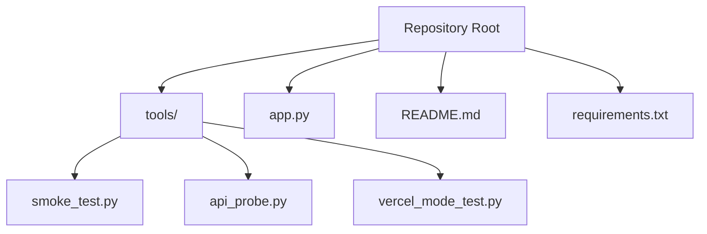
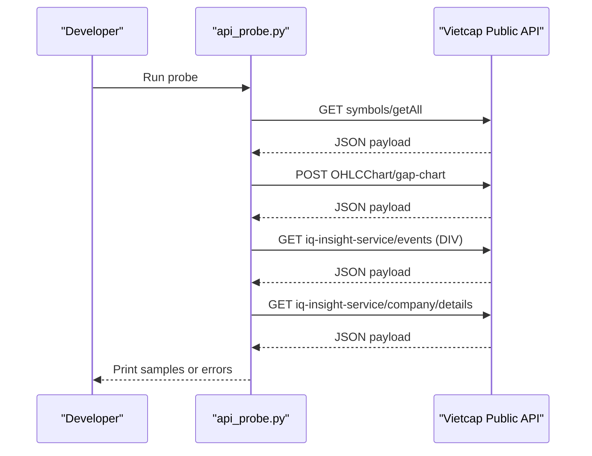
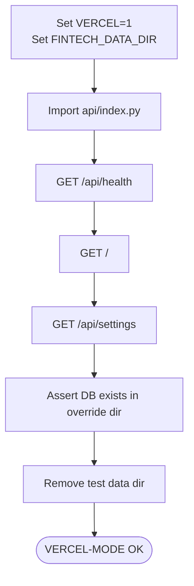
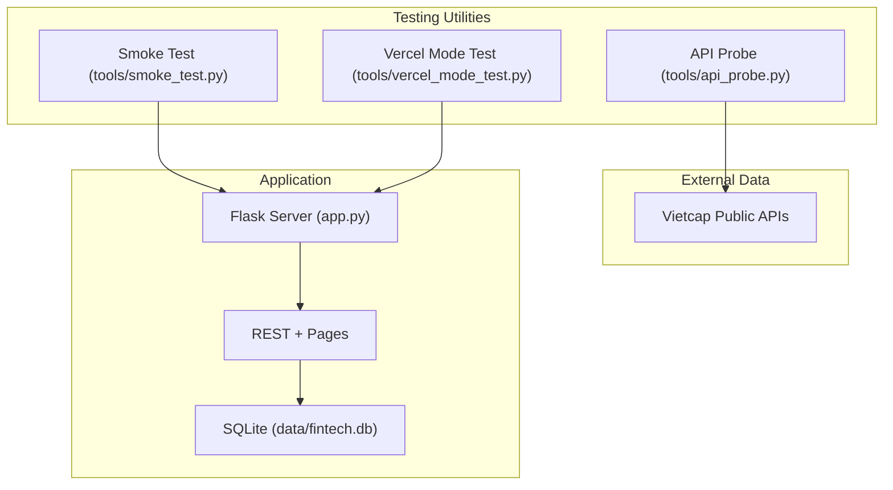
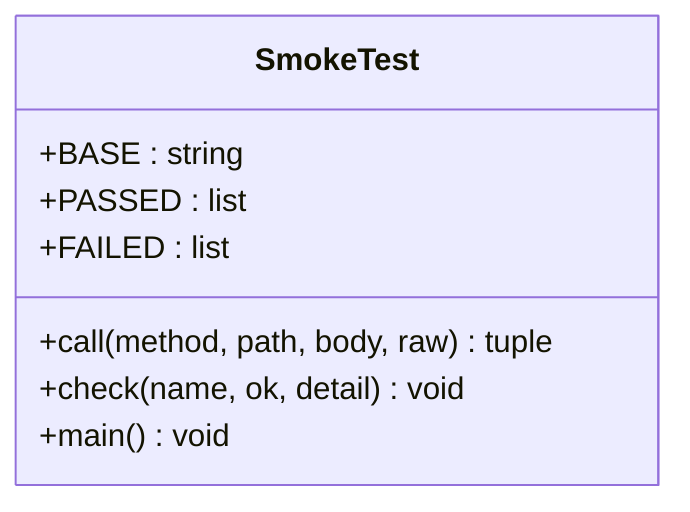
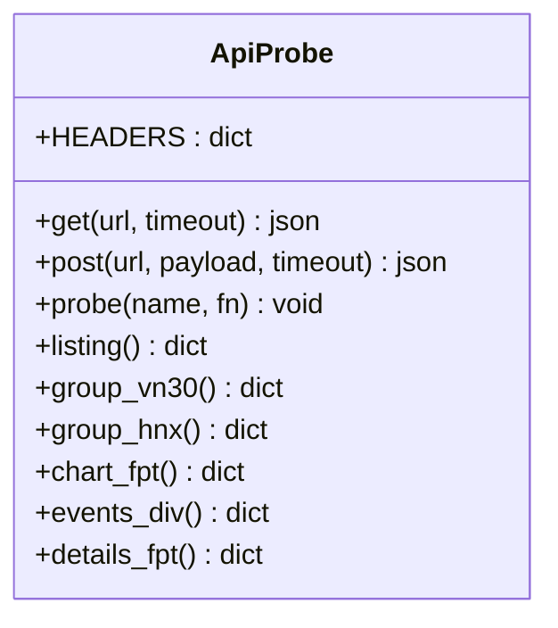
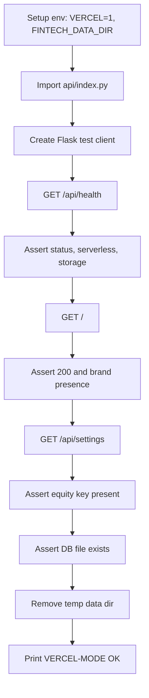
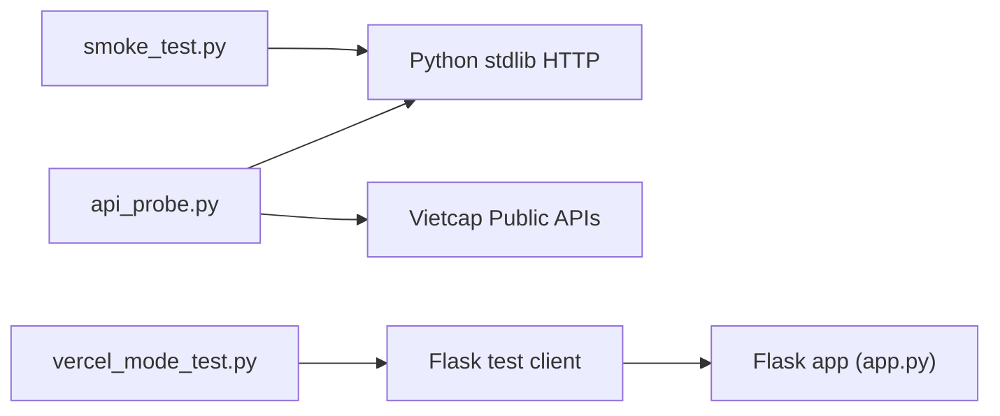

# Testing & Quality Assurance

<cite>
**Referenced Files in This Document**
- [README.md](file://README.md)
- [app.py](file://app.py)
- [requirements.txt](file://requirements.txt)
- [tools/smoke_test.py](file://tools/smoke_test.py)
- [tools/api_probe.py](file://tools/api_probe.py)
- [tools/vercel_mode_test.py](file://tools/vercel_mode_test.py)
</cite>

## Table of Contents
1. [Introduction](#introduction)
2. [Project Structure](#project-structure)
3. [Core Components](#core-components)
4. [Architecture Overview](#architecture-overview)
5. [Detailed Component Analysis](#detailed-component-analysis)
6. [Dependency Analysis](#dependency-analysis)
7. [Performance Considerations](#performance-considerations)
8. [Troubleshooting Guide](#troubleshooting-guide)
9. [Conclusion](#conclusion)
10. [Appendices](#appendices)

## Introduction
This document describes the testing and quality assurance approach for FinViet Pro, focusing on:
- The smoke test suite that validates core functionality across pages, technical analysis, Kelly calculator, stock screening, portfolio management, and alert systems.
- The API probe utility used to validate Vietcap public API connectivity and response shapes.
- End-to-end testing strategy, unit testing guidance, integration testing for external APIs, and continuous integration considerations.
- Guidelines for writing new tests, mocking external dependencies, maintaining coverage, and defining quality gates.

The repository currently provides two primary testing utilities:
- An end-to-end smoke test that runs against a live server.
- A development utility that probes external Vietcap APIs.
There is also a small Vercel-mode verification script that asserts serverless behavior locally.

**Section sources**
- [README.md:107-112](file://README.md#L107-L112)
- [tools/smoke_test.py:1-40](file://tools/smoke_test.py#L1-L40)
- [tools/api_probe.py:1-36](file://tools/api_probe.py#L1-L36)
- [tools/vercel_mode_test.py:1-36](file://tools/vercel_mode_test.py#L1-L36)

## Project Structure
The testing-related code lives under `tools/`:
- `smoke_test.py` — HTTP-based end-to-end smoke test.
- `api_probe.py` — External API shape validator.
- `vercel_mode_test.py` — Local simulation of Vercel runtime behavior.

**Diagram sources**
- [tools/smoke_test.py:1-15](file://tools/smoke_test.py#L1-L15)
- [tools/api_probe.py:1-15](file://tools/api_probe.py#L1-L15)
- [tools/vercel_mode_test.py:1-15](file://tools/vercel_mode_test.py#L1-L15)
- [app.py:1-9](file://app.py#L1-L9)
- [README.md:107-112](file://README.md#L107-L112)
- [requirements.txt:1-2](file://requirements.txt#L1-L2)

**Section sources**
- [README.md:79-105](file://README.md#L79-L105)
- [tools/smoke_test.py:1-15](file://tools/smoke_test.py#L1-L15)
- [tools/api_probe.py:1-15](file://tools/api_probe.py#L1-L15)
- [tools/vercel_mode_test.py:1-15](file://tools/vercel_mode_test.py#L1-L15)
- [app.py:1-9](file://app.py#L1-L9)
- [requirements.txt:1-2](file://requirements.txt#L1-L2)

## Core Components
This section documents the existing testing utilities and how they fit into the overall QA strategy.

### Smoke Test Suite
The smoke test performs an end-to-end validation of the running application by calling its HTTP endpoints. It covers:
- Health endpoint.
- Page rendering (dashboard, technical analysis, screener, portfolio, alerts, settings).
- Symbol listing.
- Technical analysis for a known symbol and error handling for unknown symbols.
- Kelly calculator calculation.
- Index summary.
- Screener run lifecycle: start, polling status, results retrieval, CSV export.
- Dividend filter screener scenario.
- Portfolio lifecycle: create position, overview, update, watchlist add, scan, alerts list, acknowledge alerts, ack-all.
- Settings roundtrip save.
- Cleanup of created positions and watchlist entries.

Key behaviors:
- Uses Python standard library HTTP client with JSON payloads.
- Tracks passed/failed checks and exits non-zero if any failures occur.
- Supports optional base URL argument; defaults to local Flask server.

```mermaid
flowchart TD
Start(["Start smoke test"]) --> Health["GET /api/health"]
Health --> Pages["Render major pages"]
Pages --> Symbols["GET /api/symbols?limit=5"]
Symbols --> AnalyzeKnown["GET /api/analyze?symbol=FPT"]
AnalyzeKnown --> AnalyzeUnknown["GET /api/analyze?symbol=ZZZZZ"]
AnalyzeUnknown --> Kelly["POST /api/kelly/calc"]
Kelly --> IndexSummary["GET /api/index/summary"]
IndexSummary --> ScreenerRun["POST /api/screener/run"]
ScreenerRun --> ScreenerPoll["GET /api/screener/runs/{id}"]
ScreenerPoll --> ScreenerResults["GET /api/screener/runs/{id}/results"]
ScreenerResults --> ScreenerExport["GET /api/screener/runs/{id}/export"]
ScreenerExport --> DivScreener["POST /api/screener/run (dividend filter)"]
DivScreener --> PortfolioCreate["POST /api/portfolio/positions"]
PortfolioCreate --> PortfolioOverview["GET /api/portfolio/overview"]
PortfolioOverview --> PortfolioUpdate["PUT /api/portfolio/positions/{id}"]
PortfolioUpdate --> WatchAdd["POST /api/portfolio/watch"]
WatchAdd --> AlertScan["POST /api/portfolio/scan"]
AlertScan --> AlertsList["GET /api/alerts?limit=50"]
AlertsList --> AckAlert["POST /api/alerts/{id}/ack"]
AckAlert --> AckAll["POST /api/alerts/ack-all"]
AckAll --> SettingsRoundtrip["GET/POST /api/settings"]
SettingsRoundtrip --> Cleanup["DELETE positions & watchlist"]
Cleanup --> End(["Exit with PASS/FAIL counts"])
```

**Diagram sources**
- [tools/smoke_test.py:40-186](file://tools/smoke_test.py#L40-L186)

**Section sources**
- [tools/smoke_test.py:1-196](file://tools/smoke_test.py#L1-L196)
- [README.md:107-112](file://README.md#L107-L112)

### API Probe Utility
The API probe utility validates connectivity and response shapes for Vietcap public APIs. It exercises:
- Symbol listing.
- Group queries (VN30, HNX, and additional groups via CLI).
- Chart data request.
- Dividend events.
- Company details.

It prints sample responses or errors, helping developers verify external API contracts before integrating them into the application.

**Diagram sources**
- [tools/api_probe.py:38-92](file://tools/api_probe.py#L38-L92)

**Section sources**
- [tools/api_probe.py:1-116](file://tools/api_probe.py#L1-L116)

### Vercel Mode Test
A minimal script simulates the Vercel runtime by setting environment variables and importing the serverless entrypoint. It asserts:
- Health endpoint returns expected fields.
- Dashboard page loads successfully.
- Settings endpoint returns expected keys.
- Database file is created in the overridden directory.

**Diagram sources**
- [tools/vercel_mode_test.py:1-36](file://tools/vercel_mode_test.py#L1-L36)

**Section sources**
- [tools/vercel_mode_test.py:1-36](file://tools/vercel_mode_test.py#L1-L36)

## Architecture Overview
The testing architecture integrates three layers:
- External API validation using the API probe utility.
- End-to-end smoke testing against a running Flask server.
- Serverless mode verification for deployment correctness.

**Diagram sources**
- [app.py:1-9](file://app.py#L1-L9)
- [tools/smoke_test.py:17-30](file://tools/smoke_test.py#L17-L30)
- [tools/api_probe.py:18-26](file://tools/api_probe.py#L18-L26)
- [tools/vercel_mode_test.py:15-33](file://tools/vercel_mode_test.py#L15-L33)

## Detailed Component Analysis

### Smoke Test Suite Analysis
Responsibilities:
- Validate health, pages, and key REST endpoints.
- Exercise business flows: technical analysis, Kelly sizing, screener lifecycle, portfolio operations, alerts, and settings persistence.
- Provide clear pass/fail reporting and exit codes suitable for CI.

Implementation highlights:
- HTTP helper function encapsulates request/response handling and JSON parsing.
- Check function aggregates results and prints human-readable output.
- Screener workflow includes polling until completion and verifying results and CSV export.
- Portfolio workflow creates, updates, scans, acknowledges alerts, and cleans up resources.

Complexity considerations:
- Timeouts are set for HTTP requests to avoid hanging tests.
- Screener polling uses a deadline loop to prevent indefinite waits.
- Assertions are simple boolean checks with contextual detail strings.

**Diagram sources**
- [tools/smoke_test.py:13-37](file://tools/smoke_test.py#L13-L37)
- [tools/smoke_test.py:40-196](file://tools/smoke_test.py#L40-L196)

**Section sources**
- [tools/smoke_test.py:1-196](file://tools/smoke_test.py#L1-L196)

### API Probe Utility Analysis
Responsibilities:
- Verify connectivity and response structure for multiple Vietcap endpoints.
- Provide quick feedback during development when external APIs change.

Implementation highlights:
- Shared headers mimic browser requests.
- Generic get/post helpers simplify calls.
- Probe wrapper prints results or exceptions.
- Multiple endpoint functions cover symbols, groups, chart data, dividend events, and company details.

**Diagram sources**
- [tools/api_probe.py:7-26](file://tools/api_probe.py#L7-L26)
- [tools/api_probe.py:38-92](file://tools/api_probe.py#L38-L92)

**Section sources**
- [tools/api_probe.py:1-116](file://tools/api_probe.py#L1-L116)

### Vercel Mode Test Analysis
Responsibilities:
- Simulate serverless runtime configuration.
- Assert health, dashboard, settings, and ephemeral storage behavior.

Implementation highlights:
- Sets environment variables to force serverless mode and override data directory.
- Imports the serverless entrypoint and uses Flask test client.
- Validates critical health fields and page load.
- Ensures database creation in the temporary directory and cleans up afterward.

**Diagram sources**
- [tools/vercel_mode_test.py:6-36](file://tools/vercel_mode_test.py#L6-L36)

**Section sources**
- [tools/vercel_mode_test.py:1-36](file://tools/vercel_mode_test.py#L1-L36)

## Dependency Analysis
Testing utilities depend on:
- Python standard library HTTP client for smoke testing.
- Flask test client for Vercel mode assertions.
- External Vietcap APIs for API probe validation.

**Diagram sources**
- [tools/smoke_test.py:17-30](file://tools/smoke_test.py#L17-L30)
- [tools/api_probe.py:18-26](file://tools/api_probe.py#L18-L26)
- [tools/vercel_mode_test.py:15-17](file://tools/vercel_mode_test.py#L15-L17)
- [app.py:1-9](file://app.py#L1-L9)

**Section sources**
- [tools/smoke_test.py:17-30](file://tools/smoke_test.py#L17-L30)
- [tools/api_probe.py:18-26](file://tools/api_probe.py#L18-L26)
- [tools/vercel_mode_test.py:15-17](file://tools/vercel_mode_test.py#L15-L17)
- [app.py:1-9](file://app.py#L1-L9)

## Performance Considerations
- Smoke test timeouts: HTTP requests use a generous timeout to accommodate slow external data sources and long-running screener jobs.
- Screener polling: Polling loop includes a deadline to prevent infinite waits; consider adjusting deadlines based on dataset size.
- API probe: External API calls may be rate-limited; batch group probing can be throttled to avoid overloading providers.
- SQLite I/O: Tests that mutate state should clean up after themselves to avoid cross-test interference.

[No sources needed since this section provides general guidance]

## Troubleshooting Guide
Common issues and resolutions:
- External API failures: Use the API probe utility to confirm connectivity and response shapes before investigating application logic.
- Screener hangs: Ensure the screener job completes within the configured deadline; check server logs for background task errors.
- Port conflicts: Confirm the Flask server is running on the expected host/port; adjust smoke test base URL accordingly.
- Vercel mode misconfiguration: Verify environment variables and data directory overrides; ensure ephemeral storage expectations match deployment constraints.

**Section sources**
- [tools/api_probe.py:29-35](file://tools/api_probe.py#L29-L35)
- [tools/smoke_test.py:25-30](file://tools/smoke_test.py#L25-L30)
- [tools/vercel_mode_test.py:6-15](file://tools/vercel_mode_test.py#L6-L15)

## Conclusion
FinViet Pro’s current testing strategy centers on:
- A comprehensive smoke test suite validating end-to-end workflows.
- An API probe utility ensuring external data contracts remain stable.
- A Vercel mode test confirming serverless deployment behavior.

To strengthen quality assurance, introduce structured unit tests for core modules, integrate mocks for external dependencies, and adopt pytest for consistent test execution and reporting. Establish CI pipelines that run these tests automatically and enforce quality gates such as minimum coverage thresholds and failure blocking.

[No sources needed since this section summarizes without analyzing specific files]

## Appendices

### Writing New Tests: Guidelines
- Prefer pytest for unit and integration tests; organize tests by feature module.
- For HTTP endpoints, use Flask test client to simulate requests without starting a real server.
- Mock external dependencies (e.g., Vietcap APIs) using unittest.mock.patch to isolate tests from network variability.
- Keep smoke tests focused on critical paths; avoid flaky assertions tied to volatile external data.
- Maintain deterministic state: reset or clean up databases and caches between tests.

[No sources needed since this section provides general guidance]

### Mocking External Dependencies
- Replace HTTP calls to Vietcap APIs with mock responses in unit tests.
- Stub time-dependent functions (e.g., timestamps) to control screener deadlines and polling loops.
- Use fixtures to provide consistent test data for indicators, analysis outputs, and portfolio states.

[No sources needed since this section provides general guidance]

### Continuous Integration and Quality Gates
- Add a CI step to run `python tools/smoke_test.py` against a deployed preview instance.
- Include `python tools/api_probe.py` to validate external API availability before full test runs.
- Enforce pytest discovery and report generation; fail the pipeline on assertion failures.
- Set coverage thresholds (e.g., minimum line coverage) and require passing tests before merging.

[No sources needed since this section provides general guidance]

### Example Test Cases
- Unit tests for technical analysis:
  - Verify Fibonacci levels computation for known candle patterns.
  - Validate Pivot Point calculations across day/week/month periods.
  - Ensure support/resistance clustering respects tolerance thresholds.
- Business logic tests for Kelly calculator:
  - Confirm fractional Kelly sizing and lot rounding.
  - Validate risk-per-trade and max allocation caps.
- Integration tests for screener:
  - Start a screener run with a small custom universe.
  - Poll until DONE and assert result count and CSV export content.
- Portfolio and alerts:
  - Create a position, update it, scan alerts, acknowledge alerts, and verify cleanup.

[No sources needed since this section provides conceptual examples]